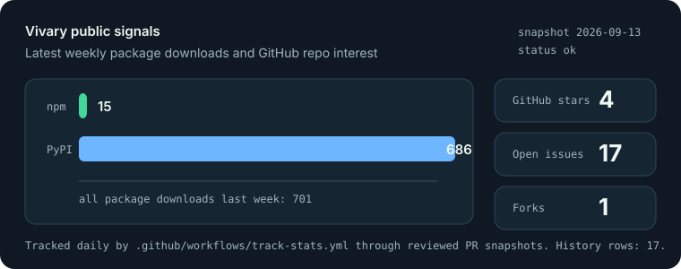

# Vivary

[](https://github.com/vivary-dev/vivary/actions/workflows/ci.yml)
[](https://github.com/vivary-dev/vivary/releases/latest)
[](https://www.npmjs.com/package/@vivary/create)
[](https://www.npmjs.com/package/@vivary/create)
[](https://pypi.org/project/create-vivary/)
[](https://pypistats.org/packages/create-vivary)
[](LICENSE)
[](https://vivary.vercel.app/)

**Typed memory and gates for AI-agent projects.** A standard plus a scaffolder that
wires up a normalized, agent-native workspace from standalone modules — typed project
memory, visible state, reusable skills, private boundaries, and verification gates —
whether the workspace is a second brain, a coding project, knowledge-work bench, or a writing project. Think
`create-t3-app`, but for an AI agent's workspace instead of a web app.

A *vivary* is an archaic word for a vivarium: a self-contained world where living
things are kept, in stacked layers. That's the metaphor — your project lives
inside a small, well-formed world with a substrate, an atmosphere, and gates.

> Release status: package versions are independent; there is no single "Vivary
> 0.4.1" release. Use **0.3.1** for the scaffolder (`create-vivary` /
> `@vivary/create`), **0.4.1** for `vivary-tropo`, **0.2.2** for `vivary-exo`,
> **0.2.0** for `vivary-ozone`, and **0.1.0** for the optional
> `vivary-memory-cognee` adapter.
> This line adds `tropo map` (read-only filesystem inventory), brownfield
> `create-vivary adopt`, `doctor --trend` drift tracking, and strato integrity
> gates in CI.

| Surface | Current | Link |
|---|---:|---|
| `vivary` (PyPI, installs the suite) | 0.1.0 | [PyPI](https://pypi.org/project/vivary/) |
| `create-vivary` (PyPI) | 0.3.1 | [PyPI](https://pypi.org/project/create-vivary/) |
| `@vivary/create` (npm) | 0.3.1 | [npm](https://www.npmjs.com/package/@vivary/create) |
| `vivary-tropo` | 0.4.1 | [PyPI](https://pypi.org/project/vivary-tropo/) |
| `vivary-ozone` | 0.2.0 | [PyPI](https://pypi.org/project/vivary-ozone/) |
| `vivary-exo` | 0.2.2 | [PyPI](https://pypi.org/project/vivary-exo/) |
| `vivary-memory-cognee` | 0.1.0 | [PyPI](https://pypi.org/project/vivary-memory-cognee/) |
| Docs site | live | [vivary.vercel.app](https://vivary.vercel.app/) |
| CI | `ci` workflow | [GitHub Actions](https://github.com/vivary-dev/vivary/actions/workflows/ci.yml) |

Versions are intentionally independent across the layers and optional adapters: `tropo`
moved to 0.4.1 for the read-only `map` filesystem inventory command, `create-vivary` /
`@vivary/create` move to 0.3.1 for brownfield `adopt` and `doctor --trend` drift
tracking, `ozone` and `exo` are unchanged in this line, and `vivary-memory-cognee`
stays at 0.1.0.

Unreleased entries documented on the `dev` branch are not included in those published
package versions until the release-train PR bumps, publishes, and verifies them.

## Public Signals



Vivary tracks public npm, PyPI, and GitHub signals through reviewed daily PR
snapshots. The chart is generated from [`stats/latest.json`](stats/latest.json) and
[`stats/history.csv`](stats/history.csv); see [docs/SIGNALS.md](docs/SIGNALS.md) for
sources and caveats.

`tropo` (typed knowledge graph + search + storage), `strato` (agent OS), `ozone`
(graph-aware review), and `exo` (coordination) are composed by `create-vivary`. See
[docs/ARCHITECTURE.md](docs/ARCHITECTURE.md) for the full model and
[docs/PORTFOLIO.md](docs/PORTFOLIO.md) for proof and case-study material. The
high-leverage backlog lives in [docs/PRODUCT-ROADMAP.md](docs/PRODUCT-ROADMAP.md).

Current command surface:

- `create-vivary init` / `doctor` / `wizard` / `capabilities` / `adopt` /
  `doctor --trend`
- `tropo check` / `graph` / `find` / `query` / `migrate` / `map` / `init --packs`
- `ozone review` / `impact`
- `exo board` / `conflicts` / `claim` / `roles`
- `vivary-cognee doctor` / `index` / `recall` / `forget` from the optional
  `vivary-memory-cognee` package

For local debugging and bug reports, the core CLIs accept `--receipt PATH` or
`VIVARY_RECEIPT_LOG=PATH` to append a dependency-free JSONL run receipt. Receipts stay
local and do not capture stdout, stderr, file contents, raw query text, target ids, or
paths.

## Quickstart

Scaffold a workspace in one npm command. No Python package install first; the launcher
needs Python 3.11+ and `uv` or `pipx` available:

```bash
npm create @vivary@latest my-workspace        # pick: second brain · coding · knowledge work · writing
```

Or install the CLIs from PyPI (run on demand with `uvx`, no install needed):

```bash
pip install vivary
create-vivary init my-workspace --preset coding     # interactive wizard on a TTY
create-vivary init my-workbench --preset knowledge-work --memory local
create-vivary init my-codebase --preset coding --active-context cocoindex-code
create-vivary capabilities --preset second-brain --json
create-vivary doctor my-workspace
uvx vivary-tropo check --root my-workspace
uvx vivary-tropo find "where is release truth owned" --root my-workspace --json
tropo check --root my-workspace --receipt .vivary/receipts.jsonl

# Agent-mode — fully non-interactive, outputs JSON:
create-vivary init . --preset coding --auto --size large --yes --json
```

The scaffolder writes a full workspace shell: `AGENTS.md`, `STATE.md`, `SOUL.md`,
private `USER.md`/`MEMORY.md` boundaries, private heartbeat report storage, strato
runtime skills for Claude/Codex-style agents, a `tropo.toml`, a starter typed graph,
and optional `.vivary/storage.toml` / `.vivary/memory.toml` capability config. Generated
modules are directories with `index.md` routers (`modules/<id>/index.md`) so agents
load the smallest useful context first. `doctor` validates the shell, active privacy
ignore rules, graph health, storage backend, semantic-memory status, and module index
coverage after creation.
`tropo find` returns small typed context packets for agents and humans to read first;
`tropo query` provides filtered graph search, and `tropo migrate` handles backend
switching. On the unreleased `dev` branch, `tropo query --mode semantic` can call an
explicitly configured optional semantic-memory provider while still returning typed
Vivary node ids.

For workspaces that explicitly choose Cognee semantic memory, the optional
`vivary-memory-cognee` package adds `vivary-cognee doctor`, `index`, `recall`, and
`forget`. It indexes privacy-filtered typed Tropo node packets and only accepts recall
hits that map back to known Vivary node ids. It is not part of the default install and
provider writes require explicit approval. `tropo query --mode semantic --json` uses
that same optional provider bridge after the workspace has been configured and indexed.

For coding workspaces that need richer source retrieval, `--active-context
cocoindex-code` adds optional CocoIndex-code guidance and graph nodes. It does not
auto-install, index, enable MCP, or send source text anywhere; the generated skill asks
before those gates, then gives the approved `ccc init` / `ccc index` / `ccc search`
path. See [docs/ACTIVE-CONTEXT.md](docs/ACTIVE-CONTEXT.md) and the copyable
[LLM active-context guide](docs/LLM-ACTIVE-CONTEXT.md).

<details><summary>Run from source (no install)</summary>

```bash
python packages/create-vivary/create_vivary.py init sandboxes/coding-demo --preset coding
python packages/create-vivary/create_vivary.py doctor sandboxes/coding-demo
python packages/tropo/tropo.py check --root sandboxes/coding-demo
python packages/tropo/tropo.py find "local ci baseline" --root sandboxes/coding-demo --json
python packages/tropo/tropo.py graph --root sandboxes/coding-demo --json
```

</details>

### Agent setup

Already working with Claude Code, Codex, Cursor, or another coding agent? Paste this
prompt and it handles setup — greenfield or brownfield — with your approval at every gate:

```text
Set up Vivary (https://vivary.vercel.app) in this project.

1. Read https://vivary.vercel.app/getting-started/ and https://vivary.vercel.app/commands/ before running anything.
2. You need Python 3.11+ and uv (or pipx). Tell me if something is missing before installing it.
3. If this folder already has content, this is an adoption: run `uvx create-vivary adopt .`, show me the dry-run plan, and apply with `--yes` only after I approve. Adopt only adds files — it never touches existing ones.
   If this folder is new or empty, it is a fresh workspace: ask me which preset fits (coding / second brain / knowledge work / writing), then run `uvx create-vivary init . --preset <choice>`.
4. Verify with `uvx create-vivary doctor .` and `uvx --from vivary-tropo tropo check --root .` — both must pass; show me the results.
5. Read the generated AGENTS.md, then follow it for all future work here.
```

## The irreducible baseline

Every agent workspace, regardless of stack or task, needs the same small core:

> **A self-improving loop running over a typed, navigable knowledge graph, with
> one visible state surface and human gates.**

Everything Vivary ships is a facet of that one sentence. The design law (inherited
from [throughline](https://github.com/Jeff-Kazzee/throughline)): *the framework
must cost almost nothing to load, or it steals the context the work needs.*

That means Vivary is deliberately DRY: one fact gets one owner, while `AGENTS.md`,
`STATE.md`, and module `index.md` files route to deeper context instead of duplicating
it. Full context management is valuable only when it keeps the active context small.

**No lock-in.** A workspace is plain Markdown + YAML and a few CLIs — it works in any
editor, or none, and on any agent runtime (Claude Code reads `.claude/skills/`, Codex
reads `AGENTS.md` + `.agents/`). Obsidian, an IDE, a particular agent — all optional.
The visual knowledge graph renders editor-free with `tropo view`; Obsidian fans get an
opt-in setup (`create-vivary init … --obsidian`) — see [docs/OBSIDIAN.md](docs/OBSIDIAN.md).

## Modules

Standalone Python packages (`vivary-*` on PyPI), plus the npm scaffolder
`@vivary/create`, composed by `create-vivary`:

| Package | Layer | Job | Source |
|---|---|---|---|
| **tropo** | troposphere — the living foundation | typed knowledge graph: what the workspace *knows* | loam ✓ |
| **strato** | stratosphere — the stable layer | agent OS: state surface, memory, the loop, gates, self-improvement | throughline + flywheel |
| **ozone** | the protective filter | review — graph-aware, code *and* editorial | new ✓ |
| **exo** | the outermost layer | coordination — conflict detection, work claiming, role contracts | new ✓ |

`create vivary` → pick a preset (**coding · second brain · knowledge work · writing**) → it lays
down `tropo` + `strato` and whichever optional layers fit. See
[Quickstart](#quickstart) above to install.

## Documentation

**Website: [vivary.vercel.app](https://vivary.vercel.app/)** — or browse the source in
[docs/](docs/):

- [Getting started](docs/GETTING-STARTED.md) — install → workspace → loop
- [Command reference](docs/COMMANDS.md) — every CLI, flag, and exit code
- [How-to recipes](docs/HOWTO.md) · [Agent skills](docs/SKILLS.md) · [FAQ](docs/FAQ.md)
- [Active context](docs/ACTIVE-CONTEXT.md) · [LLM active-context guide](docs/LLM-ACTIVE-CONTEXT.md)
- [Architecture](docs/ARCHITECTURE.md) · [Semantic memory](docs/SEMANTIC-MEMORY.md) · [Obsidian (optional)](docs/OBSIDIAN.md)
- [Release workflow](docs/RELEASE-WORKFLOW.md) — end-of-update release truth, docs/site sync, and publish checks
- [Portfolio proof](docs/PORTFOLIO.md) — shipped surfaces, screenshots, and case-study notes

## The value-add (why this isn't another harness)

1. The substrate is a **typed, validated knowledge graph**, not flat memory.
2. Every change shows its **blast radius** — before and after — beyond a text diff.
3. It's **medium-agnostic**: the same graph + review serves code and prose.
4. It **standardizes the agent workspace** — which nobody has done.
5. **Agents can self-configure from scratch** — `--auto --yes --json` gives a zero-prompt, machine-readable setup path for storage, installs, and scaffolding.

## License

MIT — see [LICENSE](LICENSE).
