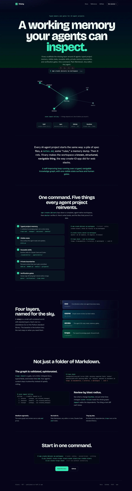
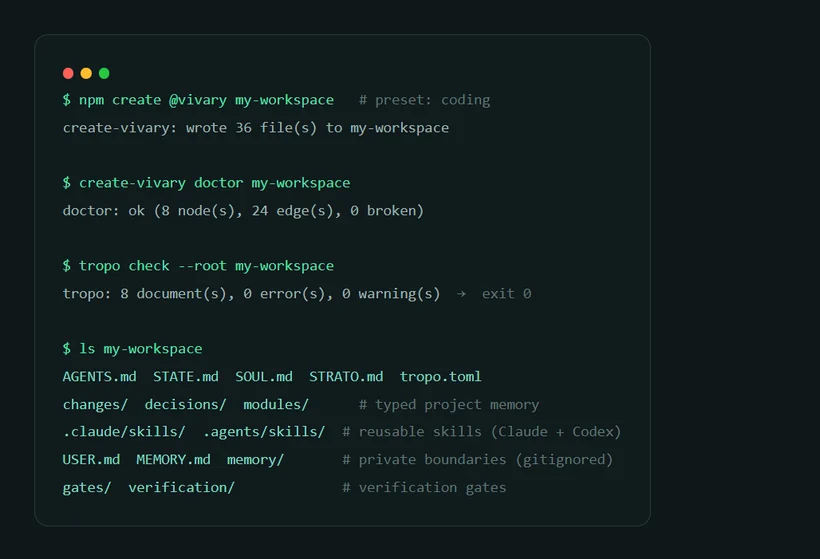

# Vivary — portfolio entry

Vivary is my open-source baseline for agent-native workspaces. It packages the
stuff every serious AI-agent project eventually invents by hand: typed project
memory, visible state, reusable skills, private memory boundaries, and
verification gates. The CLI is published on PyPI and npm; a generated workspace
can be scaffolded and checked in minutes.

## Links

- **Live site:** https://vivary.vercel.app/
- **GitHub:** https://github.com/vivary-dev/vivary (public · MIT)
- **PyPI:** [`create-vivary`](https://pypi.org/project/create-vivary/) 0.1.1 ·
  [`vivary-tropo`](https://pypi.org/project/vivary-tropo/) ·
  [`vivary-ozone`](https://pypi.org/project/vivary-ozone/) ·
  [`vivary-exo`](https://pypi.org/project/vivary-exo/) (0.1.0)
- **npm:** [`@vivary/create`](https://www.npmjs.com/package/@vivary/create) 0.1.1

## Proof

Homepage — desktop:

One command scaffolds a verified workspace (real `create-vivary` + `doctor` +
`tropo check` output):

Review by blast radius — the hero graph lights up everything that depends on a
changed node:

Mobile:

## What it demonstrates

- **Product framing:** named the irreducible layer agent projects keep
  rebuilding, and shipped it as a one-command scaffolder.
- **Distribution:** four standalone CLIs published across two registries (PyPI +
  npm), composed by `create-vivary`.
- **Restraint:** no third-party dependencies; the framework costs almost nothing
  to load. Plain Markdown, any editor, Claude Code *and* Codex.

> Release snapshot verified 2026-06-18: `create-vivary` 0.1.1 (PyPI), `@vivary/create` 0.1.1 (npm).
> Scaffold output captured from a real run — 36 files, doctor ok (8 nodes, 24
> edges, 0 broken), `tropo check` 0 errors.

> Active-context branch proof, 2026-06-20: plain coding scaffold writes 37 files and
> doctors clean at 9 nodes / 28 edges; `--active-context cocoindex-code` writes 43
> files and doctors clean at 12 nodes / 38 edges. `cocoindex-code==0.2.36` was
> installed with local embeddings, initialized against this repo, indexed 95 files into
> 897 chunks, and `ccc search --refresh` returned the active-context docs plus the
> `create_vivary.py` implementation.
