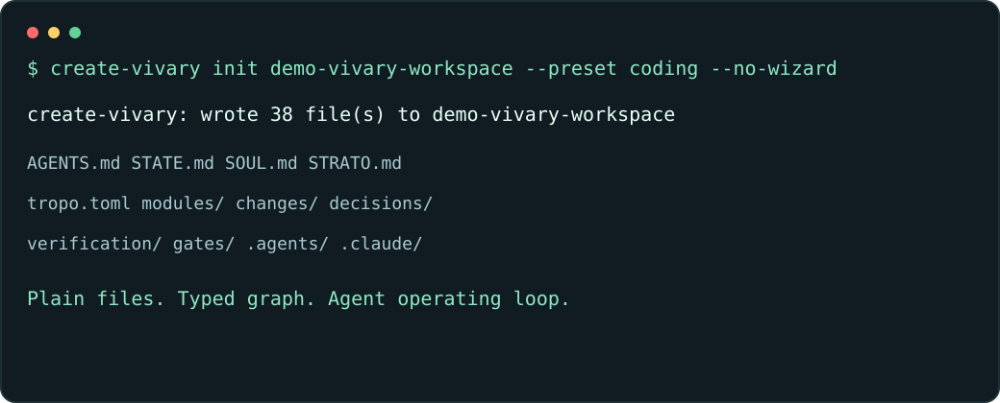
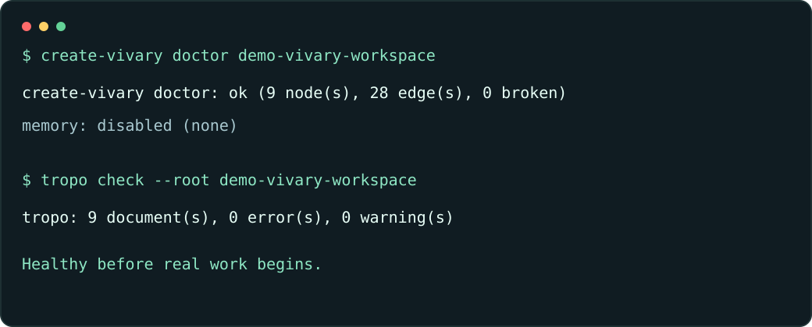
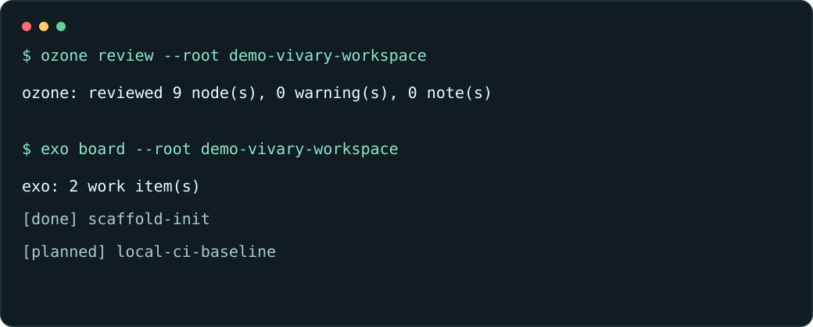
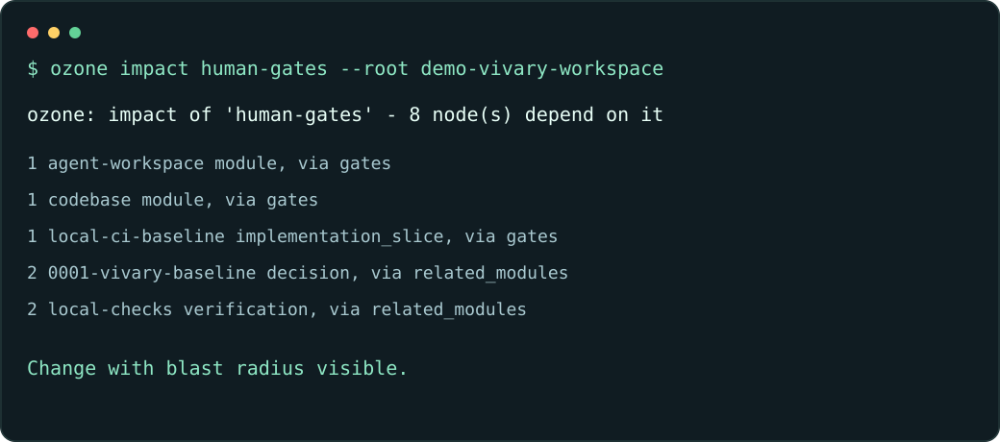

# Getting started proof

> **Historical published-line fixture.** This page records the public 0.3.1 full
> scaffold and is retained as release evidence. Published 0.4.2 uses the
> five-file thin contract described in [Getting started](GETTING-STARTED.md); it does
> not reproduce this 38-file layout.

This is a public, generic proof of the first Vivary work cycle. It uses a disposable
workspace named `demo-vivary-workspace`; no private dogfood bundle, local project brain,
API key, customer data, or internal transcript is part of this page.

The historical proof shows that a user or agent could scaffold a workspace, prove it is healthy, see
the typed graph, run review, see coordination state, and name blast radius before work.

## 1. Scaffold a workspace



The published 0.3.1 scaffold created the agent operating shell and graph starter pack:

```bash
create-vivary init demo-vivary-workspace --preset coding --no-wizard
```

In the proof run, the scaffold wrote 38 files. Those files are plain Markdown, TOML, and
agent skill files: `AGENTS.md`, `STATE.md`, `SOUL.md`, private ignored memory placeholders,
`tropo.toml`, starter graph folders, and Claude/Codex skill surfaces.

## 2. Prove workspace health



Vivary's first promise is not "trust me." It is "run the checks":

```bash
create-vivary doctor demo-vivary-workspace
tropo check --root demo-vivary-workspace
```

The proof run reported:

- `doctor`: 9 nodes, 28 edges, 0 broken refs.
- `memory`: disabled, because no optional semantic-memory provider was requested.
- `tropo check`: 9 documents, 0 errors, 0 warnings.

That gives a user and an agent a visible baseline before any real work begins.

## 3. Run review and coordination



The next part of the product loop is review and coordination:

```bash
ozone review --root demo-vivary-workspace
exo board --root demo-vivary-workspace
```

The proof run reported a clean graph-aware review and the starter work board:

- `ozone`: reviewed 9 nodes, 0 warnings, 0 notes.
- `exo`: 2 work items: `scaffold-init` done and `local-ci-baseline` planned.

This is the difference between a generated folder and a workspace an agent can operate:
there is a review gate and an explicit next-work surface.

## 4. Name impact before changing things



Before a risky edit, Vivary can show what depends on a graph node:

```bash
ozone impact human-gates --root demo-vivary-workspace
```

The proof run found 8 dependent nodes, including the starter modules, verification
records, baseline decision, and implementation slices. That is the product thesis in one
command: the agent can see blast radius before it changes the workspace.

## What this proves

- A fresh user can create a workspace without learning the whole architecture first.
- The workspace has visible health checks, not just generated files.
- The graph is typed and queryable from deterministic local files.
- Review and coordination are part of the default loop.
- Private runtime/memory surfaces are excluded from the public proof.

## What this does not prove yet

This walkthrough intentionally does not include private dogfood evidence or optional
provider runtime calls. The next productization gates are:

- Semantic memory in an incognito, privacy-first mode: optional, explicit, and never
  default.
- Typed semantic search over Tropo graph truth, tracked in
  [#20](https://github.com/vivary-dev/vivary/issues/20), returning Vivary node ids and
  paths rather than opaque chunks.

Those belong in separate feature PRs so each can run CI and review cleanly.
