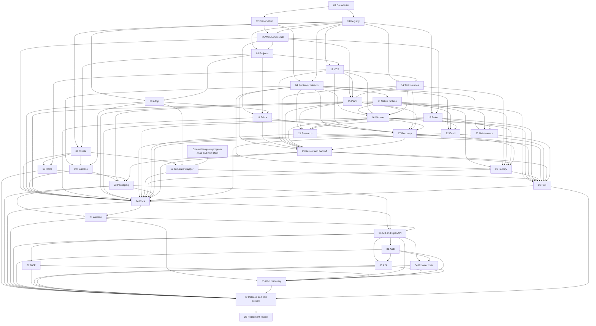

# Vivary multi-project ticket graph

Updated: 2026-09-05

Program: [design](design.md), [evidence](evidence.md), [migration](migration.md),
[release](release.md), and [terms](CONTEXT.md).

This graph plans the complete Vivary evolution. It preserves Littleagent S-00A and
S-00 through S-13, standalone Vivary, templates, integrations, public delivery, and
deferred legacy retirement. The first usable milestone does not narrow later scope.

Frontier: none. Ticket 01 is ready for human review of the documentation pull
request only. Earlier Littleagent implementation authority remains applicable only
where the accepted ticket 01 boundary reconciles it with the changed contracts.

## Tickets

| Ticket | Status | Outcome | Blocked by |
| --- | --- | --- | --- |
| [01](tickets/01-reconcile-migration-boundaries.md) | ready-for-human | Reconcile provenance and boundaries | [] |
| [02](tickets/02-prove-source-preservation.md) | needs-info | Prove source preservation | 01 |
| [03](tickets/03-define-project-registry.md) | needs-info | Define registry and authority | 01 |
| [04](tickets/04-define-runtime-session-contracts.md) | needs-info | Define runtime and session contracts | 02, 03 |
| [05](tickets/05-integrate-workbench-shell.md) | needs-info | Integrate the workbench shell | 02, 03 |
| [06](tickets/06-register-and-switch-projects.md) | needs-info | Register and switch projects | 03, 05 |
| [07](tickets/07-create-new-projects.md) | needs-info | Create new projects | 03, 06 |
| [08](tickets/08-adopt-existing-projects.md) | needs-info | Adopt existing projects | 03, 06 |
| [09](tickets/09-preserve-headless-parity.md) | needs-info | Preserve headless parity | 04, 07, 08 |
| [10](tickets/10-prove-native-runtime.md) | needs-info | Prove a native runtime | 04 |
| [11](tickets/11-finish-workspace-editor.md) | needs-info | Finish conflict-safe editing | 05, 06, 08 |
| [12](tickets/12-implement-vcs-identity-adapters.md) | needs-info | Support none, Git, and Jujutsu | 03, 06 |
| [13](tickets/13-connect-repository-hosts.md) | needs-info | Connect optional repository hosts | 07, 12 |
| [14](tickets/14-integrate-task-sources.md) | needs-info | Integrate optional task authorities | 03, 12 |
| [15](tickets/15-deliver-plans-and-kanban.md) | needs-info | Deliver plans and kanban | 05, 12, 14 |
| [16](tickets/16-run-verified-workers.md) | needs-info | Run verified workers | 04, 10, 12, 14, 15 |
| [17](tickets/17-deliver-recovery-review-handoffs.md) | needs-info | Recover and resume sessions | 04, 11, 12, 14, 15, 16 |
| [18](tickets/18-add-scoped-brain-learning.md) | needs-info | Add Brain and reviewed learning | 03, 05 |
| [19](tickets/19-integrate-template-program.md) | needs-info | Integrate the held template program after prerequisites | 07, 08, external program |
| [29](tickets/29-deliver-review-integration-handoffs.md) | needs-info | Review, integrate, and hand off | 04, 11, 12, 14-17 |
| [20](tickets/20-run-bounded-factory.md) | needs-info | Run bounded factory work | 04, 10, 14-17, 29 |
| [21](tickets/21-add-research-specialists.md) | needs-info | Add research specialists | 04, 15, 16, 18 |
| [22](tickets/22-add-intake-and-maintenance.md) | needs-info | Add signed email intake | 04, 10, 18 |
| [30](tickets/30-add-heartbeat-maintenance.md) | needs-info | Add heartbeat maintenance | 04, 10, 18 |
| [36](tickets/36-measure-pilot-outcomes.md) | needs-info | Measure S-13 pilot outcomes | 10, 16-22, 29, 30 |
| [23](tickets/23-package-and-prove-app.md) | needs-info | Prove installed application behavior | 09, 10, 13, 29 |
| [24](tickets/24-write-product-docs-guides.md) | needs-info | Write installed docs and guides | product tickets and pilot |
| [25](tickets/25-update-public-website.md) | needs-info | Update the public website | 23, 24 |
| [26](tickets/26-publish-real-agent-protocols.md) | needs-info | Publish a real read-only API and OpenAPI | 23-25 |
| [31](tickets/31-implement-auth-discovery.md) | needs-info | Implement auth discovery and scopes | 26 |
| [32](tickets/32-publish-hosted-mcp.md) | needs-info | Publish hosted MCP | 26 |
| [33](tickets/33-publish-a2a-service.md) | needs-info | Publish A2A | 26, 31 |
| [34](tickets/34-publish-browser-tools.md) | needs-info | Publish browser tools | 26, 31 |
| [35](tickets/35-complete-web-agent-discovery.md) | needs-info | Complete web and DNS discovery | 25, 26, 31-34 |
| [27](tickets/27-deploy-release-and-pass-readiness.md) | needs-info | Release and pass the actual 100 percent gate | release dependencies |
| [28](tickets/28-retire-legacy-assets.md) | needs-info | Review deferred retirement per item | 27 |

Ticket 19 depends on the six outcomes in the [external dependency
contract](external-dependencies.md#held-template-installer-program). The repository
owner must explicitly lift the implementation hold, the outcomes must have evidence,
a canonical approved source packet must exist, and a compatible installed API must be
available. This named condition avoids a dangling ticket ID and keeps the full
template program out of the wrapper ticket.

Tickets 13, 26, 27, 28, 31, and 35 contain later external actions or choices. Their
dependencies remain open, so each has `needs-info` status. When one exact outward
action becomes the only remaining work, change its status to `ready-for-human` and
name that action. Do not batch approvals.

## Dependency view

## Status rule

Tickets are authoritative. Update this graph after each transition. A ticket becomes
`done` only after its Verify section passes and its Log records the result. Retirement
remains deferred until ticket 27 passes and the repository owner decides each item's disposition.
