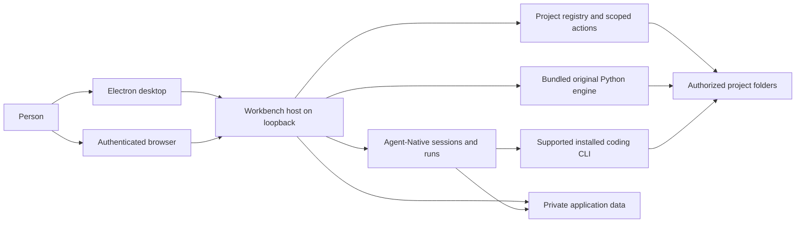
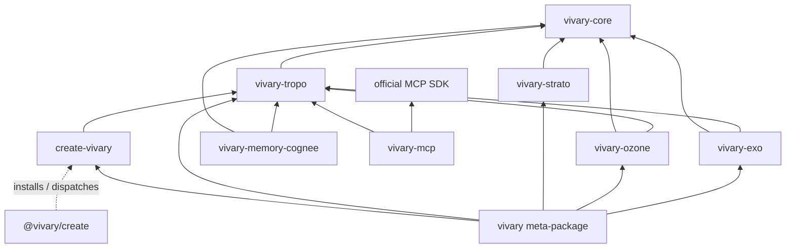

This is the high-level design for the desktop and self-hosted product in `vivary-dev/Vivary-New`. It describes the system that contributors change and the boundaries they must preserve. The [module catalog](https://github.com/vivary-dev/vivary/blob/dev/docs/product/multi-project/specification/modules.md) owns detailed responsibilities and source entry points. The [desktop acceptance register](https://github.com/vivary-dev/vivary/blob/dev/docs/product/multi-project/desktop-acceptance-status.md) owns proof by candidate. GitHub issues own task scope and lifecycle.

## Purpose and owner intent

Jeff's [desktop release decision](https://github.com/vivary-dev/vivary/blob/dev/docs/product/multi-project/desktop-release.md) calls for one Vivary instance on a user-controlled computer or suitable server. A local desktop window and a responsive browser connect to that host. The host keeps agents, project files, credentials, history, and memory. Local desktop use needs no Vivary account. Remote browser access requires explicit setup and authentication. Zo hosts development and a private preview. It is not a required user service.

The [unified workspace decision](https://github.com/vivary-dev/vivary/blob/dev/docs/product/multi-project/design.md#unified-workspace-decision-2026-09-14) puts one selected project conversation at the center. A project can have several independent conversations. Files, details, search, and preview open as optional panels. Supported installed coding runtimes retain their own tools, models, permissions, and sessions. Vivary binds their work to the selected project. A cross-runtime link and a maintained handoff remain separate product capabilities, not an implicit transfer of a live run. The [interaction contract](https://github.com/vivary-dev/vivary/blob/dev/docs/product/multi-project/unified-workspace.md) owns those details.

The original Vivary engine remains available as standalone commands and through bounded application operations. A project keeps its own folder and conventions. The original five-file workspace contract, plain authored files, and optional version control let a user continue work without the GUI. The [original CLI reference](/original-cli/) owns command and release status.

The original design reduces active agent context. `AGENTS.md` routes to `.vivary/context.md`, and `STATE.md` is read when state matters. Typed records arise from actual work. Core keeps evidence, provenance, receipts, and authority explicit. Optional semantic retrieval can suggest candidates, but it does not become authored truth. [Original CLI architecture](#original-engine) explains the package boundaries.

## Success criteria

The [desktop release journey](https://github.com/vivary-dev/vivary/blob/dev/docs/product/multi-project/desktop-release.md#acceptance-journey) defines observable success. A person can install and open the Windows package without a source checkout or Vivary account, create and adopt projects, and run authorized work in each. They can inspect actual tool results, stop work, close the app, and reopen the same project and conversation. They can save a project fact, retrieve it in a fresh session, correct it, and remove it from active memory. They can find an older chat by message content and search project files by filename, exact text, and regex. They can use all ten original command verbs through the installed operations. A desktop and phone browser can connect to the same authenticated private host, and a project preview can support an observed error and authorized repair.

These are release criteria, not a claim that the full journey passes. The [acceptance register](https://github.com/vivary-dev/vivary/blob/dev/docs/product/multi-project/desktop-acceptance-status.md#capability-and-acceptance-gaps) names the tested source and platform for each accepted slice and the remaining gaps. Hosted, simulated-provider, and packaged Windows evidence have different limits.

## System structure

The [architecture and UX diagrams](https://github.com/vivary-dev/vivary/blob/dev/docs/product/multi-project/diagrams/README.md) provide six editable tldraw pages and image exports. They are a dated view of this design and its interaction contracts.

The Electron process starts a local Workbench server, opens its loopback origin, and manages shutdown. The browser client presents the same host state. The Workbench launcher chooses local, hosted, or private-proxy access and locates private data. The source owners are [`packages/desktop/main.mjs`](https://github.com/vivary-dev/vivary/blob/dev/packages/desktop/main.mjs), [`packages/workbench/bin/start.mjs`](https://github.com/vivary-dev/vivary/blob/dev/packages/workbench/bin/start.mjs), and [`server/local-access.ts`](https://github.com/vivary-dev/vivary/blob/dev/packages/workbench/server/local-access.ts). The browser does not run agents or mount a phone's files. The dedicated desktop server owns its process exit, like the direct CLI launcher. After a quit request, it waits for local-work cleanup and, on success, Nitro close before exiting. The server is detached on every platform. On Windows this lets it observe IPC loss and finish cleanup instead of being ended by the desktop process's Windows job. The desktop launcher keeps IPC open during cleanup. Pending or rejected cleanup, including Nitro close, leaves the server PID available for the desktop parent's existing 15-second process-tree fallback. If the parent disconnects, including after requesting shutdown, the server allows 15 seconds for cleanup before attempting a tree kill against its own PID. That command has a five-second bound, and the server exits nonzero if it returns. Successful cleanup exits normally before either fallback. Each Windows preview now has a non-detached Python owner, using the bundled interpreter and [Core's shared Windows process scope](https://github.com/vivary-dev/vivary/blob/dev/packages/core/vivary_core/windows_process_scope.py). Core creates the approved package manager suspended and assigns it to a kill-on-close job. Immediately before resume, the preview owner refuses startup if its watcher has already observed host-pipe closure. Refusal kills and reaps the suspended child without executing it. Other Core callers omit that callback and retain their existing behavior. The owner preserves the reviewed arguments, folder and sanitized environment, forwards raw output through the existing pipes, and gives the manager an empty input stream. Stop closes the owner lifetime pipe without sending messages. EOF, pipe failure or manager exit causes job termination and a bounded active-process accounting check. The owner reports success only after every job member has ended. Workbench observes owner and pipe errors from spawn and shares that cleanup result with Stop and natural-exit retirement, retaining the existing closed-port check. A confirmed spawn error without a PID retires the non-launch and releases its reservation while keeping its visible failure. A launched owner with unverified cleanup stays retained. The existing public PID and liveness fields refer to the preview owner, which the UI names explicitly. Killing the owner also closes its job handle. The earlier d8cb7665 package left a shell-launched preview and child alive after server death. Native Windows CI and the fresh clean-source 4f7a0394 package now pass server-first cleanup. That package also passes active-preview normal close, abrupt Electron loss, idle close and scheduled and webhook interruption persistence. These are measured acceptance journeys, with process observations made before manual cleanup. Direct CLI and non-Windows failure exits remain unchanged. The [issue receipt](https://github.com/vivary-dev/vivary/blob/dev/docs/product/multi-project/receipts/138-desktop-quit-exit.md) separates normal packaged observations from controlled failure coverage. Shared startup and externally hosted lifecycle ownership are unchanged.

Workbench composes Agent-Native's application, chat, run, action, and storage owners. Native keeps transcripts and run lifecycle. Workbench keeps project identity and authorized root bindings, then resolves those bindings for actions and sends. The registry uses Native's database with Workbench project, binding, revision, receipt, and mutation tables. See the [project registry](https://github.com/vivary-dev/vivary/blob/dev/docs/product/multi-project/source-map/modules/project-registry/index.md), [`project-services.mjs`](https://github.com/vivary-dev/vivary/blob/dev/packages/workbench/server/project-services.mjs), and [`db/schema.mjs`](https://github.com/vivary-dev/vivary/blob/dev/packages/workbench/server/db/schema.mjs). An observed path is not by itself a project identity or a write grant.

The selected coding runtime owns execution, tools, model access, and native session continuity. Workbench currently supports Claude Code and Codex through Native Code records and the local Code host. Codex uses its app-server and account-effective model catalog. Workbench relays native approvals, progress, child activity, and Stop. Native provider chat uses Native's chat owner with a project send guard. The [harness adapter contract](https://github.com/vivary-dev/vivary/blob/dev/docs/product/multi-project/specification/harness-adapters.md), [Native owner map](https://github.com/vivary-dev/vivary/blob/dev/docs/product/multi-project/native-owners.md), and [runtime source map](https://github.com/vivary-dev/vivary/blob/dev/docs/product/multi-project/source-map/modules/native-runtime/index.md) describe the distinct owners.

### Original engine

The original engine remains a package family, not another agent loop. `vivary-core` owns pure validation and projection while callers retain execution, persistence, and human approval. Tropo observes, builds typed graph context, and retrieves. Strato evaluates policy. Ozone verifies evidence and proposes gated repairs. Exo projects claims, dependencies, and handoffs. `create-vivary` creates and adopts workspaces. The optional MCP and semantic-memory adapters are outside the default package path. The `vivary` front door routes ten verbs to their package owners. The Workbench bundles this Python runtime and calls its established commands rather than reimplementing their decisions. See [the command reference](/commands/) and [package manifests](https://github.com/vivary-dev/vivary/tree/dev/packages).

### The shared seam: vivary-core

Core is a library shared by Tropo, Strato, Ozone, and Exo. It owns deterministic
evidence projection, bounded task capsules, receipt validation, policy decisions,
and control-state projection. Callers retain clocks, execution, state persistence,
and human approval. Unknown, conflicting, or omitted evidence stays visible.
Observed ambiguity does not become permission to act. The [Core contract](https://github.com/vivary-dev/vivary/blob/dev/packages/core/README.md)
owns the detailed schemas and refusal rules.

### Package dependency map

This map shows direct source-manifest dependencies; omitted arrows are deliberately
absent. In particular, the `vivary` meta-package receives Core transitively, while MCP
and memory remain optional and outside that meta-package.

The [package manifests](https://github.com/vivary-dev/vivary/tree/dev/packages) own dependency version floors. Each
shipping package declares the Core dependency it imports. The meta-package
receives Core through its component dependencies. Source versions and published
versions remain distinct in the [CLI release status](/original-cli/#release-status).

### Distribution names

The package names remain part of the original engine's architecture. The
[original CLI release status](/original-cli/#release-status) owns published
versions. A changed source version is not evidence of a registry release.

- npm: `@vivary/create` launches the workspace creator.
- PyPI: `vivary`, `vivary-core`, `vivary-tropo`, `vivary-strato`, `vivary-ozone`,
  `vivary-exo`, `create-vivary`, `vivary-memory-cognee`, and `vivary-mcp`.

The optional memory and MCP distributions remain outside the default path.
Coordinated releases publish Core before its dependent role packages.

## Runtime flows

1. **Select a project.** Workbench resolves the authenticated actor, stable project ID, current binding, policy revision, and observed root. Project selection changes the files and history shown. A missing folder leaves authorized history available but blocks file-dependent execution. [Project registry](https://github.com/vivary-dev/vivary/blob/dev/docs/product/multi-project/source-map/modules/project-registry/index.md) owns the identity contract.
2. **Send and continue.** A Native chat send rechecks its pinned project scope before model or attachment work. A Code send starts or resumes the selected native session against its bound project. Native stores the resulting run and transcript. A model choice or project switch cannot silently move an active run. [`native-chat-project.ts`](https://github.com/vivary-dev/vivary/blob/dev/packages/workbench/server/native-chat-project.ts), [`local-code-agent.ts`](https://github.com/vivary-dev/vivary/blob/dev/packages/workbench/server/local-code-agent.ts), and the [session model](https://github.com/vivary-dev/vivary/blob/dev/docs/product/multi-project/desktop-release.md#one-understandable-model) own this flow.
   Each project message also loads the project's context when it starts. [`project-memory.ts`](https://github.com/vivary-dev/vivary/blob/dev/packages/workbench/server/project-memory.ts) reads the law files, the state file, and the fact files in the memory folders from the admitted project only, and renders one block of at most 8,000 characters. A Code send puts the full block before the engine prompt on every turn, for new runs, Claude follow-ups (each a fresh CLI session), and resumed Codex threads. A resumed Codex thread therefore accumulates one block per turn, up to 8,000 characters each. That cost is accepted so a thread never depends on an earlier block that Codex may have compacted away. Only Full chat blocks name Native's owner-wide tools. The transcript keeps only the typed message, and one note per turn, which the Code view shows, names the loaded revision and whether it changed. The panel's last load is recorded only after the send passes its refusals and claims the host slot. Full chat returns the block from Native's `extraContext` on every send. Its three Vivary hooks, the send guard (`prepareRequest`), `extraContext`, and `resolveActionSurface`, each classify the pinned chat scope again rather than sharing one match. A change to a fact file therefore applies from the next message, in new and open conversations, and after a restart. A reply already running keeps what it started with.
3. **Approve, deny, or stop.** Native owns an action request and its execution lifecycle. Workbench checks the owner, project, run, and exact request before relaying a decision. Stop targets the owned running work. During a Windows Code run, the host periodically records descendant PIDs and creation times while parent links are still visible. Every Windows stop checks those recorded identities after tree termination, including when `taskkill` reports success. When a stop cannot confirm that a run's coding processes ended, Code refuses new sends and the host strip names what is left, by process name and PID. End them ends only listed processes that Vivary traced to the run, each after it checks the process's PID and start time at the moment it acts. Continue anyway lifts the refusal on the owner's word once End them has run or cannot act, and only for processes the owner was shown. A later check lifts it on its own when nothing is left. Client closure does not itself approve or replay an action. The [coding permission decision](https://github.com/vivary-dev/vivary/blob/dev/docs/product/multi-project/design.md#native-coding-permissions-and-activity-2026-09-16) and [authority module](https://github.com/vivary-dev/vivary/blob/dev/docs/product/multi-project/specification/modules.md#m05-authority-and-approvals) own the rules.
4. **Read and change project files.** Scoped file actions list and read bounded content. Explicit Save and Rename check the selected project and file revision. Project memory is the only caller of the file service's exclusive Create and version-checked Remove, which reuse the same link refusal, per-project mutation queue, and conflicts. The Memory section in Project details calls two owner actions, `vivary-project-memory` and `vivary-project-memory-write`. It shows the memory folder and why it applies, the role assignments, when changes apply, each fact with its source and file, the exact block the next message receives, and the last load in this app session. Remember, correct, and forget write the owning file, and forget states what it cannot erase. Neither action is an agent tool. The Search panel walks one authorized project with caps, private-file exclusions, and continuation. It does not use a persistent index or a shell search process. [`project-files.ts`](https://github.com/vivary-dev/vivary/blob/dev/packages/workbench/server/project-files.ts), [`project-search.ts`](https://github.com/vivary-dev/vivary/blob/dev/packages/workbench/server/project-search.ts), and the [write-back map](https://github.com/vivary-dev/vivary/blob/dev/docs/product/multi-project/source-map/modules/project-writeback/index.md) own the behavior and limits.
5. **Call the original engine.** The bundled Python runtime receives a bounded command and a selected project root. The seven project read reports, Doctor, Check, Find, Capabilities, Receipts, Review, and Impact, share one server module for the Details panel and the Native tool. Review findings carry a rule code that the app renders from a closed sentence table, so an unknown rule makes the report unreadable instead of passing text through. The agent tool gets its project from the chat's pinned scope, not model-supplied input. Public Doctor, Find, and Check use the privacy-filtered CLI path. For issue #20, the CLI's public Review and Impact build their graph only from the documents in Tropo's privacy-filtered snapshot, before any rule runs. A link to a private note therefore reads exactly like a link to a missing id, findings carry no free-text message, and a private, missing, or unknown Impact target gets one `target_unavailable` refusal. Only the Structure and Editorial packs have a public form, because Context budget reads routing files from disk. Ozone loads one Tropo engine per process on first use, so the plain and public paths share its facade errors, and public note ids longer than 256 characters are left out and counted. Decide and control run through a separate server module, shown to the owner in the Evaluate section of Project details, where the owner picks whether to evaluate as themself or as the project's agent and every result states it was not saved and shows a refusal from Strato, Exo, or Vivary as an alert, including a refusal Core reports inside an ordinary result, [`project-evaluate.ts`](https://github.com/vivary-dev/vivary/blob/dev/packages/workbench/server/project-evaluate.ts), behind the `vivary-project-evaluate` agent tool and an owner action. The runner, not the caller, binds the actor: a tool call is always this project's agent, an opaque id hashed from the owner's actor id and the project id, and the owner chooses to evaluate as themself or as that agent. [`governed-request.ts`](https://github.com/vivary-dev/vivary/blob/dev/packages/workbench/server/governed-request.ts) is the only writer of the actor, contributor authority, project scope, and clocks, and the clocks are taken after the project lock is held. Input that names a server-owned field is refused by name, never overwritten. The agent may run decide, claim, release, expire_leases, and dependencies only, and may not submit a receipt, a verdict, or an execution log, because Native cannot verify them. Results carry `persisted: false` and are never saved. Host paths cross that boundary only as `.` and `./` project paths, and only at the absolute-path positions Core, Strato, and Exo declare. Each position names Core's capsule or claim spelling, so decoding restores claim ids and capsule fingerprints, and any other string is text that is redacted on the way out and never rewritten on the way in. An agent's scope and capsule paths are checked by their text alone, never on disk, so a claim cannot reveal whether a private file exists. A Windows device-namespace root is refused. Native has no capsule producer, so an agent decide without an owner-supplied capsule ends in Strato's own refusal. Governed writes retain their own plan, authority, and receipt rules. The creator bridge starts Python through the same runner. It previews and creates a managed project, lists the installed guidance patterns, and reads a project's memory settings, with the runner's environment allowlist, reader-writer gate, 30-second limit, receipts, and shutdown. A settings read takes its project's read lock, so it waits for a write to that project. Any queued write to that project likewise waits for the settings reads already holding its gate, and behind a slow one it can fail its own 30-second queue wait. A plan and an apply share a gate on their target folder, and the catalog shares one gate with no project. An apply records a required receipt and a plan an optional one. Catalog and settings reads record nothing, because project memory reads settings whenever its memo misses, for example after a change to the settings file or to a memory folder's listing. The creator may print 512 KiB, counting stdout and stderr together, and its stderr is then discarded. Its answer is parsed exactly as printed, and only its refusal message and an invalid settings message are redacted. Every bundled child, an original command or a creator call, compiles its bytecode once into `python-cache/<build>` in the data folder rather than on every launch, where `build` is the first 8 hex digits of the bundle manifest's sha256. The first launch that prepares the cache removes other builds' folders. A child keeps `-B` when the cache would sit in the install folder or the call's project, when the call's project sits in the cache folder, when the data folder is missing, when a cache folder is not a plain directory or cannot be created, and for any Python outside the bundle. [`python-bytecode.ts`](https://github.com/vivary-dev/vivary/blob/dev/packages/workbench/server/python-bytecode.ts) makes that decision, and `runGated` requires it. [`original-runtime.ts`](https://github.com/vivary-dev/vivary/blob/dev/packages/workbench/server/original-runtime.ts), [`project-read.ts`](https://github.com/vivary-dev/vivary/blob/dev/packages/workbench/server/project-read.ts), and the [issue #19 receipt](https://github.com/vivary-dev/vivary/blob/dev/docs/product/multi-project/receipts/09b-original-read-tools.md) record the delivered slice.
6. **Find a past conversation.** Project and unassigned history offer title/message search through the owner-only, read-only GET action `vivary-chat-search`. Authorized Native repositories are parsed once per session page; Code metadata establishes scope before transcript access or session counts. Bounded scans use recency cursors, skip malformed records, and retain Native results when Personal Code history is unavailable. The client continues automatically toward a page of hits, shows progress/Cancel, highlights excerpt terms and preserves matches/cursors on Retry. Clear/Escape restores the ordinary list. Search and Native match reads use the owner transport's session rejection registry and invalidation hook on 401. Opening a result imports the Native path through the match to its retained head/leaf, or a checked Code window with preceding context and normal deduplication. A normally hidden Code event gets a transient row in saved event order with the parent chain preserved. Focus, theme-aware marking and scroll settling reveal the match. Replay refuses execution and server saves; the standalone Native import is cleared from session storage on exit. The Native match read reports authoritative archive state; Return stays disabled while loading and for archived matches. Project and Personal archived matches explain restoration through Archived conversations and reopening; Unassigned matches say they are archived and read-only here because that history has no restore control. A failed read explains recovery; Return removes the unread thread and match anchors, then uses the existing saved-selection restore, which refuses archived threads. Read-only replay preserves that saved selection. Malformed or missing Native match data returns the same stale-result 404. Project switching clears message and event anchors before admitting the new conversation. The normal twenty-run list and latest-400-event Code view stay unchanged. No index or new transcript owner is created. Forgotten or removed active-memory facts can remain findable in chat history. [The workspace contract](https://github.com/vivary-dev/vivary/blob/dev/docs/product/multi-project/unified-workspace.md#conversation-content-search) owns interaction, ordering and scan limits.
7. **Preview a project.** A reviewed local command starts a project process. The app presents its page in an isolated frame and supports Stop. The selected coding runtime can inspect and repair the project through its supported browser tools. The [preview receipt](https://github.com/vivary-dev/vivary/blob/dev/docs/product/multi-project/receipts/11e-live-project-preview.md) states what passed on Zo and what still needs packaged or platform proof.

## Data and trust boundaries

| Data or effect | Owner and boundary |
| --- | --- |
| Project files and authored memory | Stay in the user's authorized folder. Workspace roles identify authored knowledge. Authored facts are one Markdown file per fact in `.vivary/knowledge/` or the folders the `memory` role names. In a thin workspace Tropo types them as `vivary_fact`, which requires a source and a confirmed date, at both its private and public compose paths. `.vivary/memory/` is disposable semantic-provider state, not an authored note store, and provider forget never touches authored facts. Memory folders, law files, and the state file never use `.git`, `.vivary/memory`, the engine's declared private, runtime, and capability storage paths, or boundary role paths, compared without regard to case. Paths with a part Windows cannot use (a trailing dot or space, a device name, a colon, a backslash, or a control character) are refused. A memory folder, law file, state file, or fact file that the workspace's `.gitignore` files ignore is not loaded or changed. Neither is a fact file the engine did not check. Both sides list a memory folder the same way: the first 200 `.md` names of regular files and links, secret-looking names left out, in UTF-16 order, from at most 4,000 scanned entries. The engine checks the regular files among them whose paths the Workbench answer schema accepts, at most 3,000 paths and 96 KiB of JSON in all. The Workbench skips a link as linked, a name the engine can never report as unsupported, and a file created after the check as not checked, and Correct and Forget refuse each. Remember checks the exact new file name, so no fact is saved where the rules would ignore it. For memory the engine matches fail-closed: memory treats a path as private when any positive rule could match it and ignores negations, so it may refuse a file Git would re-include. The owner can choose a memory folder that no rule matches. A rule matches in exact case or without regard to case, a run of two or more stars reads the same whatever its length, as in Git, and a run not bounded by slashes crosses `/`, a rule and a path match as code points or as UTF-8 bytes, and a trailing `/` also matches a file. Each `.gitignore` is read as bytes: a UTF-8 byte order mark is skipped, lines split only on a newline, with one carriage return before it dropped, and an entry ends at its first NUL. Memory reads a bracket body itself only when it holds plain members and ranges, such as `[._]` or `[a-v]`, with an optional leading `!` or `^`. A body that holds a backslash, starts with `]`, `!]`, or `^]`, or holds a POSIX class, an equivalence class, or a collating symbol, a negated body holding an ASCII capital letter outside a range, such as `[!B]`, an unescaped `[` that never closes, a set Python cannot compile, and a rule longer than 256 characters make the rule match everything under its folder. Matching tracks reachable positions without backtracking, and each context read spends from a fixed matching budget. When the budget runs out, every path not yet decided counts as private, the answer sets `privacy_limited`, and the context block and the panel say the ignore rules were too costly to check in full. The budget is 20 million units: each positive rule and path pair costs its rule length plus 64 (a negated rule is skipped without a charge), and each match step costs the path positions it visits. A read that loads more than 2,000 rules from the `.gitignore` files it consults stops the same way. The budget bounds the work a read does, not its time on every machine. On Zo the slowest case measured, 1,999 rules against 200 files, stopped at the budget in about 1.7 seconds. Outside brackets a backslash escapes the next character. A differential test checks this against `git check-ignore`. The engine checks `.gitignore` files only. It does not read `.git/info/exclude` or global Git excludes, so a rule kept only there does not make memory private. Agents receive facts as labeled information in the per-message project block, never as instructions. Project chats do not get Native's owner-wide `resources`, `save-memory`, `delete-memory`, or `chat-history` actions, or its database tools `db-schema`, `db-query`, `db-exec`, and `db-patch`, because those stores have no project column and SQL could read the owner-scoped resources table. Native drops the framework prompt lines that name the tools, but its resources context note stays in the prompt, so the Full chat project block says the tools are unavailable. Personal and legacy chats keep them. |
| Project identities and bindings | Workbench registry tables in private Native-backed application data. The server checks actor, collection, device, policy, and observed root before effects. |
| Raw database tools | Owner chats expose `db-schema` and `db-query`. Project chats remove database tools. The maintained Core patch shares token inspection across query, exec, patch, and extensions SQL checks. Quoted values remain data, protected and qualified table references remain visible in joins, comma lists, and parenthesized groups, and write scoping uses parsed targets and clauses. Unsupported write forms, replacement conflicts, caller-supplied organization ownership, and unsupported dialect quoting return an error before execution. Extensions keep their separate table policy and delegate execution to the same Core scripts. Tests use production scoping and require a returned owner row before asserting a refusal. Each PostgreSQL transaction pins standard string escaping before scoped-view setup and user SQL. Its transaction-order tests use a mocked connection with synthetic rows. The [patch notes](https://github.com/vivary-dev/vivary/blob/dev/packages/workbench/patches/README.md#raw-sql-inspection) list each inspection and its limits. |
| Conversations, runs, and approvals | Native records in private application data. Workbench stores references and project scope rather than copying full transcripts into a second store. Archive only sets a chat's archive time. A project's Archived conversations list and Restore go through the `vivary-native-archive` owner action, which clears that time only for the owner's chat in the same organization or with none and in the exact project scope, so a restored chat keeps its transcript and scope. |
| Unattended automation runs | Scheduled, event, webhook, and Run now runs execute in the Vivary server process with no one present to approve a step. The owner decided on 2026-09-26 that they are local-only, and the maintained Core patch enforces it with an allowlist. A run gets 12 Native tools: `resources`, `save-memory`, `delete-memory`, `chat-history`, `manage-progress`, `manage-notifications`, `manage-jobs`, `manage-automations`, and four lookups over files bundled with Core. It cannot send email or messages, reach the web or other agents, call MCP tools, change settings, jobs, or automations, or read or change agent profiles, remote agent manifests, or MCP configuration. It cannot pass an argument its tool does not declare. Since issue #111, chats get the same argument rules: Core's CLI bridge passes each value as one `--name=value` token, and each tool behind the CLI bridge refuses a name its schema does not declare ([patch notes](https://github.com/vivary-dev/vivary/blob/dev/packages/workbench/patches/README.md#cli-bridge-arguments)). Notifications from a run reach the in-app inbox only. An automation that lists MCP tools fails before any model call, because an approval cannot be granted after the fact in an unattended run. A run can still read resources and change its owner's personal resources, memory, chat history, and progress. Every write a run makes records the run. A proposed instruction or memory change waits for the owner's review in Settings > Automation files. Chats and later runs keep loading the saved accepted version until the owner accepts the proposal. Discard restores the saved version or removes a proposal with no saved predecessor. Settings keeps an unconfirmed decision notice for each affected file until that file has a confirmed decision. A run's `LEARNINGS.md` write goes to the app default unless it names the personal scope, so it is refused. A chat's prompt says only how many files wait, though a chat can still list their paths, and Core's raw database tools refuse the `resources` table. A run writes and deletes only its owner's personal files, and writes only under a plain path, because app default, organization, and workspace files load for other people and the loaders match a path as it was stored. The store refuses run deletion of instruction and memory paths. Its trusted review metadata keeps one accepted predecessor, conditional writes retry after a competing change, and pending proposals cannot hide that predecessor with scratch visibility or expiry. Legacy pending rows have no recoverable predecessor. The [patch notes](https://github.com/vivary-dev/vivary/blob/dev/packages/workbench/patches/README.md#automation-written-instruction-files) own the path rules, loader coverage and inheritance limit. Two outward paths stay, and only the owner sets them from a chat or the app: reply delivery to the automation's delivery platform and dispatch to a paired execution host. Interactive chats keep their tools. A webhook call starts a run too. On the desktop its URL names the loopback address, so only programs on the same computer can call it while Vivary runs. In self-hosted mode with an app URL, anyone who has the URL can. The URL token is a stored secret, so redaction hides it, and the request body reaches the run fenced as untrusted data. A webhook or event automation with a condition sends the request body or the event's data to Anthropic's API to check it, and needs an Anthropic key for that. For an automation created through the service, only a run that a schedule, Run now, or a webhook call started, or a refused, failed, or expired webhook call, emits `automation.run.finished`. That includes a scheduled run on a paired execution host. A run that an event started finishes silently, so event automations inside Vivary cannot keep starting themselves or each other through that event. An automation also never starts from its own run, so running an automation subscribed to that event with Run now does not start it again. An automation with 20 calls waiting refuses more, and a call that waited 24 hours is expired unrun. A normal quit ends a run in progress as interrupted, returns an interrupted webhook call to the queue, and releases the run's lease if it holds one. The scheduler lease covers one scan. Each scheduled run or Run now holds a lease of its own until its outcome is written, or until it is queued on a paired host, so a long run does not delay other automations. Event and webhook runs take none ([issue #139](https://github.com/vivary-dev/vivary/issues/139)). After a hard kill the run reads running for up to 15 minutes after it started, the lease of a scheduled run or Run now holds until 10 minutes after its last renewal and blocks only that automation, and an interrupted webhook call runs again about 15 minutes after its claim. During that wait Settings shows when scheduling resumes instead of a next run that passes with no run ([issue #140](https://github.com/vivary-dev/vivary/issues/140)). An automation whose next run falls after the wait keeps that time. The [patch notes](https://github.com/vivary-dev/vivary/blob/dev/packages/workbench/patches/README.md#local-only-automation-runs) own the allowlist and the refusals. The [packaged Windows follow-up](https://github.com/vivary-dev/vivary/blob/dev/docs/product/multi-project/receipts/windows-runtime-followups-2026-10-02.md) checks accepted projection through the shipped store and actual Settings decisions with a synthetic automation context, separate from owner-chat and scheduler execution. |
| CLI credentials and logs | Stay in each provider's supported location. Vivary references native sessions. A coding runtime runs commands its agent chooses. [`local-runtime-setup.ts`](https://github.com/vivary-dev/vivary/blob/dev/packages/workbench/server/local-runtime-setup.ts) builds the Codex launch and the CLI status checks from the host environment without any credential-shaped name, in any letter case. A name is withheld when it contains PASSWORD, PASSWD, SECRET, TOKEN, APIKEY, CREDENTIAL, CONNECTION_STRING, CONNECTIONSTRING, COOKIE, or WEBHOOK, when one of its `_`-separated words is KEY, KEYS, PASS, PAT, or DSN, when its last word is AUTH, or when a URL or URI word follows a word that ends in DB or starts with DATABASE, DATASOURCE, POSTGRES, PG, MYSQL, MARIADB, MONGO, REDIS, KV, BROKER, AMQP, or CLOUDAMQP. It is also withheld when it is `MCP_SERVERS`, `MYSQL_PWD`, `DOCKER_AUTH_CONFIG`, `GIT_CONFIG_PARAMETERS`, or `BW_SESSION`, when it starts with `OP_SESSION_`, or when it belongs to Git's `GIT_CONFIG_COUNT`, `GIT_CONFIG_KEY_n`, and `GIT_CONFIG_VALUE_n` group, which is withheld whole because Git needs complete pairs. Five names that match stay, because tools need them and they hold no secret: `GCM_CREDENTIAL_STORE`, `GCM_AZREPOS_CREDENTIALTYPE`, `NUGET_CREDENTIALPROVIDERS_PATH`, `COOKIECUTTER_CONFIG`, and `TIKTOKEN_CACHE_DIR`. That covers Native provider keys, the sign-in secret, secret-store keys, and the conventional names of integration secrets. A credential under an unconventional name still passes. Proxies, locale, and most toolchain paths pass through, including a proxy URL that carries a user name and password. A path whose name matches the rule, such as `PASSWORD_STORE_DIR`, is withheld. A user's own token variables, such as `GITHUB_TOKEN`, are withheld too, so each CLI uses its own login. Claude Code turns receive only Agent-Native's short allowlist. Issue #98 applies the same filter to the coding worker that starts Codex and Claude Code, so the process above a runtime starts without a credential-shaped name as well. The worker needs none. Claude Code gets `--strict-mcp-config` with no MCP configuration, native Codex uses its own configuration and never reaches Core's merged MCP settings, and runs are stored in files under the code-runs folder, not the database. The worker starts without database settings, so a future Core call that queried the database from the worker would open an empty default database in its working folder, and a Workbench test that runs the Claude Code path fails if that happens. [`code-execution-host.ts`](https://github.com/vivary-dev/vivary/blob/dev/packages/workbench/server/code-execution-host.ts) builds that environment and still removes the desktop and standalone host markers. The filter controls what a runtime inherits, not what it can reach. The runtime runs as the same operating-system user, so a determined command can still read the private data folder, including the sign-in secret file and the database. Every credential in Vivary's launch environment, such as provider keys and a user's own token variables, stays in the start environment of the server and of the desktop process that starts it, and a same-user command can read it there. Where the operating system allows it, a same-user process can also read another's memory. Windows allows it between one user's processes at one integrity level, which Vivary's are, and Linux allows it when Yama `ptrace_scope` is 0 or Yama is absent. On Windows, the settings that `bin/start.mjs` assigns at startup, including the sign-in secret, also sit in the server process's environment block. The [#98 packaged Windows check](https://github.com/vivary-dev/vivary/blob/dev/docs/product/multi-project/receipts/98-coding-worker-environment.md) ran a command in a Codex run before and after the fix, and both times it read their names from the server's environment, five processes above it. App-invoked original command receipts go to private application data. Every Python child the original runner starts, the original commands and the creator bridge, gets only the Windows system, home, temp, locale, `TZ`, and `PATH` names, `PYTHONNOUSERSITE`, and, for an original command that receives a receipt path, `VIVARY_RECEIPT_LOG`, so a provider key or the sign-in secret in the server environment does not reach it (issue #156). On Windows, Node's process launcher also adds the account names `HOMEDRIVE`, `HOMEPATH`, `LOGONSERVER`, `SYSTEMDRIVE`, `USERDOMAIN`, and `USERNAME` from the server's environment, none of them a credential. The child's `PATH` keeps only absolute entries not spelled inside the call's project folder, and a creator catalog call has no project, so it keeps every absolute entry. The filter compares spellings, not the folders they reach, so an entry that reaches the project through a symlink, a junction, a `subst` drive, or an 8.3 short name stays. Node's process launcher finds a bare `VIVARY_PYTHON` or `python3` for the creator on that filtered `PATH`, and on Windows it first looks in the child's working folder, which is the bridge's folder. A project's own Python therefore never runs for that project through a `PATH` entry spelled inside the project's folder. A relative `VIVARY_PYTHON` path resolves against the server's working folder. |
| Credentials in shown, stored, and model-bound text | Issue #97. Vivary replaces a credential with a placeholder before text reaches a model, storage, a log, or the screen. [`credential-redaction.ts`](https://github.com/vivary-dev/vivary/blob/dev/packages/workbench/server/credential-redaction.ts) holds the values Vivary knows: credential-named server environment settings, named by the same rule as the coding runtime filter, values in the Agent-Native secret store, legacy credential settings, and the credential environments and headers in `mcp.config.json`. A JSON bundle adds its credential-named fields, a `Bearer` value adds its token, and a URL adds its password and its credential-named query values, or its whole address when the setting is a webhook. Values under 16 characters, numbers, booleans, hosts, ports, `file:` URLs, base URLs, and paths in settings named for a path, file, or folder are not held. The set reloads at startup, after each secret write or delete, and before each Native chat send and each Code send. An exact held value, or its URL-encoded, JSON-escaped, or base64 form, becomes `[redacted NAME]`. Pattern rules turn formats Vivary does not hold into `[redacted credential]`: `sk-`, Stripe live, GitHub, GitLab, `AKIA`, `AIza`, and `xox` tokens, JSON Web Tokens, `Bearer` tokens that look like tokens, URL passwords, and credential-named assignments such as `OPENROUTER_API_KEY=...`. Assignments skip names that print ordinary data: identifiers, names, paths, addresses, expiry times, pagination tokens, and public, cache, storage, and idempotency keys. A webhook-named assignment whose value is a URL is redacted. Every rule scans a line in linear time. The maintained Core patch applies the registered redactor to a whole Native tool result before truncation, so the model, the screen, and the run journal share one redacted string, and to tool error text, the recovered-result ledger on write and replay, every run event before it is kept or stored, the saved provider-failure message, saved and forked threads, earlier turns the browser sends back, automation run errors and last errors, and Code transcript events and run records. A streamed text, thinking, or tool-input delta keeps back its last word or two, up to the longest held form plus 256 characters and at most 16,384, so a value split across deltas is redacted whole. Vivary redacts the per-message project context block, Codex approval cards, original command output and component receipts, and every server stdout and stderr write. The creator bridge's answer is the exception. It is parsed exactly as printed, because a placeholder in a file path would name a different file. Vivary redacts its refusal message and an invalid settings message, and discards its stderr. For Codex and Claude Code runs, the host sends the coding worker salted fingerprints of the held forms, never the values, because the CLI it starts can read the worker's memory on Windows and on Linux hosts where Yama `ptrace_scope` is 0 or Yama is absent. On Linux with scope 1 or higher, the CLI can still read the worker's start environment and command line. A fingerprint is a form's length, 20 bits of a keyed rolling hash of its first 16 characters, a salted SHA-256 digest, and its placeholder. A credential typed into a chat reaches the model in the turn it is typed. Later turns, saved threads, and forks get the placeholder. Limits: pattern matching misses hex, reversed, line-split, and partial prints, compressed or custom encodings, base64 of values Vivary does not hold, and secrets with no known format, and it does no entropy detection. It can redact text that only looks like a credential, and a model that rewrites a file it read can write the placeholder back. Events stored before this change keep their text. The Codex or Claude CLI still sends raw tool output to its own provider and keeps its own session files. The worker starts without credential-shaped names (issue #98), but anything that can read the worker can test guesses against a fingerprint's digest, which finds a weak held value of 16 or more characters. Core's `captureError` forwards a raw error message to a configured tracking or error-reporting provider, which stays inactive without telemetry. The desktop startup error dialog shows server startup errors, which are Vivary's own messages, without redaction. The [patch notes](https://github.com/vivary-dev/vivary/blob/dev/packages/workbench/patches/README.md#credential-redaction) own the Core call sites. |
| Bundled Python bytecode | Issue #155. The install folder ships no `.pyc` file and receives none. A bundled child compiles into `python-cache/<build>` in private application data. CPython runs a cached file whose header matches its source's modification time and size without reading the source, so a process that can write the cache changes what the next command runs without touching a source. That process runs as the same user, who can already edit the bundle's sources in a user-writable install and read the server's `auth-secret` file in the same data folder, so the cache adds a place to tamper, not a capability. No integrity check closes it, because any key the app could check sits within that user's reach. The cache is refused inside the install folder and inside the call's project, and a call whose project sits inside the cache folder keeps `-B`, so a coding runtime confined to a project outside the data folder cannot reach the cache. A project that holds it already exposes `auth-secret`. The cache can also hold bytecode for a project file a command imports, for example `doctor` loading a project's `packages/tropo/tropo.py`, outside the project and the install folder. [`python-bytecode.ts`](https://github.com/vivary-dev/vivary/blob/dev/packages/workbench/server/python-bytecode.ts) owns the folder. The [Windows measurements](https://github.com/vivary-dev/vivary/blob/dev/docs/product/multi-project/receipts/windows-runtime-followups-2026-10-02.md) show warm direct interpreter calls reusing cached bytecode and no bytecode in the install folder. They do not measure GUI latency or prove long paths with the Windows policy disabled. The same-profile `d6241f03` upgrade removed the old build cache, preserved an unrelated sentinel and completed a creator preview without writing bytecode into the install folder. |
| Search results and indexes | Project file search reads the authorized folder with bounded work. Conversation search reads the existing Native SQL and Code stores, with owner/org/scope predicates before content and excerpts. Project, Personal and unassigned scopes stay separate; Unassigned follows the Native list, while project-less Code runs stay Personal. Archived Native history requires an explicit filter. Replay uses the same content authorization, disables execution/saves, and clears the transient Native browser import on exit. Neither search creates an index. A future derived index is rebuildable and belongs in private application data. |
| Codex model discovery | The model-check owner bounds CLI discovery and cleanup independently of coding runs. The [Windows follow-up](https://github.com/vivary-dev/vivary/blob/dev/docs/product/multi-project/receipts/windows-runtime-followups-2026-10-02.md) used an external synthetic CLI through packaged Settings to check Ready, cleanup after an answered request lingered, timeout, and recovery in the same server session. It used no real Codex service and did not force taskkill to fail. |
| Creator process lifetime | The original-command runner owns the bundled creator from admission through its receipt and shutdown. Normal desktop quit stops an admitted creator before its command deadline. The [#156 packaged Windows check](https://github.com/vivary-dev/vivary/blob/dev/docs/product/multi-project/receipts/156-creator-shutdown-windows.md) observed this on `c0b0bbc0` with a reviewed external pause, then reopened with the successful project retained and the interrupted project unregistered. That packaged check created no grandchild. The separate Windows CI shutdown fixture covers a Python child and grandchild. |
| Windows coding process identities | The Code host samples PID, parent PID, creation time, and process name during an active run. It never queries command lines, paths, or owners. Scans run serially with a one-second delay after each completes, and stop cancels active observation before terminating the tree. At most 200 tracked identities and 200 traced identities are retained. Recognition of a possible descendant does not itself authorize End them. That action uses only identities traced through observed live ancestry and rechecks PID and creation time before ending the process. A failed final scan or tracking overflow refuses another Code run. An ancestry chain created and lost entirely between scans can be missed. Active observations live in memory until a cleanup refusal persists them, so an abrupt host exit can lose them. The [issue #133 receipt](https://github.com/vivary-dev/vivary/blob/dev/docs/product/multi-project/receipts/133-windows-orphan-tracking.md) records scanner cost and acceptance limits. |
| Preview processes | Start only from reviewed project commands. Preview content is isolated from privileged Workbench state. Stop and host shutdown own cleanup. |

The local desktop server binds to loopback and opens without a Vivary account. Hosted mode uses Native authentication. The private Zo preview also sits behind its owner-login proxy. Since issue #157, a loopback peer with the expected Host no longer receives owner authority on its own. Vivary creates a new owner session only for a request that carries an owner proof. It checks that proof after every other request check, so a refused request never spends one. A failure while creating the session after a match still costs that address, and the next one is already saved. On the desktop, the proof is the per-launch capability described below. Standalone local mode and the private Zo preview use a one-time sign-in address instead. [`owner-sign-in.ts`](https://github.com/vivary-dev/vivary/blob/dev/packages/workbench/server/owner-sign-in.ts) creates a random 32-byte secret at each server start and saves the address `<origin>/sign-in#<secret>` in `owner-sign-in.txt` in the data folder, readable only by its user (mode 0600 on POSIX systems). On Windows the file has the data folder's permissions. The default folder in the user profile is readable only by that account, administrators, and SYSTEM, and a folder elsewhere must not be readable by other accounts. The launcher prints the file's path, never its contents. The sign-in script runs first in the page head, before any script Native adds, and removes the fragment from the address bar and history. It sends the fragment to the session endpoint in the `x-vivary-owner-sign-in` header. The server compares SHA-256 digests in constant time, creates the session, and saves a new address, so a used address fails. Existing owner sessions need no secret. The Zo proxy drops the `Cookie` header, which a probe confirmed on 2026-10-01. In private-proxy mode the sign-in page therefore keeps the session token in browser storage, and the client sends it as `X-Vivary-Session` on same-origin reads, as it already did for owner writes. Native's live-update stream cannot carry that header, so it falls back to polling there. If the browser blocks site storage, the private-proxy page says so and does not spend the address. Native's MCP endpoint and its MCP connect and OAuth routes are off in every Vivary launch: standalone local, private-proxy, desktop, and hosted. Its guard skips MCP paths, and with no `ACCESS_TOKEN` or `A2A_SECRET` its loopback development mode admitted any local caller that named the owner's email in a header. That replaces the reason [receipt 51](https://github.com/vivary-dev/vivary/blob/dev/docs/product/multi-project/receipts/51-automation-lifecycle.md) gave for keeping keyless loopback MCP. Vivary also refuses Native's public `/.well-known/mcp.json` card, which advertised that endpoint, and turns off Native's MCP App embed routes, whose tickets only MCP tools mint. Native's WebMCP tool routes stay, because they serve the page itself and require a session. Settings shows every user a short note in place of Native's MCP setup guides, and Settings search no longer offers them. The separate `vivary-mcp` adapter remains the way to give an MCP client read-only access to a local workspace. A program running as the same user can read the data folder and stays outside this boundary. Remote access to a user's host remains an explicit, authenticated setup requirement, with real-phone and revocation acceptance still open. [`local-access.ts`](https://github.com/vivary-dev/vivary/blob/dev/packages/workbench/server/local-access.ts) owns request checks. The [host decision](https://github.com/vivary-dev/vivary/blob/dev/docs/product/multi-project/design.md#host-and-browser-access-decision-2026-09-13) owns the product boundary.

Issue #30 adds optional paired-browser access to the same desktop process and Native database.
It is off on a new installation. The owner's enabled setting, exact HTTPS origin,
stable host identity and approved device grants survive normal restarts; pending
pairing challenges do not. The protected HTTPS path must already be configured.
Vivary opens only the configured extra loopback port and does not install a tunnel,
certificate or firewall rule. A failed optional listener leaves desktop access and
its repair controls available.

[`browser-access.mjs`](https://github.com/vivary-dev/vivary/blob/dev/packages/workbench/server/browser-access.mjs) owns pairing,
grant expiry and revocation in Native-backed tables. A browser receives a separate
Secure, HttpOnly cookie; its digest identifies a grant whose Native session token
stays on the server. The reserved owner, existing organization, projects and threads
remain unchanged. [`browser-ingress.mjs`](https://github.com/vivary-dev/vivary/blob/dev/packages/workbench/server/browser-ingress.mjs)
rejects requests before Native dispatch, including alternate authentication inputs,
encoded auth/control routes and public MCP credential routes. Listener-owned request
context supplies identity. Remote session responses omit the Native token, and all
forwarded responses strip Native cookies. A cross-site or same-site top-level HTML navigation to
exactly `/` or `/pair`, including queries, receives only generic bootstrap HTML after the host, enabled
state, path and alternate-credential guards. That request never admits a device or
creates a challenge. The page checks status once from the app origin, where its
Strict cookie can resume a saved grant. A 401 offers pairing. Connection failure
offers explicit retry without changing the saved grant. On return to a relative
root URL, the client preserves only `project`, `run`, `draft`, `runtime`, `history`,
`thread`, `panel`, `path` and `line` through URLSearchParams. Other keys, including
Native desktop codes, are dropped. Pair-page queries are dropped entirely. Raw
queries are never reflected in server HTML or interpreted as redirect targets.
Pairing still ends with an
explicit same-origin completion after desktop matching-code approval. Cross-site
API, frame, mutation and other-route requests remain denied.
Revocation closes device-owned responses
and future admission before Native session cleanup; it does not roll back accepted
host actions or stop unrelated runs. Failed persistence closes admission and reports
failure. Restart after an unsaved revocation can restore the last saved grant, so the
owner must retry that failure before restarting.

The desktop listener also requires a per-launch capability passed through private
parent/child IPC. Electron injects it only for the owned main frame at the exact app
origin, with a one-use initial navigation exception. Preview subframes receive none.
Settings requests changes, but native desktop confirmation over correlated IPC owns
enablement, pairing approval, revocation and disablement. Remote browsers cannot use
those controls or the desktop folder chooser. Connection UI names the host, detects
unavailability and offers explicit retry without sending a message. A status 401
means access ended, including when a restored shell has no cached host metadata.
That initial denied state does not mount Native session providers. Pairing and
checking access again are explicit choices. Network failures have separate retry
wording. An already mounted workspace is hidden during denial so Native fallback notices cannot compete with access recovery. It stays mounted through denial or connection
failure so unsent drafts survive. The connection
wrapper owns the dynamic viewport height; its wrapping notice and workspace share
that height, with the existing shell filling the remaining space. Conversation recovery notices, runtime selectors and the setup
card share the existing scrollable composer slot when space is short, preserving
the composer.

Optional remote previews use a separate protected HTTPS port on the same hostname,
with a dedicated loopback listener that never dispatches Native. Port separation
isolates DOM origins. Credentialless sandboxed embedding isolates ordinary cookies
and storage, and a trusted bootstrap exchanges a one-use preview ticket through
an exact-origin message. Top-level preview entry is refused. The gateway strips
app credentials and upstream cookies, blocks workers and upgrades, and forwards
only to the established socket verified as belonging to the selected registered
project launch. Existing process identities, launch ownership and shutdown remain
the owners. Unknown ownership fails closed, including on unsupported platforms.

One app document is locked to one project, launch and host generation because
removing an iframe does not reset its credentialless storage partition. Opening a
different preview requires an explicit full refresh. The existing chat and
selection close-flush must succeed before grant closure and reload. File editing
retains its beforeunload guard. A restored browser-history document requires a
refresh. Preview grants expire on restart and revocation cuts their streams without
stopping unrelated host work. Shared review/start/status/stop controls remain in
BrowserPreview. After opening, setup collapses behind a disclosure so the page
fills the available height. The shared work panel has a visible drag grip with
keyboard resizing. Full page and Back to workspace controls expand and restore
the same mounted panel on desktop and phone. The iframe stays in its DOM position,
so display changes preserve page state, navigation and live connections. Covered
workspace controls are inert during full-page display. A compact header preserves
project identity and Back to workspace. Setup, Stop, Refresh and Close share one
action row while the remote frame is open. A failed preview action reveals setup
and its error without changing the recorded running state, with Stop available
for an explicit retry. The alert sits beside the controls, outside the scrollable setup, so it stays
visible even when setup was already open and scrolled. Stop remains directly available, and
Refresh preview replaces only the frame for the same identity. Separate transport configuration and credentialless support are
required. This source slice does not establish packaged Windows or actual-phone
acceptance.

The Electron window accepts its local server origin, isolates the renderer, denies browser permissions and downloads, and routes a small set of setup links externally. A project grant does not bypass CLI-native permissions. A prompt containing a path is not filesystem isolation. The selected harness may send supplied model context to its provider. Local storage does not imply offline model inference. The [runtime isolation decision](https://github.com/vivary-dev/vivary/blob/dev/docs/product/multi-project/design.md#runtime-ownership-and-isolation) and [desktop host](https://github.com/vivary-dev/vivary/blob/dev/packages/desktop/main.mjs) own those limits.

## Delivery and known gaps

The unified workspace, project registration and selection, scoped Code and Native history, bounded files and search, reviewed project preview, bundled original CLI, and selected original operations have implemented and tested slices. The [acceptance register](https://github.com/vivary-dev/vivary/blob/dev/docs/product/multi-project/desktop-acceptance-status.md) states their candidate-specific evidence. A passing component or source check does not complete the desktop and browser release journey.

Issue #19's five project read reports entered `dev` in PR #89. Its receipt records hosted fake-provider proof and the Windows packages, including the final `e6ccddf5` package, which passed the panel reads and the agent turn. PR #94 recorded that result, and the owner closed issue #19 on 2026-09-26. PR #90 added [route-question research](https://github.com/vivary-dev/vivary/blob/dev/docs/product/multi-project/research/tropo-find-route-questions.md) only. It did not change Tropo's public path refusal or MCP privacy rules.

Issue #20 adds public Review and Impact to the project read tool and adds a second agent tool, `vivary-project-evaluate`, for decide and four control operations, with an owner Evaluate panel. PR #95 merged it into `dev` as `7fb73bd`, and the owner closed issue #20 on 2026-09-26. Its [receipt](https://github.com/vivary-dev/vivary/blob/dev/docs/product/multi-project/receipts/09c-original-review-control-tools.md) records three review rounds and a 22-step hosted fake-provider journey that passed three runs in a row on `33cbcbb`. The unpublished `1249572d` Windows package passed the panel checks and a 14-check agent turn with a fake provider. No real provider turn has run. Native has no capsule producer, so an agent decide needs a capsule the owner hands over, and the server copies the workspace fingerprint from that capsule, which makes Strato's workspace match a self-consistency check only. Ozone's Tropo floor and the front door's Ozone floor must rise when those packages release, because the public paths need Tropo's `public_graph`. The bundled app ships all packages from one source tree and is not affected.

Issue #21's scoped file memory is implemented. Code and Full chat load each project's instructions, state, and facts per message. Its [receipt](https://github.com/vivary-dev/vivary/blob/dev/docs/product/multi-project/receipts/18a-scoped-file-memory.md) records an 11-step hosted journey that passed three runs in a row on the final code commit `285f65c` with a fake provider, a real Codex check that passed on `22d4cc0`, and a packaged Windows Full chat journey on the `90ab1eb` merge. No real Claude or Native-provider turn has run, and no Code run was part of the Windows check. Chat-content search, a generic grouped harness catalog, linked cross-harness conversations, concurrent root runs, and complete GUI/agent coverage of all original operations remain open. Real Native-provider turns passed under issue #50 on the unpublished `265a7ede` Windows package, with OpenRouter and the project read and evaluate tools, and its [receipt](https://github.com/vivary-dev/vivary/blob/dev/docs/product/multi-project/receipts/50-real-native-provider.md) records the limits that remain. Automations passed their lifecycle journey under issue #51 on the unpublished `c096528a` Windows package, and the [#51 receipt](https://github.com/vivary-dev/vivary/blob/dev/docs/product/multi-project/receipts/51-automation-lifecycle.md) records the journey and the limits that remain. Authenticated phone routing, revocation and reconnect, packaged preview behavior, upgrade and removal, and final Windows acceptance remain release work. The [release target](https://github.com/vivary-dev/vivary/blob/dev/docs/product/multi-project/desktop-release.md), [module catalog](https://github.com/vivary-dev/vivary/blob/dev/docs/product/multi-project/specification/modules.md), and live issues own the precise current status.

## Maintaining this document

This page owns the full-product structure, data owners, trust boundaries, and cross-component flows. Detailed contracts and source paths live in the [module catalog](https://github.com/vivary-dev/vivary/blob/dev/docs/product/multi-project/specification/modules.md) and [source map](https://github.com/vivary-dev/vivary/blob/dev/docs/product/multi-project/source-map/index.md). Product decisions live in [design.md](https://github.com/vivary-dev/vivary/blob/dev/docs/product/multi-project/design.md). GitHub issues own goals, acceptance, dependencies, and lifecycle. Update those owners with this page when their facts change.

For a relevant source, configuration, or documentation change, update this page in the same commit. When the change alters architecture, revise the affected description, diagram, flow, boundary, or gap. When an internal change leaves the described architecture true, update **Last change review** with the concrete changed area, why the description still holds, and the evidence checked. A timestamp or whitespace change is not a review. The [maintenance skill](https://github.com/vivary-dev/vivary/blob/dev/.agents/skills/maintain-hldd/SKILL.md) gives the review steps. The staged checker, `python scripts/check_hldd.py --staged`, and the branch checker, `python scripts/check_hldd.py --base <ref> --head HEAD`, enforce a substantive document update. They do not judge architectural truth. Human and agent review do that. The branch checker passes a commit authored by Dependabot without a document update when every relevant file it changes is a dependency file. In `package.json` dependency maps and `pyproject.toml` requirements, only version values may change. On a workflow `uses:` line, only the ref and the version comment after it may change, and a SHA pin must stay a SHA. An npm or pnpm lockfile may change in any way, because the checker does not inspect lockfile content. A merge commit passes the same way when it takes a merged branch's copy of each dependency file it changes and the other line left that file alone since one of their common ancestors. The range must also have checked every commit on that branch, and commits already on the base branch count as checked. An exempt commit leaves this document unchanged and still needs it complete. The staged checker never makes these exceptions. Git author identity is self-asserted, so anyone can claim to be Dependabot. That is acceptable because the exception allows no change beyond those version values and lockfiles. The dependency review in [CONTRIBUTING.md](https://github.com/vivary-dev/vivary/blob/dev/CONTRIBUTING.md) is the control for what a lockfile brings in. No commit hook rewrites this page automatically.

The application bundles this document at build time and exposes it through
Settings > Documentation. The reader uses the existing read-only Markdown
component. Its text remains available offline. Source and detailed-reference
links open online through the browser or desktop's existing confirmation flow.
No documentation route reads arbitrary host files.

## Last change review

Issue #11 second reintroduction, PR #194 match-visit fix. Native replay status now
belongs to a visit, with a synchronous reset and render guard on navigation.
Returning to an earlier match waits for that visit's archive read before enabling
Return; the request-sequence guard still rejects late replies. The audit regression
failed before the fix, and archived/active reload cases check both outputs. Runtime
flow 6 remains accurate; replay, archive restoration and server scan owners are unchanged.

Issue #11 second reintroduction, PR #194 snapshot continuation fix. Admitted Native
and Code sessions now finish after an update without moving their cursor ordering
key. Skipped updates to existing conversations set the coverage notice, whose text
explains starting again. The conversation-search contract records that admission
rule and the active-session exception. Fail-before regressions cover both stores
and the notice. Runtime flow 6, authoritative owners and scan caps remain accurate.
The historical PR #189 revert entry is restored verbatim from dev `28e769b`.

Issue #11 second reintroduction, PR #194 page-budget fix. Code search defers to
a continuation when Native reads leave insufficient room for the full 4 MiB
metadata window plus one transcript page. A fail-before regression covers large
Native repositories, missed Code matches, progress on the fresh Code page and
final completion. Runtime flow 6 and the separate metadata budget remain accurate;
authoritative stores, ownership checks, scan caps and ordering are unchanged.

Issue #11 second reintroduction, final P3 fixes. Native replay status now belongs
to each read's sequence, so A to B to A navigation cannot apply an older A reply.
Code metadata admission skips parseable run-name timestamps newer than the search
snapshot before reading or spending budget; other names keep their existing path.
Fail-before regressions cover late success/failure and a new run displacing a
partly-read session under the metadata cap. Runtime flow 6 remains accurate:
authoritative stores, archive checks, scan limits and cursor ordering are unchanged.

PR #191 automated-review follow-up, issue #11. Regressions confirmed that a
superseded Native match response could replace the current replay status,
incomplete retained messages could reach replay, the match read's SQL cap counted
characters instead of bytes, and ascending Code metadata admission excluded
recent timestamp-named runs when its budget filled. The existing route now guards
both successful and failed status updates against the current match. The match
action requires the saved message role and content array and uses search's same
SQLite BLOB-length/PostgreSQL octet-length predicate before reading the repository.
Code metadata is admitted in descending filename order, then authorized candidates
retain the existing updated-time/ID ordering and cursor positions. The metadata,
directory, repository and transcript caps and ownership-before-content checks
remain in force; metadata outside the budget remains incomplete coverage.
The maintained chat-search route covers all four failures, exact byte boundaries,
late success/failure, and capped Code continuation/retry. The built-app HTTP
fixture also checks stale-result 404s and recent Code hits under the metadata cap.
These changes preserve the authoritative stores, replay execution refusal, saved
selection and archive restoration owners described above. Browser interaction
and independent coordinator review remain separate acceptance checks.

Wording fix in the unified-workspace contract's archived-match sentence; no behavior or design change.

Issue #11 reintroduction, final small review fixes. Unassigned archived replay now
states that the conversation is archived and read-only here in both its notice and
disabled composer. A failed Native match read enables Return with a short recovery
explanation and clears the unread thread along with its anchors. Replay no longer
overwrites the saved latest selection, so Return can use its existing availability
check, which refuses archived threads. Loading and proven-archived matches still
disable Return. Component regressions cover 404, 401 and network failures, active
and archived saved-selection recovery, and project/Personal versus Unassigned
guidance. The workspace contract and runtime flow above describe these changes;
authoritative stores, restore ownership and read-only execution remain accurate.

Search test coverage in maintained CI. Five socket-free search and replay test files came with issue #11 (`chat-content-search.test.ts`, `chat-search-client.test.ts`, `chat-search-navigation.test.ts`, `code-transcript-page.test.ts`, `chat-search-code-replay.test.mjs`); `chat-search-components.test.mjs` came with the subsequent finding fixes. None was initially referenced by CI, so earlier green checks did not run them. All six now run as `test:chat-search`, which `test:maintained` and the maintained workbench checks job execute. Each test has a 60-second timeout. The suite exits normally without `--test-force-exit`, so that flag has been removed. The built-app check `tests/chat-search-app.mjs` still needs a production build, which the CI route does not perform, so it remains a recorded built-app check like the other built-app tests. CI wiring alone changed no runtime behavior.

PR #189 follow-up, issue #11. Review confirmed five gaps in exact-match replay:
an archived Native hit could enable editing without Restore, hidden Code events
appeared after later turns, malformed Native match data escaped as a server error,
project changes retained match anchors, and search/match GETs omitted owner-session
invalidation. The existing match action now validates retained repository shape
and reports archive state; the Native view keeps Return to latest disabled until
that read verifies an active conversation. Code replay inserts its synthetic row
in event order and reconnects the next row's parent. Workspace clears the three
anchor keys, and both GETs share the existing owner's token rejection and session
invalidation behavior. The flow above reflects these corrections; authoritative
stores, scope predicates, explicit restore ownership, and ordinary history windows
stay accurate. Before-fix regressions reproduced all five findings; focused tests
cover the affected components, stale-result 404s, archive state, chronological
parent chains and session recovery. Built-app HTTP and final automated results
are recorded in the coordinator handoff; browser layout and interaction acceptance
remain with the coordinator in this environment where Chrome cannot launch.

Issue #11 adds retained content search and exact-message replay. The final review fixes synchronous per-message Native JSON traversal, foreign Code runs consuming the session cap, missing Personal workspace fallback, malformed/partial records, recency ordering and retry cursors. Focused tests cover one parse of a >4 MiB thread per page, foreign owner/org/project exclusion, Native-only Unassigned, old messages/runs/events, context/deduplication and full Native branch paths. Client tests cover bounded automatic continuation, cancellation, retry at the failed cursor and safely rendered excerpt marks. The GUI adds human time context, theme-aware focus/marking, scroll settling and hiding the ordinary list during search. Core exposes no standalone replay persistence opt-out; its public cleanup API removes the transient Native import on exit. The runtime flow and trust boundary above reflect these changes; authoritative stores, read-only actions, scope admission and default history windows remain intact. The coordinator's earlier build/typecheck and regressions passed outside the sandbox; this round's revised build, real-app HTTP and desktop/390 px acceptance remain with the coordinator.

Required review gate (PR #193). PRs #189 and #191 merged while review findings were open or a review was still running, and the cloud Codex reviewer then hit its usage limit. `.github/workflows/review-gate.yml` runs only for pull requests. It runs `scripts/check_review_gate.py` from the pull request's base commit, or, while the base has no such script, from a commit pinned by full SHA in the workflow. For PR #193, which introduced the gate, no reviewed base had the script, so the pinned commit is that PR's own earlier commit. Its script is byte-identical to the PR's reviewed final script, and after a merge commit it is part of `dev`'s history. `main` uses it until a promotion brings the script to `main`. The workflow fetches that pinned commit only when the base lacks the script, so once `dev` has it, no pull request depends on the pinned commit staying fetchable. The CI workflow contract pins the workflow's exact text. The script requires a result from the server-side reviewer `vivary-independent-review`, which runs outside the repository on the Vivary host. A result counts only when an allowed publisher wrote it and, if it was edited, last edited it, and it is completed for the pull request's live head and base. Every finding it reports must have a review thread that the publisher started, and every review thread, outdated ones included, must be resolved. A running result, or none yet for the exact head, waits, and so does a Codex review still in progress on the head; finished, failed or quota-limited Codex reviews are ignored. A failed result for the head, a result against another base, or a missing thread blocks until the final commit is reviewed again. Drafts, a head that is not the live head, and API refusals fail; rate-limit responses (429, or 403 with a retry or remaining-zero header) and server errors are retried until the wait ends. The reviewer runs Claude Code with `--restricted`, `--strict-mcp-config` and only the Read, Grep and Glob tools, from an empty folder with the checkout added as a directory. The pull request's settings, hooks, MCP servers and CLAUDE.md therefore never configure it. It omits the generated documentation mirrors, which CI regenerates and compares, fails a diff too large for one review, and adds a finding whenever CI, agent or instruction files change. `scripts/tests/test_review_gate.py` covers those decisions and runs the workflow's own shell step for the base and bootstrap cases. On PR #193, CI ran the pinned bootstrap script because `dev` had no gate script yet; the workflow pins `80370e0`, the commit whose script checks editors and threads and waits for the final commit's review. Limits: under `pull_request` a pull request can edit its own workflow, and the allowed publisher is the owner account that agents on the host also use. The gate therefore makes reviews finish and findings get answered before merge, but it is not a security boundary. The owner's Entire approval, which an agent cannot record, remains required. GitHub refuses a merge on the gate only once branch protection marks it required, and no event re-runs it when a thread is resolved, so it is re-run right before merging. No runtime component changed.

Revert of PR #191 (issue #11 chat-content search reintroduction). PR #191 merged while its automated Codex review was still running; that review then reported four findings. At the owner's direction this history-preserving revert returns the design described here to its state before #191: chat history lists filter titles only, and no content search, exact-message replay or search action exists. The feature returns only after the findings are triaged and fixed, every required review has finished and been reconciled, tests and independent review pass, and the owner approves the final commit. Checked by comparing the reverted tree with dev after #190 (`396b5f7`); they are identical apart from this entry and its generated mirrors.

Revert of PR #189 (issue #11 chat-content search). PR #189 merged into dev before its five automated review findings were dispositioned. At the owner's direction this history-preserving revert restores the design described here to its state before #189: chat history lists filter titles only, and no content search, exact-message replay, or search action exists. The feature returns in a later change only after the findings are triaged and fixed, tests and independent review pass, and the owner approves the final commit. Checked by comparing the reverted tree with dev before #189 (`d2d1f47`); they are identical apart from this entry and its generated mirrors.

Contributor working style in `AGENTS.md`. A new "How we work" section records Jeff's
2026-10-05 direction: own the outcome, ask at real forks, explore boldly and ship
narrowly, self-correct, prove improvements against a measured baseline, keep
benchmarks as both experiment metrics and ratcheting CI budgets, shorten the
development loop itself, check the execution environment before expensive work, and fix what a person would notice in
the built app. A model-roles bullet names Sol for implementation and Opus 5.5 for
coordination and independent review; the integration's own model calls keep GPT-6
Astra. This changes how agents plan and report work, not any runtime component,
contract, data flow, or trust boundary, so the architecture described here still
holds. Checked by reading the changed sections against ENGINEERING.md and the
Delivery and authority gates, which remain unchanged.

Windows Code cleanup/status source closeout. The
[2026-10-04 receipt](https://github.com/vivary-dev/vivary/blob/dev/docs/product/multi-project/receipts/windows-code-cleanup-status-source-2026-10-04.md)
records distinct VPS executions of the scanner/refusal and awaited-discovery
regressions and focused static checks, separating baseline `e240f31` results
from the post-review candidate. Deadline `TimeoutError` failures, including an
`AbortError` caused by one, now retain the `timeout` category; a plain abort
remains `aborted`. A focused cleanup check covers all three cases. The cleanup
and runtime ownership described below remain accurate; refusal and process
identity decisions are unchanged. The receipt
keeps the historical scanner failure unreproduced and unattributed, records no
implementation checkpoint association, and leaves packaged Windows cleanup,
Stop, and restart acceptance pending. Historical Zo and packaged evidence remain
separate from these Linux source results.

Windows coding cleanup retains a fixed scan failure category in the persisted refusal. It records no raw
scanner command or stderr and still refuses new work when verification is unavailable. The ten-second scan
limit, process identity checks and cleanup decisions are unchanged. Subprocess regressions cover a failed
command, malformed output, timeout and a complete successful scan. A recheck reparses the stored refusal and
keeps refusing with its category.

Code state re-probes the selected runtime after awaited model discovery and permission work, updating both
the selected readiness and its engine entry's configured state. If a newer default conversation changes the
engine during that probe, it probes the new selection before returning. Run status, transcript and host
activity are then read synchronously, so a terminal run cannot retain an earlier busy or active-run snapshot.
The recorded Codex model retained for follow-up comes from the refreshed selection.
The state snapshot regressions cover terminal history after held discovery, a changed default engine or model,
runtime sign-out during discovery and host activity when a run finishes during awaited work. These changes
preserve the runtime, host cleanup and persistence owners described above. They fix reproduced stale responses and do
not establish the cause of the earlier packaged scan failure or complete Windows acceptance. Packaged
retesting remains pending.

Issue #140. After a hard kill during a scheduled run, the run reads `running` and the dead process keeps its run lease for up to 10 minutes, and a scanner killed mid-scan keeps the `<appId>:global` scheduler lease the same way. During that wait the automation list named a NEXT RUN about a minute ahead, and that time passed with no run. The first commit added two cases to `packages/workbench/tests/automation-quit.test.mjs`, "the list names no next run before a killed run's lease lets the scheduler act" and "the list names no next run while a dead scanner's lease blocks every scan". Both failed on dev, because `list-automations` computed `nextRun` as the next occurrence from now and read neither lease. The fix commit changes the maintained Core patch, and its hash moves from `c8415a61` to `0873fa5c`, then to `09dc3a60` in the round 1 fix commit, and to `6b738864` in the round 2 fix commit, and to `5820d1f1` in the dev merge. The new `jobs/next-run.js` holds `listedNextRun`, which `list-automations` and `list-recurring-jobs` now share in place of their own `nextRun` copies, and `readScheduleView`, which reads the clock and the held leases once per request through the new `readHeldAutomationLeases` in `scheduler-health.js`. A row the scheduler cannot act on yet lists `nextRun: null` and a `schedulerWait` of `{ reason, resumesAfter }`, and every other row lists the value it listed before with `schedulerWait: null`. A held run lease or a `running` mark is a wait on its automation until the later of the lease expiry and `lastRun` plus `resolveBackgroundRunHardTimeoutMs()`. A held run lease is a wait even while its holder still writes it, because a lease killed seconds ago looks live. Whether the holder wrote the row within 90 seconds, one and a half renewals, picks only the reason, `run` or `stalled-run`. Every live scan holds the scheduler lease, so only a scheduler lease not written for 90 seconds is a wait, `scheduler`. The scheduler acts on a wait at the first tick at or after its end, up to 70 seconds later for a fresh launch, so the list still shows a due time more than two ticks after the end and hides an earlier one. An hourly or daily automation keeps its date under a short wait. `resumesAfter` is the end of the wait, a bound and not a run time. A failed lease read is logged and reads as no held lease, so a row with no running mark lists as before and a running mark still waits on its time window. Details shows "After the current run finishes", "Scheduling resumes after {{date}}, when an unfinished run times out", "Scheduling resumes after {{date}}, when an interrupted schedule check times out", or, once that time has passed, "Waiting for the next schedule check". The no-scheduler string still wins, and a row without the field reads as no wait. `holdRunLease` builds its key with the new `automationRunLeaseKey`, and the scheduler timer reads the new `AUTOMATION_SCHEDULER_TICK_MS`. The scheduler, the runner, every lease write, and the hard-kill fallback are unchanged, and `manage-automations list` and `jobs/tools.js` still return the stored `nextRun`. The fix commit adds four cases to the quit file. A run lease aged three minutes lists `stalled-run` at the later of its expiry and `lastRun` plus 10 minutes, then the stored next run once a tick resets the mark. A live run held by a child lists `run`, while an hourly automation under a live lease keeps its hour. A scheduler lease taken as a scan takes it changes no row. Under a dead scanner's lease, a paused automation lists no next run and no wait, and an event automation lists as before. It adds six cases to `automation-status.test.mjs`. A table covers `listedNextRun` at a fixed time. A simulation resets a killed run for every-minute, every-five-minute, hourly, and daily schedules at tick phases up to 69 seconds after the wait and 70 seconds after a launch that follows it, and checks each listed NEXT RUN against the time the reset stores. The others cover the legacy job list's wait, the end of a 30-minute run time limit set by `AGENT_BACKGROUND_RUN_HARD_TIMEOUT_MS`, the four Details strings, and the no-scheduler string over a wait. The failed health read case also checks a failed lease read. The round 1 fix commit closes that round's findings. A table row whose five-minute schedule comes due 70 seconds after a stale lease's expiry pins the two-tick slack, and the simulation now steps kill times by 7 seconds and phases by 4.6 seconds, so a slack of one tick fails both. The failed-read case lists a running mark, which keeps its time-window wait, and the code comment, the type file, the README, and this entry now say so. The README names three limits: the 90 seconds after a scanner dies mid-scan, when a shown time can pass, the catch-up run under a dead scanner, and a run that starts or ends between a list's two reads, which can show a wait until the next refresh. The desktop guide and the #114 entry say an automation whose next run lies past the wait keeps that time. The round 2 fix commit builds the scheduler's debug start line from `AUTOMATION_SCHEDULER_TICK_MS`, qualifies the README's three summaries of the wait and the Unattended automation runs row the same way, and adds a Details case that shows the wait while the scheduler status check fails. A build fix commit marks the status test's removal of that run time limit with the env-mutation guard, which the workbench build's doctor check requires. The quit file passes 45 of 45, the status file 39 of 39, the nine `automation-*` test files 175 of 175, and `test:maintained` 246 of 246, and the workbench type check passes. The patch README gains the section "Settings next run during a scheduler wait", and its sections "Automation runs at quit", "Scheduler lease per scan", and "Settings automation status" point to it. The desktop guide, the Unattended automation runs row, and the #114 entry describe the wait. The design description above still holds. After #173, #179, and #182 merged into dev, the branch merged dev, which brought the desktop quit and crash cleanup, the project-agent character, and truthful email BCC. Dev's Core patch edits only `server/email-actions.js`, `server/email.js`, and `server/email.d.ts`, none of the files this change edits, and the Core the merged patch installs is dev's Core plus this change's 14 files, byte for byte. The build's doctor check refused three `NODE_ENV` writes in dev's `tests/email-bcc.test.mjs`, on dev as well, so a commit after the merge marked them with the env-mutation guard. On the merged tree `test:maintained` passes 256 of 256, `desktop-server-shutdown.test.mjs` passes 12 with its 4 Windows-only cases skipped, and the workbench build passes. After #181 merged into dev, the branch merged dev again, which brought the private recording setup in `.entire/settings.json`, `.gitignore`, and `docs/ENTIRE.md` and changed no file under `packages/`. After #184 landed the same annotations on dev, the branch merged dev a third time and took #184's `tests/email-bcc.test.mjs` unchanged, so this change no longer edits that file.

Contributor guide navigation. The architecture page links directly to the
canonical Entire guide on GitHub because the documentation site does not
publish that guide as a page. The site sync and failed built-link check
showed that the relative link resolved to a missing architecture/ENTIRE.md
route. This corrects documentation navigation; session recording, the
historical upload hold and the product boundaries above are unchanged.

Contributor session recording. The shared Entire settings route future approved
Vivary checkpoints to the existing private recording repository and retain an
automatic upload hold for the historical shared queue. Source remotes, branch
roles, Native conversation storage and runtime ownership are unchanged. The
[contributor guide](https://github.com/vivary-dev/vivary/blob/dev/docs/ENTIRE.md) distinguishes installed hooks, actual local capture
and remote delivery, and requires a fresh session for previously disabled
checkouts. Review used Entire 0.10.6 configuration, remote resolution and native
checkpoint ref naming, plus metadata from an existing real checkpoint. The web
link to a newly delivered private checkpoint remains to be verified. This changes
development recording, not the product's persistence or access boundaries above.

Issue #112, truthful BCC delivery. The maintained Core email action now passes its normalized BCC to the existing transport, whose Resend and SendGrid payloads carry it separately from visible recipients and content. The transport refuses a BCC send without a provider in both production and development. Provider rejection remains an action error. Native still owns email execution and provider selection, and unattended runs retain their local-only tool allowlist. Ten tests exercise the installed action, renderer and transport with synthetic credentials and a fake HTTP boundary. They cover both provider formats, blind-recipient privacy, omitted BCC, address lists and delivery errors. No real email was sent. The [patch notes](https://github.com/vivary-dev/vivary/blob/dev/packages/workbench/patches/README.md#email-bcc-delivery) describe the maintained contract and upstream removal condition.

Approved mascot integration. CodeConversation's existing empty-state introduction displays the approved static vector icon as a decorative 48px image with reserved dimensions. The main README reuses the approved transparent character artwork and links to the existing website brand guide. These are the visual identity of the main project agent, with no new persona prompt, execution owner, state indicator, controls, or public character name. The selected coding runtime and Native retain the behavior described above. The icon's bone tile works with the existing light and dark themes, and no motion is added. Asset-byte comparison, the affected JSX/CSS, and the existing empty-state contract are the review evidence. Browser validation and the applicable checks are recorded in the pull request.

Issue #138, final runtime acceptance on 4f7a0394. The reviewed implementation and integrated #175 patch are unchanged. All required fresh Windows journeys passed, including server-first cleanup of the complete pnpm, shell, preview and ordinary-child chain while Electron stayed alive, active-preview normal close and parent loss, and idle, scheduled and webhook shutdown persistence. The original registered root, grants and five file hashes were preserved. Private observer corrections retained PID and creation-time checks and did not alter product source or the package. The receipt separates earlier failures, native controls and completed package evidence. This update changes only documentation and generated mirrors.

Integration of PR #175 with issue #138. The merge preserves the approved automation refresh patch, lockfile and tests from dev, and all preview containment and shutdown source from the reviewed #138 candidate. Only the architecture history and acceptance register needed combined wording. The register retains the qualified #138 and #139 package evidence and names #141 as source-only. Documentation mirrors are regenerated from the canonical text. Combined-candidate checks and fresh Windows acceptance remain required.

Issue #138, final source review corrections. A real missing-executable regression first failed because the non-launch kept its port reservation, while the real launched-owner failure control passed. The error handler now retires only a confirmed no-PID spawn failure, permitting retry and Stop without relaxing failed cleanup after a real launch. The public PID remains the ownership root and its schema and UI now say so. The native Core test explicitly selects its source package before import, so isolated collection no longer depends on neighboring tests. Its isolated import failure is retained separately from the passing earlier full suite. No PID protocol or runtime architecture was added. Fresh corrected candidate checks and packaged acceptance remain required.

Issue #138, observed host-pipe closure before startup. Core now accepts an optional pre-resume callback inside the existing suspended-child cleanup boundary. The preview owner refuses through that callback when its watcher has already observed EOF or a pipe failure. The check runs after job assignment and before any command execution, so this refusal reaps the suspended child. Observation callers retain the default behavior. This closes the reported already-observed-EOF race, without claiming an atomic guarantee against host death after the check or before the watcher can observe it. Native no-execution regression, the existing live-command control and fresh package acceptance own verification.

Integration of PR #178 with issue #138. The merge preserves the independently reviewed site cache-policy replacement and preview containment source byte-for-byte. Only adjacent architecture review entries conflicted, and both records are retained. Documentation mirrors are regenerated from the combined canonical text. Exact combined-candidate audit, CI and Windows package acceptance remain required.

Issue #138, approved preview containment implementation. The shared Core scope now supports explicit working folder, stdio and hidden-window options, and verifies Windows Job emptiness through bounded active-process accounting rather than the job handle's signaled state. A packaged Python preview owner retains that scope, handles EOF and manager exit, and reports verified cleanup to the existing preview service. Package tests verify its staged bytes, digest and license. Native regressions cover server death, Stop, natural command exit, a retained Popen handle and failed assignment before execution. Source review, 12 capped-runner tests, 10 packaging tests, 14 preview/isolation tests and the actual TypeScript checker pass on Zo. Native Windows and fresh packaged acceptance remain pending. The [receipt](https://github.com/vivary-dev/vivary/blob/dev/docs/product/multi-project/receipts/138-desktop-quit-exit.md#approved-containment-implementation) keeps the earlier failures separate.

Issue #138, launch-boundary design decision. After a separate fixture setup failure, native Windows regression 3a349b66 reaches readiness and verifies the full process ancestry, then fails at the complete-chain cleanup assertion. The server-first defect remains unresolved. Review found no spawn-flag or shell substitution that preserves supported package-manager semantics. Core already has suspended launch and kill-on-close containment, but preview reuse needs an explicitly approved persistent owner and streaming lifecycle. No runtime architecture changed. The [issue receipt](https://github.com/vivary-dev/vivary/blob/dev/docs/product/multi-project/receipts/138-desktop-quit-exit.md#launch-boundary-design-decision) records both test outcomes and recommends Core reuse over another native integration for the next owner decision.

Issue #138, evidence closeout. No runtime source changed after d8cb7665. Its fresh Windows package passed normal idle, active scheduled and active webhook quit, with main exits of 303, 391 and 444 ms and all observed package processes gone within 608, 635 and 730 ms. SQLite persisted interruption and shutdown abort, deleted the scheduled run lease and returned the same webhook task to pending with its attempt refunded. The webhook used a separate fresh profile. The initial schedule observer's lazy-table startup failure remains separate from product evidence.

The real server-first crash check failed. With Electron still alive, terminating only the server stopped the actual Code worker, synthetic Codex CLI, original Python command and pnpm preview launcher. The preview Node and its ordinary non-detached child survived for the full five-second observation. The observed chain crosses a command shell. Per-process libuv jobs did not clear that complete chain. This is a current-package failure, without a claim that server detachment introduced it. The P1 stays unresolved. Separate manual cleanup verified all recorded identities gone and observer exit. Original test-root files retained their hashes and its grants were unchanged. Active-preview normal quit and parent-loss checks remain unrun.

The receipt, desktop guide, desktop README and acceptance register now distinguish verified normal quits, controlled native regression coverage and the demonstrated crash-cleanup failure. Runtime implementation and existing cleanup ordering remain unchanged during this documentation update. The current description is qualified because the earlier parent-loss design did not establish server-first cleanup. The next source correction and its test-first review are handed back to the controller. The [issue receipt](https://github.com/vivary-dev/vivary/blob/dev/docs/product/multi-project/receipts/138-desktop-quit-exit.md) records candidate provenance, proof before manual cleanup, CI limits and remaining work.

Issue #141. Details showed the list entry captured when it opened, and nothing refreshed the automation lists while the Automations tab stayed open, so LAST CHECKED, NEXT RUN, LAST RUN, and LAST STATUS could be minutes old. The first commit added three cases to `packages/workbench/tests/automation-status.test.mjs`. They bundle Core's real `AgentJobsTab.js`, `AutomationDetailsDialog.js`, and `use-jobs.js`, check the esbuild metafile for all three, run the hooks on React Query with a fake transport, and render under linkedom. All three failed on dev. The fix commit changes the maintained Core patch, which gains a hunk for `client/agent-page/use-jobs.js`, and its hash moves from `5d78cfc6` to `9157237f`, then to `631aa57e` in the round 1 fix commit, to `7dafe048` in the round 2 fix commit, to `5073ad3f` in the round 3 fix commit, to `0b780607` in the round 4 fix commit, to `51754920` in the round 5 fix commit, to `27eb641a` in the round 6 fix commit, and to `c8415a61` in the round 7 fix commit. `AgentJobsTab.js` keeps the open entry's key, its kind and resource id, and looks the key up in the current lists on each render, so Details shows current values and closes when its entry leaves the lists. A resource id is the primary key of the `resources` table, so the key is unique across both scopes. Every Details control goes through one function that also refetches the list that holds the entry. `useRecurringJobs`, `useAutomations`, and `useAutomationRuns` refetch every 30 seconds, half the scheduler's heartbeat interval, and React Query skips that refetch while the page is hidden. The fix commit adds a recurring-job assertion to the timed-refresh case, a case where past runs refresh while Details stays open, and a case where Details closes when its automation leaves the list. A mutation check found that no case clicked the hidden row button or the View details link, so the third commit adds a case that opens Details from each of the three controls and counts a list fetch for each. Every case opened a personal automation, so the fourth commit adds a case that opens Details on a personal recurring job and on an organization automation and checks that each refetches its own list. The round 1 fix commit closes that round's findings. An effect clears the key once no entry matches it, so a departed entry that returns does not reopen Details. A failed refresh keeps the last answer. Past runs keeps its list, and a section reports a load error only for a list with no answer. The three hooks set `refetchOnWindowFocus: true`, because Vivary does not mount the `useDbSync` that the house client's `false` assumes, so a return to a hidden window refetches stale data. Its cases pin the id key with one automation name in both scopes, close Details through a stub Close control, keep a returning entry closed, keep rows, Details values, and past runs through a failed refresh, skip the timer while hidden and refetch on return, check that every interval is exactly 30 seconds and that none outlives the tab, open Details from closed through each control, and cover the organization recurring-job branch. Past runs stays within 30 seconds of LAST RUN. A visible tab sends four list GETs every 30 seconds and a fifth while Details is open, and each reads the owner's job rows. The round 2 fix commit makes a refresh that keeps failing visible. A section whose list failed to refresh after an answer shows "Could not refresh automations. The values shown may be out of date.", and Details shows "Could not refresh. These values may be out of date." when its own list or Past runs did. Both notes follow React Query's `isRefetchError` and clear on the next successful refresh, so with a note shown, a LAST CHECKED far older than 90 seconds is the last value Settings received, because the latest refresh failed, and Vivary's server may be down, unreachable, or failing. Its cases check both notes and their clearing, that opening Details refetches no other list, and that Past runs fetches nothing after Close. A test commit then fails each of the four lists in turn and checks that the section note shows above that section's rows and not in the other section. The desktop guide's Automations bullet gains the failure caveat. The round 3 fix commit sets `networkMode: "always"` on the three hooks, so they keep fetching while the browser reports no network, because the desktop window's server runs on the same computer. It splits the Details note. The line above the fields follows only the entry's list, and Past runs shows "Could not refresh run history." for its own refresh. A pause, resume, edit, or delete from the page writes the list through its optimistic update or its rollback, which clears the list's error, so its note hides until the next refresh fails. Its cases check fetching and the notes while the browser reports no network, a first load that fails with its load error and no refresh note, the Details note for its own list only, the Past runs note and its clearing, and a return refetch of all four lists and the runs. A test commit then watches both organization lists in the no-network case and opens Details on a personal and an organization recurring job whose list then fails. The round 4 fix commit sets `networkMode: "always"` on `useManageRecurringJob`, `useManageAutomation`, and `useRunAutomationNow`, so with no network a change is sent at once instead of waiting for the connection while the list refresh undoes its optimistic value. It sets `refetchOnReconnect: true` on the three query hooks, because `networkMode: "always"` turns that refetch off. Its cases send a pause of a job and of an automation and a Run now with no network, refetch stale lists and runs when the network returns, fail each list's first load in turn, and place the Past runs note under its heading. The round 5 fix commit keeps a list that never loaded on its load error while the 30 second refresh retries it. React Query clears the list's error for each retry, so the tab counts a list with no data and an earlier failure (`errorUpdateCount`) as failed, and does not show "Loading…" for that retry. Its cases hold a timed retry of a never-loaded list in flight and check the load error and no "Loading…" during and after it, and refuse a resume with no network and check the rollback and the error line. The README now says Run now has nothing to roll back and shows its error in its dialog and the page's error line. The round 6 fix commit gives Past runs the same rule. The two helpers move to `use-jobs.js`, which the tab and the Details dialog both import, so a run history that never loaded keeps "Could not load run history." through each retry and shows no "Loading…". Its case holds a timed retry of the runs with Details open and checks the load error and no "Loading…" during and after it. The README's limit sentence now names an edit, which can show the old cron expression and timezone in Details while it saves. The round 7 fix commit makes the two helpers count only a fetch that finished since the query's observer mounted (`isFetchedAfterMount`), because React Query keeps a query and its failures for five minutes after Details closes or the tab is left. A list or Past runs reopened after a failed load now shows "Loading…" during its own fetch instead of the old load error, and a retry within one mount still keeps the load error. Its cases reopen the tab and Details after a failed load, hold the reopen's fetch, and check "Loading…" and no load error during it, the load error when it fails, and the rows or the run when a later fetch succeeds. The README, the desktop guide, and this entry now say that with a refresh note shown the values are the last ones Settings received, and the server may be down, unreachable, or failing, instead of saying the scheduler still runs. The same commit answers a review comment on the pull request. With `networkMode: "always"` on the three change hooks, a page opened from another device through browser access sent a change while that device was offline, failed it, and rolled it back, where React Query would have held it and sent it on reconnect. The change hooks now set `networkMode: "always"` only on a page whose hostname is `localhost`, `127.0.0.1`, or `[::1]`, and keep React Query's default elsewhere. The query hooks keep it on every page, because a failed read shows the refresh note. Its cases send an offline pause at once from each loopback hostname, and on a page from another device hold an offline pause of a job and of an automation and a Run now until the network returns. The file passes 32 of 32, the nine `automation-*` test files pass 162 of 162, and the workbench type check passes. Each of 80 mutations, one rule of the fix reverted or broken alone in the installed Core, fails a named case. They cover the snapshot, the key's makeup, each opener, the list each opener refetches and that it refetches no other, closing, Past runs stopping after Close, the key clearing on departure, each interval and its length, the refetch on return, the refetch on reconnect, fetching in both scopes and sending each change hook's request while the browser reports no network on a page from this computer, each loopback hostname, each change hook waiting with no network on a page from another device, the rollback and error line of a change refused with no network, both failed-refresh rules, the load error staying and Loading staying off while a list or Past runs that never loaded retries, Loading and no old load error when a list or Past runs is reopened after a failed load, the section note for each list and only in its own section, the Details note for its own list only, a job's as well as an automation's, the Past runs note for its runs only and under its heading, the section note reading `isRefetchError` and not `isError` for each list, the Past runs note doing the same, and each note clearing on the next successful refresh. The Settings page still polls and receives no pushed scheduler change, and the server is unchanged, so the descriptions above still hold. The patch README section "Settings automation status", the desktop guide, and the acceptance register describe the change. After #178 merged into dev, the branch merged dev. #178 changed the documentation site, `docs/RELEASE-WORKFLOW.md`, and this file. Its only overlap with this change is the top of this Last change review and the two site mirrors of this file, and the merge kept both entries.

The documentation site removes the affected `http-cache-semantics` implementation
for GHSA-ch52-4w7c-c8xp. Astro 7.3.3 is pinned and resolves its cache-policy import
to the independently written private `@vivary/astro-no-cache-policy` module.
The two-method adapter assigns zero freshness to new or revalidated remote
images; Astro still owns image storage, conditional requests, and stale fallback.
The [release workflow](/release-workflow/#astro-remote-image-dependency-replacement)
owns upgrade checks and limitations. Installed-module resolution and real Astro
remote-helper tests cover compatibility. This affects the static documentation
build, not desktop or hosted application boundaries. The live npm audit gate
keeps its existing blocking threshold and has no exception.

Issue #139. A sweep held the scheduler lease until every job it started had finished, so while one scheduled run was in progress no other automation of the app started and LAST CHECKED stood still. The first commit added a failing case and a guard to `packages/workbench/tests/automation-quit.test.mjs`. The fix commit changes the maintained Core patch, which now has a hunk for `jobs/scheduler-health.js`. The scheduler lease covers one scan. `sweepRecurringJobs` releases it before it starts the jobs it reserved and still settles after them, so the stop and the sweep route wait as before. Each scheduled run or Run now holds a run lease of its own, a `run:<owner>:<path>` row in `automation_scheduler_health` on the existing lease columns, from before its running mark until after its outcome write, or until a paired-host run is queued, renewed every minute. The row is keyed by the resource alone, so the lease takes no app id and taking it reads nothing from the run's dependencies. Event and webhook runs take none. A failed release is logged, and the row then expires as after a hard kill. Run now and scheduled runs now need a writable health table. A sweep leaves a `running` mark whose run lease another run holds. Otherwise it takes the lease, reads the automation again, and resets it only when that fresh read still reads running with a valid schedule past the time window, which still covers marks with no run lease. The paired-host reconcile follows the same rule, so a tick cannot reconcile a mark whose dispatch is in flight. A failure on one mark is logged, and the scan goes on to the next automation. No heartbeat is written when runs end. A hard kill now blocks only the killed automation until its run lease expires, and a kill during a scan still blocks scans for 10 minutes. The Unattended automation runs row, the #114 and #115 entries, the patch README sections "Settings automation status" and "Automation runs at quit", the new section "Scheduler lease per scan", and the desktop guide say so. The Automations row of the acceptance register records the fix as in source. In the quit test the red case and the guard pass, the six assertions that pinned the whole-run lease now check the run lease, the next launch after a hard kill runs another due automation, and nine cases are new. A run whose lease another process holds stays live past its window and Run now refuses it, a mark with no run lease keeps the window, a paired-host mark is left alone while its dispatch holds the lease, a run that finished after the scan read it is left alone with its history, a paired-host mark is reconciled from a fresh read, a paired-host dispatch holds the run lease until the run is queued, a due automation whose run lease another run holds is skipped and stays due, a refused run lease delete leaves the run's outcome, and a running mark the scan cannot check leaves the rest of the scan. The red case checks that a run still holds its run lease when its outcome is written. A review round added the fresh reconcile and dispatch cases, that check, the logged release and per-mark failures, the schedule check on the fresh read, and a check that the tick scanned in three cases. After #144 merged into dev, the branch merged dev and regenerated the patch from dev's patch with the same edits. The four `jobs/` files this change edits were byte-identical to the ones reviewed before the merge, and every Core file #144 changed is byte-identical to dev's. A second review round added the last three cases, the history rows in the fresh-read case, a check that the tick scanned in a fourth case, a check that the tick logs no "Could not check the running mark" warning in the five cases whose tick should leave a running mark alone (the held run, the unleased mark, the dispatching paired-host mark, the finished run, and the fresh reconcile), and a log line when a scheduled job is skipped at its run lease. It corrected the comments and docs that said every run holds a run lease until its outcome, that a reset always finishes the history row, and that the scheduler lease is already free when a stop begins, and it renamed the guard to say scans. A third review round fixed a regression that the maintained workbench checks caught. Since the fix commit, `executeJob` had read the app id from the run's dependencies for the run lease before the running mark and outside the run's error handling. The issue #97 case for an automation's last error passes a stand-in for those dependencies that throws on every read, so its failure escaped `executeJob` with no last error recorded, and the case failed. The run lease now takes no app id and reads nothing from the dependencies, so any failure they raise lands in the run's own error handling and its redacted last error, as that case pins. That round also made the fresh-read cases check that their tick took the mark's run lease with no scan error, made the refused-release case check the Run now's own refused delete and its row, corrected the stop's comments for a scan in progress, named a Run now refused during a scan's short hold of a stale mark's run lease as a limit, and noted the fix in the acceptance register. A fourth review round made the cases for the held run and the dispatching paired-host mark count the scan's attempt to take the mark's run lease and check that it got none, so each of the five cases shows that its tick reached the mark. It widened the README's Run now limit to any Run now that arrives while a scan holds the automation's run lease, which can follow a run that has just finished. The README, this entry, and the `executeJob` comment now say where a failure of the run's dependencies lands. All 39 quit cases, all 138 automation cases, and the maintained workbench checks pass, and the workbench type check passes.

Issue #133. The Code host records Windows descendants while their parents are alive and checks retained identities after every stop. A successful tree-stop command no longer skips verification. Before the final scan, the host saves the cleanup target so a restart during verification retains the refusal. Pending text says that Vivary is checking, without calling a successful tree stop a failure. Runtime flow 3, the Windows coding process identities row, and the [issue receipt](https://github.com/vivary-dev/vivary/blob/dev/docs/product/multi-project/receipts/133-windows-orphan-tracking.md) describe names-only queries, bounded sampling, PID reuse protection, measured scan cost, and the abrupt-host-exit limit. Test-only commits `d2b7f27f` and `0921607d` preceded their fixes. All 44 host tests and 25 cleanup-refusal tests pass, along with type checking. Nine targeted mutations fail at their intended assertions after passing controls. Independent review found one persistence gap, now fixed and covered, then no remaining production issue. Its documentation timing correction is also closed. The clean `042dce25` build and built-server smoke test passed on Zo. Its private Windows package completed normal Code turns before and after a real orphan journey. Stop named the survivor after its parent exited, End them removed it before its fallback deadline, and a separate process using the same executable remained alive with the same creation time and an advancing heartbeat. Normal app close left no candidate processes. The receipt distinguishes the offline CLI fixture from a real provider call and records the corrected fixture and repeated control check. The PR records final CI status.

Packaged Windows runtime acceptance, 2026-10-02. The private `c0b0bbc0` candidate completed UI creation, then normal desktop quit stopped a bundled creator held in flight by a reviewed external helper. Reopening retained the successful project and left the interrupted project unregistered. The [creator receipt](https://github.com/vivary-dev/vivary/blob/dev/docs/product/multi-project/receipts/156-creator-shutdown-windows.md) separates this synthetic pause from the Windows CI grandchild proof. The [runtime follow-up receipt](https://github.com/vivary-dev/vivary/blob/dev/docs/product/multi-project/receipts/windows-runtime-followups-2026-10-02.md) adds direct bundled-interpreter bytecode timings, synthetic Codex discovery through the packaged Settings UI, and packaged-store instruction preservation with actual review actions. Warm bytecode runs reused their cache, the bundle stayed free of bytecode, discovery recovered after timeout, and stale instruction acceptance was refused. These checks preserve the existing runner, cache, discovery and review owners. The second `d6241f03` package opened the same profile, replaced the old manifest-derived cache with the new build cache, preserved an unrelated sentinel, and completed a creator preview. Normal close removed all eight observed application processes. No real Codex service, Windows owner-chat instruction loading, scheduler run, or forced taskkill failure is claimed.

Issue #144. The maintained Core patch preserves the last accepted personal instruction or memory version while an automation proposal waits. Model-facing loaders project that saved version, and the authenticated owner action accepts or discards the exact version shown. Discard restores the predecessor in one conditional write. Run deletion and alternate instruction mutations are refused. The store owns review metadata, retries conflicting writes and prevents pending proposals from expiring accepted content. Moves compare the inspected identity and version, and ID-based deletes compare the inspected owner and path, closing two independently reviewed races. The Unattended automation runs row, patch README and desktop guide describe the behavior and the legacy-row and inheritance limits. All 41 focused tests pass, including the final store and Settings behavior. The first test commit recorded 15 failures, and two later identity-race cases failed before their fixes. Independent source review verified both race fixes. The production build, 18-check authenticated Settings and owner-chat journey, all four Zo CI waves and all nine GitHub Actions jobs passed on code head `66031bfd`. The Windows job records 804 passed and 71 skipped plus the long-path skip. The acceptance register links the bounded receipt. A further UI review found that non-conflict decision errors were silent. Its follow-up shows an unconfirmed decision message, preserves it when another file succeeds and clears it after that file has a confirmed decision. Deferred two-file tests cover overlapping decisions. The feedback regression commit fails against the prior UI, and the final independent review found no remaining actionable issues. The later [Windows follow-up](https://github.com/vivary-dev/vivary/blob/dev/docs/product/multi-project/receipts/windows-runtime-followups-2026-10-02.md) verifies packaged-store projection and Settings review with a synthetic run context. Windows owner-chat loading, live PostgreSQL and scheduler execution remain outside that evidence.

Raw SQL inspection. The maintained Core patch uses a shared tokenizer and bounded write parser for query, exec, patch, and extensions checks. The final review correction replaces the table-position regex with the shared table-context walk, so every qualified table in a comma list or parenthesized group is refused. Column qualification and function arguments remain valid. Its two tests failed before this change. The suite passes 55 production-mode SQLite cases and three mocked PostgreSQL transaction-order cases. Every added or rewritten test detects a targeted mutation. Independent review has no remaining actionable finding in this scope. The Raw database tools row and patch notes list the inspection sites, supported syntax, and limits. No live credential or session data was queried, and the PostgreSQL transport tests do not establish a live server run.

Issue #111. Core's CLI bridge turned a chat's tool arguments into `--name value` pairs, and the scripts read a value that starts with `--` as the next flag and let a later flag win. The first commit added `tests/cli-bridge-arguments.test.mjs` to the workbench test step in CI, and 5 of its 6 cases failed on dev: front matter stored as `true`, a `--path=` value that moved a write, crafted names that overrode `path`, `db-query` reading or creating another SQLite file through `limit`, and plan mode approving a read of one resource while the script read another. The second commit changes the maintained Core patch for every caller of the bridge. `formatArgs` in `scripts/parse-args.js` passes each value as one `--name=value` token and leaves out `null` and `undefined`. `isUnsafeArgumentName` moved beside it from `jobs/unattended-surface.js` and also flags `__proto__`. `wrapCliScript` and the `resources` and `chat-history` dispatchers refuse a name the tool's schema does not declare, through `fail()` with the error code `unknown_argument`, before the `resources` write adds the keys the server sets. The automation-only branch and `allowedArgs` are gone. Plan mode checks the object that `run` receives, and the script now reads that object as sent, so `production-agent.js` does not change. `tests/automation-file-review.test.mjs` sent `runId`, `threadId`, and `metadata` on a chat write and expected the write, so it now expects a refusal for each and writes with declared names. The third commit moves the extensions SQL route onto the same encoder. `handleSqlQuery` and `handleSqlExec` in `extensions/routes.js` keep their checks in order and build argv with `formatArgs`, so a signed-in caller's `limit` of `--db=<file>` reaches the query script as the `limit` value instead of opening that file. The fourth commit answers the first review. The #109 case's chat write now runs in a chat's run context with its own thread, a control write shows that thread reaching the store, and the owner's store write names another run and thread, so a store that let a caller's thread or run id replace a waiting file's origin fails the case. The plan-mode case checks each call's result: the crafted name's refusal, the not-found text for the literal `--path=` path, the visible file's content, and the `db-query` row. The route pin needs exactly one `formatArgs({` call in each handler, no `.push(`, and no string literal, in any quote style, that starts with `--`. The round trip adds a value that starts with `=`. Core comments and the patch notes now name the error code that `fail()` adds instead of an HTTP route that does not serve these tools, list the seven kept tools that check an automation caller themselves, and say that the three lookups rely on the run surface. The fifth commit answers the second review. A refused `resources` write and a refused `db-query` call must reject with the error code `unknown_argument` and status 400, so a refusal thrown without its code, or one that the output capture turns into tool text, fails. The declared-arguments case writes the shared scope, `workspace` visibility, and `text/plain` to a `notes/` path, each unlike that path's default, and reads them back from the stored row. The patch notes say that `framework-search`'s `query` alias serves a shell user, that the script's help text names it, and that a chat that tries it gets a refusal that names `pattern`. The acceptance status lists the #110 and #111 fixes as in source with no packaged result. The test has 10 cases and all pass: the original 6, with `createdBy` and `threadId` added to the refused names and the exact refusal text checked, the encoder's round trip, an undeclared name on every script tool a chat can reach, a `chat-history` search, and a source pin on the bridge and the route. `automation-local-only` and `native-chat-project` pass unedited, and the 107 automation suite tests pass. Each of 16 mutations fails at least the cases it targets, including a `--limit` pair pushed beside `formatArgs`, a store that lets a caller's thread or run id win, a refusal thrown as a plain `Error`, and a name check moved inside the output capture. The Unattended automation runs row says that chats get the same argument rules and that each tool behind the CLI bridge refuses an undeclared name, and the patch notes own the four argv builders left alone. The runtime flows still hold, because the bridge and the route keep their owners and plan mode keeps its check.

Issue #110. Event automations subscribed to `automation.run.finished` no longer start themselves or each other again. The first commit added `tests/automation-event-loop.test.mjs` to the workbench test step in CI, and 4 of its 5 cases failed. The second moved the history-owner expression into one function, `automationHistoryOwner` in the maintained Core patch's `jobs/run-history.js`, with no behavior change. The background runner, remote execution, and the dispatcher's `recordAutomationFailure` each held a copy. The third adds two rules to the patch. A run that a bus event started records its history and last status without emitting `automation.run.finished`. The dispatcher sets the runner's new `emitFinished` option on every dispatch, `false` for an event and `true` for a webhook call. The runner passes it on for success, error, and interrupted outcomes. `handleEvent` also skips an `automation.run.finished` event that reports a run of the subscriber itself, judged by path and by `automationHistoryOwner`. A skipped event writes nothing. The event's registered description states both rules, and the Unattended automation runs row now names them. An independent review by two models then found gaps. The self case wrote its own history rows, so no case showed that the row Run now writes carries the owner the check derives. The test cleared only three provider key names. The docs overstated which runs emit, which loops the rules close, and when the restart proof holds. The fourth commit runs the self case through Run now's in-process runner hook. It adds a case for a queued Run now row that ends late and one for a self-subscribed automation with a condition and no Anthropic key, which skips its own runs before the key lookup. The relay case counts events too. The Core comment above the own-run check names Run now only. The patch README now says why Run now's owner matches and why a run cannot start a scheduled, Run now, or webhook run. It names the loops that stay open, through an event a run emits mid-run or through a program outside Vivary. It says what a hand-written event automation with a schedule does after a crash, and that a personal event automation skips a shared job's runs at the same path. A second review round found only wording and test-naming nits, and the fifth commit fixes all of them. For an automation created through the service, only a run that a schedule, Run now, or a webhook call started, or a refused, failed, or expired webhook call, emits the event. The registered description, the patch README, the Unattended automation runs row, and the desktop guide now name the failed and expired calls, which `recordAutomationFailure` records as it records a refused one. In the row, the silent finish stops loops between event automations, and the own-run rule stops a Run now from starting its automation again. The README says that remote execution finishes its rows without the runner, so they emit. The test clears 16 names that Core's engine code read on 2026-10-01: `AGENT_ENGINE`, `AGENT_BUILT_IN_ENGINES`, `AGENT_NATIVE_BUILD_ENGINE_PACKAGES`, the seven provider key names, the four Builder credential names, `OLLAMA_BASE_URL`, and `OPENAI_BASE_URL`. The condition case is now named for the refusal it checks. A comment above the Run now self case names the late Run now case as the one that pins the own-run rule. The runtime flows are unchanged, because the dispatcher, the runner, and run history keep their owners and storage. The desktop guide says which runs fire the event, and the acceptance status lists the #110 fix as in source with no packaged result. Review covered the loop test, which passes 10 of 10, and the automation suites on Zo, where 107 of 107 tests pass. Each of eight mutations of the fix fails the cases it targets. Two Run now runs pass without the own-run check, because on SQLite the "running" guard drops their finishes first. The late Run now case covers that check for Run now.

Issue #155. Bundled Python no longer compiles every module it imports on every command. It compiles once into the data folder. `resolveOriginalRuntime` reads `manifest.json` once as bytes and also returns `build`, the first 8 hex digits of their sha256. The manifest records the source commit and the hash of every wheel, the bridge, and the interpreter, so `build` changes whenever the bundle's Python files can. The new `python-bytecode.ts` decides each launch's bytecode argument. It is `-B`, or one `-Xpycache_prefix=<data>/python-cache/<build>` argument, which Windows gets in its `\\?\` spelling so a cached path may pass 260 characters. It refuses a cache inside the install folder or inside the call's project, and a call whose project sits inside the cache folder. Both front doors pass their project, and the bundle root and the project must be canonical paths. It creates its folders without writing through a link, a junction, or a mount point, and the first launch that prepares it removes other builds' folders with one log line each. A folder the sweep cannot list or remove is logged and kept, and the launch still gets its cache. The original command runner and the creator bridge each ask for the flag before `runGated`, which requires it and places it right after `-I -X utf8`, so every later argument keeps its position. The creator's runtime now names its bundle, so a development or standalone Python keeps `-B`. The preparations live on the runner's process-wide host, because the server loads that module twice. Runtime flow 5 and a new Bundled Python bytecode row in Data and trust boundaries describe the result. The Linux workbench job and the Windows step beside the creator shutdown test are set to run the bytecode tests. On Windows the junction and sweep tests start no Python child, and the long-path and real-child tests use the runner's Python 3.11. The desktop README names the adapter's bytecode flag. An independent review found that the refusal tests compared 8.3 temp spellings with canonical paths, which would fail on Windows, and that an original command did not pass its project. Both are fixed. A second review added tests that pin the real-path checks at preparation and in the sweep. On Zo, through the real runner with a fresh data folder, a warm `capabilities` took 111 ms against 457 ms shipped, and a warm creator catalog took 89 ms against 416 ms. The bundle held no `.pyc` file afterward. The packaged Windows timing and the bundle's own Python 3.12.14 accepting the `\\?\` prefix are not yet verified. Review covered the bytecode tests, including a real Python child that compiles into the cache, is stopped, and leaves a file its successor reads unchanged, plus the original runtime, shutdown, read, evaluate, adoption, memory, creator, managed project, code agent, credential redaction, and desktop runtime suites.

Issue #156. The creator bridge moves onto the original-command runner in steps. The first step changes no behavior. In `original-runtime.ts`, the part of `execute` that runs from taking the lock to recording the receipt moves into `runGated`, so a second front door can share it. The lock takes a branded gate key instead of a bare project id, preparing the private receipt folder is its own function, and `runOriginalProcess` takes an output policy whose default keeps the 256 KiB cap and redaction. Runtime flow 5 still holds, because an original command keeps its order: the project check, the lock, the re-check, the shutdown registration, the child, and the receipt. Review covered the original-runtime, shutdown, project read, evaluate, and adoption suites and the credential redaction suite, which pass with no test edits. The second step sends every creator call through `runCreatorBridge`, which builds the allowlisted environment and calls `runGated`, so `managed-projects.mjs` no longer starts a process. Before, the bridge inherited the whole server environment, had no queue or receipt, and only its own 30-second timer stopped it, by killing the direct child. Shutdown did not reach it. Runtime flow 5 and the credentials rows now describe the creator. `readWorkspaceContext` takes the admitted workspace instead of its root, so a settings read can take its project's lock. The creator's development fallback to `VIVARY_PYTHON` or `python3` stays in `managed-projects.mjs`, and its receipts name the interpreter `unbundled`. The allowlist drops `TMPDIR`, so Python falls back to `TEMP`, `TMP`, or `/tmp`, and bridge stderr now counts toward the output cap before it is discarded, as before. A creator failure now reads as the runner's message, such as the 30-second limit. The committed test that seeds `BETTER_AUTH_SECRET` and `OPENROUTER_API_KEY` passes with its seeding and assertions unchanged. A later commit added three doctor opt-out comments to it. The managed-project, reconnection, project memory, Code, chat, and root provider suites pass. The third step adds the proof. `tests/creator-runner.test.ts` shows that a settings read waits while an adoption write holds its project, that a plan waits for an apply to the same folder in any letter case while the catalog does not, which calls record a receipt, that an apply with no data folder or an unwritable receipt never starts, that a 300 KiB answer passes and a 600 KiB answer stops, that an answer holding a credential-shaped path comes back byte-exact while the refusal message is redacted, that no creator gate key can equal a project id, and that `managed-projects.mjs` imports no `child_process`. `tests/creator-shutdown.test.mjs` starts a real Python bridge that starts a second Python, calls the shutdown every stop path calls, and checks that both processes end, the apply's failed receipt is in the log when shutdown resolves, and a later call is refused. Both files run in the `workbench tests` job. The `governed verification (Windows)` job now installs the workbench dependencies and runs the shutdown file alone, the first Node test on Windows CI, so the `taskkill /T /F` branch runs against a real Python tree. It runs that one file because the runner suites have never run on Windows. Zo cannot run that job, so its first result will come from GitHub Actions. Review then dropped the reinstall step from the error for an unbundled interpreter that cannot start, gave the shutdown test's grandchild the output pipes on Windows too, redacted an invalid settings message, and made the Windows install step stop at its first failed command. A second review removed a lookup of the interpreter on the server's own `PATH`, which ran a project's own Python when that `PATH` held it, and kept the lock map's original names, so old and new copies of the module share one command host. A third review stated the `PATH` filter's spelling limit and the Windows search order, made the unbundled start failure an `ActionContractError` with a log line, and added tests for a relative interpreter path and a missing bare name.

Site dependency update. The site's `npm audit` step failed on new high advisories against `devalue` 5.9.2 and earlier, which Astro pulls in with the range `^5.8.1`. The site lockfile moves `devalue` from 5.8.1 to 5.9.4. No source, package manifest, or design changed, so every description above still holds.

Issue #162. Hosted launches now turn Native's MCP endpoint and its connect and OAuth routes off too, as Jeff decided on 2026-10-01. One constant in `server/native-mcp.ts` decides MCP for every launch, and no plugin reads the access mode for it. Review found that Native still served the public `/.well-known/mcp.json` card and the MCP App embed routes, so Vivary now refuses the card and turns the embed routes off. The Settings note now holds in every launch, and Settings search no longer offers MCP setup. No MCP connect token or device code existed in the private Zo preview's database, and the laptop test profiles had no token table. No hosted deployment is documented, so no earlier token is known to remain. Unit tests check the constant through Native's own resolvers and pin Native's gates. The built-app tests, which CI does not run because CI does not build the app, were run on Zo against the build: hosted, standalone local, and private-proxy launches answered 404 for the MCP endpoint, its connect, OAuth, and metadata routes, the MCP card, and the embed start route, and the same test failed on the earlier build, which still served the card. A second review found that the card refusal runs ahead of Native's security headers middleware, so it sets `no-store` and `nosniff` itself, and the built-app tests check both headers. The tests also post an embed error report. Native mounts that route ahead of its sign-in guard, so it answered 204 while mounted, and it now reaches the guard and gets 401. The desktop listener already refuses every request without its capability. The owner proof and session design described in Data and trust boundaries is unchanged.

The acceptance register records the issue #157 packaged result on the `15063405` Windows package. It opened signed in, stayed signed in through a restart and an upgrade from the `0ac3bc10` package, refused raw local requests, wrote no sign-in file, and carried no secret in process command lines. A reload passed on `0ac3bc10`. The owner proof design described in Data and trust boundaries is unchanged, and the entry keeps packaged and hosted results separate. A fourth review round found that the MCP settings note showed a blank tab when the session check was unavailable, so it now offers Retry session, and a component test covers its loading, unavailable, local owner, and other states. It also found that a packaged build, which has no plugins folder on disk, relies on Native marking the core-routes slot before its first await to keep one core-routes plugin. A test now pins that, and a run from a folder with no plugins folder served no MCP connect or OAuth route.

Issue #157. A new owner session now needs an owner proof in every local access mode. `local-access.ts` derives the proof from the resolved configuration: desktop admission or a one-time sign-in store. A non-desktop launch without a data folder does not start. The desktop path already met the issue through the #30 capability and is unchanged. Standalone local and private-proxy launches gain the one-time sign-in address. `readVivarySessionTokens` now also accepts `X-Vivary-Session` on same-origin reads in private-proxy mode, because a probe behind the real Zo proxy received no `Cookie` header after a response set two cookies. An independent review then found that Native's MCP endpoint skipped the session guard and admitted a raw loopback caller that sent `X-Agent-Native-Owner-Email`. A run against the built app confirmed it, so `server/plugins/agent-chat.ts` turns the MCP server off whenever a local access mode is configured. The owner proof is now a required value that one function pairs with the configuration, and the private-proxy sign-in page checks browser storage before it spends an address. A second review round confirmed those fixes. It led Settings to hide the MCP tab for the local owner, moved the MCP decision into one function tested through Native's option resolver, and left hosted MCP for a separate decision. A third round turned Native's MCP connect and OAuth routes off with the endpoint through an app core-routes plugin, replaced the MCP settings guides with a note for the local owner, and restored test checks the second round had dropped. Native's Bearer, `_session`, and embed-token fallbacks still accept a valid existing token without Vivary's request checks. They need a credential first, so they are outside this issue. Before this change every proxied read minted a fresh owner session, which is the gap the issue names. Review covered the resolver and sign-in source, a regression for a loopback request with the expected Host, no Origin, and no secret (a session before the change, none after), the focused and built-app tests, a Chromium journey on Zo, the proxy probe log, a sign-in and replay check through the real Zo proxy, and the MCP reproduction before and after the fix.

CI runs the workbench tests in two jobs apart from `tests + checks`. `workbench
tests` installs the workbench dependencies and runs state transport, and
`maintained workbench checks` installs them and runs the maintained checks.
Serializing the runtime tests raised the state transport step from 137 to 255
seconds, and `tests + checks`, which took 9m44s on a passing run, was cancelled
at its 10-minute limit. One combined workbench job would take about 8 minutes,
and each change adds state transport tests, so the maintained checks run alone.
The split restores the 10-minute limit for `tests + checks`, superseding the
temporary 30-minute allowance from PR #154. Both workbench jobs also use a
10-minute limit. Every job keeps the changed-path guard and every test command
and flag, including the event-condition regression from PR #153. The pinned pip install stays with the state transport step
because the desktop launcher test imports pip's vendored distlib. The
maintained checks run only Node tests, so their job skips the Python setup and
the pin. No later `tests + checks` step uses the pin. The CI workflow contract
now requires both workbench jobs to wait for dispatch validation and fail closed
when it fails, and requires the maintained checks to run once, in their own job.
Review covered a step comparison of both workflow versions, the contract
regression tests, and the step times of runs 36808062653 and 36815482778.
Runtime ownership and product behavior are unchanged.

Issue #135. An event automation's condition now follows the webhook rule from #113. The maintained Core patch's event
dispatcher looks up a key only for an automation with a condition, and only an Anthropic key, from the owner's settings
or the launch environment. Before, it sent Anthropic the key of whatever provider the `agent-engine` setting names. A
missing or rejected Anthropic key starts no run and leaves an errored history row with
`automation_condition_key_missing` or `automation_condition_key_rejected`. That row emits no
`automation.run.finished`, because nothing ran, so an automation subscribed to that event cannot retrigger itself
through its own refusal. Issue #110 still owns a run that retriggers itself through its own finished run. Another
failure of the check stays a plain skip, because an event has no queue to retry it from. An automation without a condition no longer needs a stored key,
because its run resolves its own engine and credential as a scheduled run does. The Unattended automation runs row now
names event automations in its condition sentence. The runtime flows are unchanged, because the dispatcher, the runs,
and their storage keep their owners. The desktop guide's event paragraph and troubleshooting row say the same. The
patch README section "Event automation conditions" has the detail. `tests/automation-event-condition.test.mjs`
failed 4 of 4 on the previous patch, and its two loop cases failed on the first version of this fix.

PR #154 CI timeout. The tests + checks job now allows 30 minutes for dependency installation and its
sequential suites. The previous 10-minute limit cancelled passing checks before the job finished. The workflow
keeps every test and acceptance gate; this changes the execution budget, not the product design. The workflow
and its contract tests support this review.

Issue #152, repository name. Agent and contributor instructions, the engineering policy, the README, the Windows
prerelease and getting-started guides, the in-app documentation link resolver, the site generator, and the plan
generator now name `vivary-dev/vivary` instead of `vivary-dev/Vivary-New`. Sentences that mean the original CLI
repository name `vivary-dev/vivary-cli`. Dated plans, packets, receipts, and the changelog keep `Vivary-New` links,
because GitHub redirects the former name. The bundled managed-project bridge license is now
`licenses/LICENSE.vivary-managed-project-bridge`. This changes names and links, not the design.

Issue #152, original-repository links. On 2026-09-30 the original CLI repository becomes `vivary-dev/vivary-cli`
and this repository takes the name `vivary-dev/vivary`. Links to the original repository's issues, pull requests,
releases, and Actions runs now name `vivary-dev/vivary-cli`, and so does one changelog link to line numbers in a file
whose lines have since moved here. Repository-root, issue-tracker, API, and blob or tree links whose path exists in
this repository stay unchanged, because after the rename they name this repository. This changes documentation links
only, not the design.

Issue #30 acceptance references now identify the tested browser and Windows
candidates, the Node 24.19 runtime checks, and the shared work-panel grip and
Details containment proof. The issue #9 row reflects its verified merged delivery.
This documentation review changes no runtime ownership or access boundary.
The `77282275` native Windows check restored the keyboard-selected width after
Full page and Back while retaining preview state and the contained workspace.

Issue #30 saves the layout supplied by the panel group when the user resizes with
the keyboard. The callback runs before DOM widths update, so the work panel
converts the new percentage using the two panels' stable total width. User-input,
full-page and narrow-layout guards still exclude programmatic sizing from saved
preferences. Review covers pointer then keyboard resizing and an exact width
comparison after Full page and return, alongside retained iframe state.

Issue #30 gives the work-panel splitter a 1px divider and a 3px by 28px vertical
grip inside a 14px transparent pointer target. The grip disables the toolkit's
inherited CSS rotation. Hover and keyboard focus reveal
the grip without changing resize, full-page, or iframe ownership. Preview, Details,
Files, and Search share this divider. Project navigation keeps its existing styling.
Project details now contains its absolute
screen-reader labels inside its own scrolling region. Those labels previously
used the outer main area as their containing block and extended its scroll height.
Review covers the label positioning, pointer and keyboard resizing, and viewport
containment while the details region scrolls.

Issue #30 updates the Windows x64 Node pin to 24.19.0. The packager still requires
Workbench output built with that exact Node version and ABI 137. SQLite 12.11.1
keeps its existing ABI 137 Windows asset. Review checked the runtime pin,
the build-marker guard, the [official checksums](https://nodejs.org/dist/v24.19.0/SHASUMS256.txt),
and the [upstream Windows TCP crash report](https://github.com/nodejs/node/issues/63620).
Node 24.19.0 includes the upstream
[Windows version-structure initialization fix](https://github.com/libuv/libuv/commit/aabb7651de).
This runtime update preserves packaging ownership and local access boundaries.
The original Vivary crash remains unreproduced. The acceptance register and
issue #30 packet retain the tested package and its platform limits.

Issue #30 preview sizing reuses the shared panel resize and maximize state.
Parent visual review prompted a compact header and shared action row so phone
full-page space goes to the iframe while retaining touch targets and direct Stop.
Action failure reopens setup so a rejected Stop cannot hide its feedback.
Full-page display changes CSS on the existing panel without moving or replacing
its iframe. Setup remains available after automatic collapse for local and remote
pages. Isolation and document identity reload guards are unchanged. Review covers
the flex height chain, keyboard access and the existing preview fixture.

The local preview confirmation no longer says remote phone routing is unavailable.
Review of BrowserPreview confirms that this copy correction preserves the local
host checkbox and embedding conditions. The isolated paired-browser preview
boundary described below is unchanged.

The runtime CI command now runs its existing test files with explicit concurrency
of one. This scheduling change preserves every assertion and production timeout.
The original parallel runs failed process-scan checks, while the same file list
passed serially. That evidence does not establish the precise failure cause.
Runtime ownership and cleanup contracts remain unchanged. Review covered the
workflow command and retained failed and serial test results.

Issue #30 isolated preview candidate reuses the project launcher and Native owner
transport. A new socket check verifies the established peer before HTTP bytes are
sent. Focused Linux checks reject an unrelated responder and a rebound port while
the original launcher remains alive. Gateway tests cover credential stripping,
document identity, interrupted uploads, unsupported upgrades and redirects.
The existing close-flush test proves save failure prevents preview revocation and
reload. At that source review, Windows socket inspection was prepared and
awaited packaged acceptance.
The disposable HTTPS Chromium journey verifies storage partition reset on guarded
reload, saved draft and selection, hostile-content denial and stream revocation.
At phone width, setup collapses after opening and the page retains usable height.
That source review did not prove actual BFCache restoration or packaged Windows
acceptance. The issue #30 packet records later candidate-specific acceptance.
The PR #127 diagrams and their dated review remain intact.

Issue #30 denial wording correction: BrowserConnection owns a denied state without
host metadata and checks HTTP 401 before the standalone-local fallback. It avoids
Native's generic temporary-server message on a restored denied shell, retains an
already mounted workspace behind a hidden wrapper during denial, and separates access checks from connection retries.
Component tests exercise initial denial, desktop-local status and dirty drafts.
The existing HTTPS fixture covers a loaded and restored shell after revocation
against a healthy backend, plus distinct network failure. The component test proves
dirty draft identity across denial, connection failure and explicit recovery.

Issue #30 browser entry correction: the outer ingress now serves a generic public
bootstrap for guarded cross-site and same-site top-level HTML entry at `/` and
`/pair`, including query strings. The client preserves only the named root
navigation keys as inert URLSearchParams values and drops pair-page queries. It does
not dispatch Native or use the supplied cookie. The bootstrap then checks the
saved grant from the same origin, preserving Strict cookies, and distinguishes
pairing from a connection failure. Focused denial tests and the existing normal-app
browser journey cover external-link entry, saved-cookie resume, explicit completion,
revocation and connection retry. This source correction does not establish the
headers sent by any particular phone or acceptance of its packaged candidate.

Issue #30 viewport correction: BrowserConnection now allocates space for its
notice and the workspace within Core's dynamic viewport height. The shell uses
its remaining row instead of adding another viewport below the notice. The
existing private normal-app UI proof checks composer bounds and page overflow at
390x844 and 390x600, wrapping connection/error notices, and paired Alpha/Beta
selection across reload. These simulated viewports do not establish physical
phone keyboard acceptance.

Issue #30 introduces the desktop capability, outer paired-browser admission,
persisted device lifecycle and Settings/connection UI described above. Focused tests
exercise interrupted completion, admission during shutdown, stale response cleanup,
expiry, alternate-auth denial, bodyless response headers and listener shutdown.
The normal-app and browser checks use disposable state and no real provider calls.
Transport setup, isolated preview routing and the real Windows/phone journey remain
separate acceptance work. No external service is enabled by this source change.

PR #151 merged issue #109 into `dev` as `b63ed90f` on 2026-09-29 and closed the issue.
The acceptance register now records that closure. Its `e50ae89c` Windows evidence
predates the later raw-database, count and loader fixes described below, which ran
on Zo only. The merge does not establish final-head packaged acceptance. This
update changes delivery status; the instruction-review design remains unchanged.

PR #127 brings the dated diagram collection together with the current design without replacing its newer product reviews. The project flow separates denied/revoked access from authorized missing-folder recovery, and resume from new-runtime selection, denial returns to the running session, pending approval exposes Stop, and answer-bearing questions/forms collect required content before Continue. Automation flows distinguish event triggers, paused definitions, rejected/duplicate webhooks that do not queue runs, and dispatch-specific next-run bookkeeping; deletion terminates the definition/run-row lifecycle while preserving internal job thread rows. Run inspection uses automation history; retained run threads are not openable from Settings or chat history. The workspace interaction contract, Code approval owner, and automation lifecycle receipt support these corrections. The planning checker recognizes only signature-matching JPEG and tldraw assets directly in the diagram directory, with the exact visually reviewed source/export hashes pinned in code. Changed, unknown, or mismatched exports require another visual/source review and deliberate pin update before acceptance; other planning text remains strict UTF-8, and preflight and visible-byte privacy checks remain. Tldraw ZIP entries are decompressed in memory under entry/count/total-size limits and scanned for private paths and credentials; invalid or unscannable archives fail closed. The scan validates actual DEFLATE stream completion and sizes, and decodes escaped strings in SQLite diagram records, rather than trusting ZIP headers or raw bytes alone. The editable archive uses ZIP compression while preserving identical entry contents, so storage encoding does not change any diagram record. Its thumbnail-sized preview is rendered from the same reviewed diagram; the editable database, viewport settings, and full-size exports are unchanged. This changes documentation and its validation, not runtime behavior or release acceptance.

Issue #109. The owner decided on 2026-09-28 and 2026-09-29 that an instruction or memory file an automation run writes
waits for the owner's review in Settings > Automation files, and that chats and later runs skip it until the owner
accepts it. The maintained Core patch's run wrapper puts the run in the request context of each tool call, and
`resourcePut` reads it there. Every write a run makes records its run and thread, and a write to `AGENTS.md`,
`instructions/`, `skills/`, `memory/`, or a personal `LEARNINGS.md` gets a pending review mark in the row's metadata
that only an accept or a delete clears. A run's `LEARNINGS.md` write with no scope goes to the app default and is
refused. A chat's write and an owner's edit keep the mark and the run's origin. A run writes and deletes only its
owner's personal files, because in hosted mode a personal automation runs with no organization and could write or delete
the app default `AGENTS.md` that every user loads, or write a shared note whose title the resource index prints in every
prompt. `resourcePut` and the store's three delete functions refuse any other owner in a run, which the owner decided
for deletes on 2026-09-29. A run also writes only a plain path, because the loaders match the stored path as written,
and `skills/../x/SKILL.md` would list as a skill while the mark saw `x/SKILL.md`. The prompt loaders a personal file
reaches, the applied skill, the slash-skill menu, the files inventory that Vivary leaves off, and `resources read` skip
a waiting file, and the prompt gets a one-line count of every file the Settings tab lists, memory files included. The
loaders that list files and then read each one by id also check the row they read. A run can overwrite an accepted file
between the two, and the overwrite keeps the row's id. Core's raw database tools, `db-query`, `db-exec`, and `db-patch`,
refuse the `resources` table, because in the packaged check a chat's `db-query` read a waiting file's text from it, and
a probe showed that a `db-exec` could clear the mark. The Settings tab is a plain list of the owner's waiting files with
their text, Accept, and Delete, served by the `vivary-automation-files` owner action, which no chat, MCP client, or run
can call. Accept and Delete act only on the version the list showed, named by its update time, and every write moves
that time forward, even within one millisecond. Two writes that both read the row before either lands can still store
the same time, which the README names as a limit. A review refused because the file changed, which the action answers
with 409, leaves one notice on the file to read it again. Another refusal, such as an expired session, leaves none. A
failed list says so. The owner asked on 2026-09-29 for the smallest version, so the review has no organization or app
default tiers, the resource index is unchanged because it lists no personal file, and the tab has no loading or empty
state. The Unattended automation runs row says so. It names #144 for a run's delete of the owner's own files and an
overwrite that hides the owner's earlier text. The patch README section "Automation-written instruction files" has the
detail and the limits, including a waiting file that hides a shared file at the same path, and the desktop guide's
Automations section has the owner's view. The branch merged `dev` at `3ec2f02`, so the Core patch's #142 hunk comes from
`dev` and the branch adds only the #109 hunks. `tests/automation-file-review.test.mjs` and
`tests/automation-file-review-component.test.mjs` pass, and each case failed before its fix, on `dev` at `4c19c2e` or on
this branch before a review round's or the packaged check's fixes. The unpublished `e50ae89c` package ran the Windows
check ([#109 receipt](https://github.com/vivary-dev/vivary/blob/dev/docs/product/multi-project/receipts/109-automation-file-review.md)). A run's `AGENTS.md`, instruction
file, and memory waited with their origin and mark, its shared write and delete were refused, Settings listed, accepted,
and deleted them, a chat's stored prompt held the run's `AGENTS.md` only after Accept, and a stale Accept showed the
notice. The raw database tools and the note's count changed after that check. The loaders' check of the row they read
came from a later PR review finding. All three ran on Zo only. The design description holds. The receipt lists the
limits: a waiting file that hides a shared file at the same path, #144, a chat's `resources read` of an automation's
body, which is outside #109, and the historical normal-quit delay. The [#138 receipt](https://github.com/vivary-dev/vivary/blob/dev/docs/product/multi-project/receipts/138-desktop-quit-exit.md) supersedes that delay for the tested `5ce5468c` package.

Issues #114 and #115 are closed. PR #137 merged `fix/automation-quit-and-status` into `dev` as `4c19c2e`, and
#114 and #115 were closed on 2026-09-29. The Automations row in the acceptance register no longer lists the merge
as remaining. It names the follow-ups #138 through #141 and says that PR #137's commits from `0c150ae` on, the
fourth review round, have not run in a package. The #114 and #115 receipt reads merged. Documentation only, so the
design description holds.

Issue #145. A saved Native thread's fallback title and preview no longer show the context Vivary's composer appends.
Core's `extractThreadMeta` takes the title from the first user message with text and the preview from the last, both
from the raw text, including the `<context>` block with the project's scope id. So the preview, and the title whenever
no generated title replaced it, showed it in the chat list. The maintained Core patch removes only the trailing
envelope shape that `appendAgentChatContextToMessage` adds, cut from its first opening so context holding its own block
stays hidden, and a `<context>` the owner typed inline stays. The patch README section "Native thread titles and
previews without context" owns the detail and its limit. A test builds messages with
Core's own `appendAgentChatContextToMessage`, and a loopback run saved a clean preview where `dev` saved the context
block.

Issue #147. The composer no longer pulls focus out of a field the owner is typing in. When a refused send's run ended,
Vivary's draft owner handed the text back through the Toolkit composer's `initialText`, and the composer focused itself
unconditionally, so a chat rename under way in the sidebar blurred, saved half typed, and sent the rest of the typing to
the model. The maintained Toolkit patch adds `composerMayTakeFocus` in `dist/composer/TiptapComposer.js`, which refuses
while an input, textarea, select, or editable element outside the composer has focus. `focusComposerAtEnd` replaces
Tiptap's `focus("end")` for a restored draft, handed `initialText`, and the imperative `focus()` and `setText()`, and
checks that rule inside the next frame, right before the DOM focus, because Tiptap's own command focuses a frame later
without checking. With no field in use the composer still takes focus. The patch README section "Composer focus while the owner types elsewhere" owns the detail. A component
test covers the three ways text arrives and a field focused between the request and the frame, and a browser run
renamed a chat while its run ended, eight of eight times with the full title and nothing sent.

Issue #131. The project sidebar's conversation row menus now work from the keyboard. The maintained Toolkit patch adds
`ChatHistoryMenuItem`, a Radix `DropdownMenu.Item` around the existing button, and uses it for Rename, Pin, and
Delete. Vivary's Archive in `ProjectHistory.tsx` uses it too. Radix's arrow keys, typeahead, Enter, and Space reach
only registered items, and the plain `role="menuitem"` buttons before this were unreachable. Archive removes its row
and the trigger focus would return to. After a confirmed archive, once the row is gone, the sidebar moves focus to the
row that took its place, else the one before it, else New conversation, chosen by `focusAfterRemoval` in
`app/lib/row-focus.ts`. Archiving the open chat opens a new one, whose composer keeps focus. A failed archive asks for
no move, and a key or pointer press after Archive was chosen leaves focus where the owner put it. The patch README
section "Sidebar row menus from the keyboard" owns the detail. A component test opens a row menu from the keyboard, a
unit test covers the focus choice, and a browser run of the built app walked, renamed, and archived by keyboard at 1280
and 390 px, with focus landing on the next row, the previous row, and the new chat's composer.

Issue #142. An error that a framework route throws after it has read the request body now reaches the client. Core
mounts framework routes, the Native chat POST among them, through `getH3App(...).use`, and its wrapper treated any
destroyed request stream as a client that left. Node destroys a request stream once its body has been read to the end,
so the error was dropped, h3 answered 404 "Cannot find any route", and Core's chat client posted the turn nine times.
The maintained Core patch now counts a destroyed request as an abort only when its body did not complete, and a
destroyed response as before, so a client that really leaves is still not logged as a server error. The wrapper's JSON
error response also keeps the fields of an h3 error's `body`, as h3's own response does, so the send guard's
`errorCode` and `retryable: false` from #91 reach the chat client. A `stack` in that body is left out, so a stack
still reaches a client only with `AGENT_NATIVE_DEBUG_ERRORS=1`. The patch README section "Errors thrown after a
request body is read" owns the detail. A test serves a route mounted through Core's wrapper over a Node HTTP server.
Other framework routes change the same way: an unauthenticated POST to a Native action, which read its body before the
owner check threw, now answers 401 instead of that 404, and `registry-http.test.mjs` now expects 401. Who may call is
unchanged.

Issue #91. A Native chat send that the project send guard refuses now shows the refusal's own sentence once.
`native-chat-project.ts` passed project services' 403 through as a 403 and answered anything else with a 409. Core's
chat client reads a 401 or 403 on a send as a lost session: it checks the session, can send the turn again, and asks
the owner to sign in, which a local owner cannot do and a refusal does not need. It reads a 409 as a run still
finishing, so the folder refusal showed as "Server error: 409". The guard now answers a refusal, and its fallback,
with a 422 whose body carries `error`, `errorCode` `vivary_project_conversation_refused`, and `retryable: false`.
Core's client shows that as a final error in the refusal's sentence and does not send the turn again. A lost session
keeps its 401, so the sign-in recovery still runs, and folders that are not ready keep their 503, which the client
already shows in its sentence. Who may send is unchanged. Tests run Core's chat client, loaded from the installed
package, against the guard in an h3 app, and check what the chat shows and how many times it sends.

Issue #114. A normal quit now ends in-flight automation runs and releases the scheduler lease. The maintained Core
patch adds `stopRecurringJobs({ timeoutMs })` to `@agent-native/core/jobs`, and Vivary's one shutdown owner,
`stopLocalWork` in `02-local-code-lifecycle.ts`, calls it first, beside the Code host stop, with the same 10-second
wait, so it settles before the desktop's 15-second kill. Every stop starts even when another throws, and a failed stop
is reported only after all of them settle, so the automation stop is always waited for. The stop closes
the scheduler to new sweeps and Run now claims, and the runner, the event handler, the in-process webhook runner, and
Core's process-task route to new runs, so work that arrives during the quit starts no run and a due job stays due. The
event handler checks before its first write and again right before its dispatch, and the route leaves a webhook call
unclaimed. A run for a paired execution host is checked again right before it is queued there, because the stop cannot
abort it, so a quit during its running mark leaves the job due. It aborts every in-process run that is still running
with the reason `shutdown`, so a run that already
completed, or one the owner stopped, keeps its own outcome. It waits while each run records itself interrupted with
Core's existing message and code, the trigger dispatcher and the webhook task worker record their outcome, whether
the in-process runner or the process-task route ran the call, and each scheduled run or Run now releases its run lease.
Its wait drains the tracked work until none is left, so it also waits for work tracked after the quit began, such as a
route call whose claim was saving, and it ends at the bound. It writes nothing itself. A webhook call whose run a normal
quit interrupted goes back to the queue with its payload and an unspent attempt, as the owner decided on 2026-09-29. The
run's own settle path writes that, never the stop, and the next launch's retry sweep runs the call at its first pass at
least 90 seconds after the quit, with later calls behind it. A hard kill, or a run that outlasts the bound, keeps the
fallback. The row reads running until the liveness ceiling, the lease of a scheduled run or Run now expires 10 minutes
after its last renewal, and a webhook call runs again about 15 minutes after its claim. Since #139 that lease blocks
only the killed automation. The Unattended automation runs row states the quit behavior. The patch README section
"Automation runs at quit" has the detail, and the desktop guide, the #51 receipt, and the acceptance register state the
webhook requeue and its resend timing. `tests/automation-quit.test.mjs` failed on the first patch in eight of nine
cases, with the
hard-kill case passing on both. A review round added trigger, late-work, finished-run, and soft-timeout cases, each of
which failed on the patch before its fix, and pins for a scanning sweep, a second stop, and a run still preparing. A
second round added process-task route cases at and after the quit and an event with a condition after the quit, each
of which failed on the patch before its fix, and pins for an event whose condition check spans the quit and a run the
owner stopped just before it. A third round added a quit that begins while the route's claim saves and work that
keeps arriving during the stop, each of which failed on the patch before its fix. A fourth round added two cases in
which one of the owner's stops throws and another rejects, and a quit during the running mark of two runs for a paired
host, each of which failed before its fix. The unpublished `9e921ca0` package ran the Windows check
([#114 and #115 receipt](https://github.com/vivary-dev/vivary/blob/dev/docs/product/multi-project/receipts/114-automation-quit-and-status.md)). A quit
during a scheduled run left its row interrupted 18 ms after the close with the lease released, the next launch ran at
its first tick, a webhook call cut off by a quit ran once after relaunch, and a hard kill kept the lease until it
expired. The server bundle holds one copy of the scheduler module. On that historical package, every normal quit took 15.5 to 15.9 seconds,
because the desktop server called no exit after its cleanup and the desktop's 15-second kill ended it. The
[#138 receipt](https://github.com/vivary-dev/vivary/blob/dev/docs/product/multi-project/receipts/138-desktop-quit-exit.md) supersedes this delay on `5ce5468c`. After a hard kill,
Settings showed a next run about a minute out while the held lease let nothing run. Since #140 it shows when scheduling
resumes, and an automation whose next run lies past the wait keeps that time. The design description holds, and
the receipt, the desktop guide, and the patch notes state these limits. The fourth round's commits have not run in a
package. Since #139 a hard kill outside a scan leaves only the killed run's lease, which holds back only that
automation.

Issue #115. Settings > Agent > Automations is Core's page, and the maintained Core patch changes two things in it.
LAST CHECKED came from the automation's front matter, which the scheduler writes only when it skips a run, so a
healthy scheduled automation read as never checked. `list-automations` and `list-recurring-jobs` now report, for an
enabled scheduled entry, the later of that field and the app's scheduler heartbeat in `automation_scheduler_health`,
which every tick that holds the scheduler lease writes before it scans. Since #139 a scheduled run in progress no
longer keeps ticks from scanning. Event, webhook, and paused entries keep their
own value. A heartbeat from before the entry was created does not count, so a new automation shows no check until the
next one, and a resumed automation, which keeps its created time, shows the last check at once. A heartbeat whose
check recorded an error does not count, and a failed read of that row is logged and
leaves each entry's stored value, so the list does not fail on it. The desktop guide says LAST CHECKED updates about
once a minute. The Details dialog no longer offers Open thread on a past
run. Run threads have no chat scope, every Vivary history list shows only its own scope, and nothing on Settings
handled the request, so the owner decided on 2026-09-29 that run threads are not openable from Settings. The desktop
guide says so, corrects its claim that run threads stay in chat history, and describes event triggers with their key
requirement and #135. The Unattended automation runs row and the runtime flows still hold, because the scheduler, the
runs, and their storage are unchanged. The patch README section "Settings automation status" has the detail.
`tests/automation-status.test.mjs` failed on the first patch for LAST CHECKED and Open thread, and its failed-read and
failed-check cases failed on the patch before the fallback, and its created-time case failed on the patch before the
fourth round's fix, which has not run in a package. In the `9e921ca0` package, LAST CHECKED advanced with the
heartbeat, Details offered no Open thread, and a paused automation showed no next run. Details showed the list entry
captured when it opened, so LAST CHECKED could lag until the Automations tab reloaded. Issue #141 fixes that, and the
desktop guide and the patch notes say so.

Issue #130. A Codex model check whose Codex stops slowly but completely no longer counts as a failed stop, and a stop
it cannot confirm no longer blocks Codex until a restart. `codex-models.ts` gives its stop one budget from the first
step, `CLEANUP_TIMEOUT_MS` from `code-execution-host.ts`, as the Code host does. After one second for Codex to exit on
its own, it stops the tree, with `taskkill` on Windows bounded by the budget less `CLEANUP_EXIT_RESERVE_MS`, and waits
the rest of the budget for Codex to close its pipes. A tree stop that succeeds, followed by that close, finishes the
stop, whatever exit code a forced stop leaves. A wait whose timer fires before the host delivers a close that already
happened reads it one turn later, as the Code host's exit wait does. Any failed step goes to the Code host's #121
check, `checkWorkerCleanup`, which only reads: a tree stop that fails or times out, no close within the budget, or a
Linux sweep of the group after the close that fails or whose group does not empty within the budget. As in the Code
host, the sweep waits for the group, because a delivered SIGKILL does not mean its members have ended. Codex's close cannot settle such a stop alone, because a process that
holds none of its pipes, such as an MCP server, can outlive it. A clean check means the stop finished after all.
Otherwise the model check reports that Vivary could not confirm that Codex stopped, keeps the check's target, and
writes `cleanup-unverified` to the redacted server log with the step, an error code, `timeout`, or the error's name,
the scan result, and the number of processes found, never their names, an error message, or a command line. A Codex
that does not close within the budget after a successful tree stop logs the `exit` step with `timeout`. Every later model check first
checks each kept target again, drops the clean ones, and starts no Codex while one remains, so refreshes cannot pile up
Codex processes after a stop Vivary saw fail, and a stop that finishes late needs no restart. The kept targets live
in memory, so a restart clears the refusal but not the processes. The message therefore asks the owner, if it stays,
to end any Codex processes still running on the computer that runs Vivary, which for a self-hosted instance is not
the browser's, before restarting Vivary. Model checks that start during that look share it, so
each kept target is checked once and is never copied. The module flag that refused every later check until a
restart is gone. On a platform the check does not support, a failed step is logged and refuses nothing later. On
Windows a Codex that exits on its own within its first second gets no tree stop and no check, so a process it started
that holds none of its pipes, such as an MCP server, is not looked for. That is the Windows limit #133 describes for
Code runs: `taskkill /T` cannot reach a process whose parent already exited. Closing it would need a process scan after
every model check. Unit
tests stand in tree stops that fail or time out while Codex ends, that never end it, and that end Codex but leave a
helper that holds none of its pipes, including a sweep that reports success while the helper outlasts the budget. On
a mocked clock, a Codex that closes four seconds after a successful tree stop,
past the former three-second wait, finishes its stop without the check, which the test stands in to report Codex
still running.

Issue #121 is closed. PR #134 merged part B into `dev` as `e21174b` after all eight checks passed, including
Entire Gates, and #121 was closed on 2026-09-29. The Coding worker startup row in the acceptance register no longer
lists part B as remaining. It names the `681e2ac9` packaged check of a seeded refusal and says that PR #134's commits
from `1dd7880` on have not run in a package. The row now lists #133 and #130 as remaining. Documentation only, so
the design description holds.

Issue #121, part B. A failed stop now names what it left behind, and the owner can end it or continue.
`code-execution-host.ts` takes one fresh check after the failure, and a check only reads. On Linux it sends signal 0
to the worker's process group. When the kernel reports no such group, the check is clean without reading `/proc`.
Otherwise it reads each `/proc/<pid>/stat` for a member's `comm` name and start time, never its command line or
environment, and gives the group one more second to empty. A `stat` read that fails with `EACCES` or `EPERM`, as under
`hidepid=1`, no longer fails the stop. While the group exists, such an entry marks it hidden, even beside readable
members, because the entry could be a member. A group the kernel reports gone still reads clean, so a clean stop is
unaffected. On Windows the check runs one `Get-CimInstance` query through PowerShell that
selects only the process ID, parent ID, image name, and creation time of each process. The script also works under
Constrained Language Mode, and it ends with a count of its rows. Output that lacks the count, holds a different count,
or has a row without a creation time other than PIDs 0 and 4 makes the scan unavailable, never clean. It follows
parent IDs from the worker by creation time, so a process that reused the worker's PID is not taken for the worker or
its child. The worker's own window is the host clock read just before and just after the fork, and a child counts only
when it was created before the worker's observed exit, each bound with 20 ms for the clock's resolution. A unit test
of `workerCleanupTarget` pins both windows and their tolerance. A Windows target tracks at most 200 process
identities. Past that, it drops the identities of processes the scan did not find, and when it still holds too many it
records an overflow, after which every check of it is unavailable, never clean, so the owner decides with Continue
anyway. A check that
finds nothing settles the stop as clean, so a Windows worker that exited on its own and left nothing behind no longer
refuses later runs. A check that finds processes, or cannot run, travels on the cleanup error with what a later check
needs to find them again. `local-code-agent.ts` keeps that as a typed refusal on the run, `metadata.cleanupRefusal`,
with the target, the processes last seen, and whether the scan ran. The host reports a failed stop before that check
starts, so the refusal is on the record at once and gains the names after the check. A quit during the check still
leaves it. When a write of a refusal fails, it stays in force from memory, the redacted log records
`cleanup-record-failed`, and the next write retries it. It leaves memory only once its run records the lift. A lift
whose transcript or record write fails keeps its refusal in force from memory, with any End them it now holds, so a
later lift still records what End them ended. `hostState.closing` now means shutdown only, with its own
sentence. The oldest refusal in force refuses every Code send with `vivary_code_cleanup_required`, and the host state
shows it to every user of the host, naming the run only to its owner. The host checks every refusal again at start,
without waiting, and before a send, never from the one-second polls. A check that finds nothing lifts the refusal and
adds a transcript status. Every lift's status says that Vivary accepts new messages again only when no other refusal
is in force. Otherwise it says that this run no longer keeps Vivary from accepting new messages, but another run still
does. A marker from before this change, `cleanupUnverified: true`, has no target and stays until a
person continues. The `vivary-code-cleanup` action, which no agent or tool may call, carries a signed-in person's
choice. End them tries each listed process traced to the run, newest first, and checks its identity at the moment it
acts. On Windows one PowerShell call takes each process by PID, reads its creation time through the handle it opens,
and ends it through that same object only when the time matches, never with `/T`. Windows does not reuse a PID while a
handle to it is open. On Linux it reads the process's `stat` again right before `SIGKILL` to that one PID, and skips
it when the start time or group changed. Each process is reported as ended, mismatched, gone, or failed. When the
Windows End call fails or prints output Vivary cannot read, each process it was sent is recorded as unknown, because
it may have ended, and the strip and the lift's transcript status say that Vivary could not read what End them did to
it. It then checks again and lifts the refusal when nothing is left. The traced
processes are those the check right after the failed stop found, `checkStoppedWorker`, and their later children found
through a parent alive in the same scan. A target traces at most 200 processes. Past that, it drops the traced
processes the scan did not find, so an ended one makes room for one that runs. A check still lists a process linked
only through an exited parent or a
reused Linux group id, so the refusal holds, but End them leaves it alone, because it could belong to another program
after PID reuse. End them also leaves alone a PID whose start time changed, a process the owner was not shown, and the
host itself. A boot id that is not a UUID fails to parse and keeps refusing. Each choice carries a version of the list
the strip showed, and a choice about a list that changed since is refused with `vivary_code_cleanup_changed`, so the
strip shows the new list first. A refusal lists at most 50 processes, and the strip says how many more the check found.
The refusal also records how many processes the check found and a SHA-256 fingerprint of all of them, by PID and start
time, and of whether one was hidden, and the choice's version covers that fingerprint. Continue anyway lifts the
refusal on the owner's word after one more check, unless that check's fingerprint differs from the recorded one. So a
process that starts, exits, or changes its start time refuses the choice as changed, listed or not, and the strip
shows the new list. The lift records the list the owner saw and what the check found, with its count. A list that
stays the same lifts even when it holds more than 50 processes and End them could end none of them. The
refusal keeps each End them, with who chose it, when, and whether each process was ended, mismatched, gone, failed, or
unknown,
also when the check after it lists more or cannot run. Every lift copies that record into `metadata.cleanupLifted`,
and its transcript status names what End them ended and marks any listed process that Vivary did not trace to the run.
The server log records the scan result and the number of leftovers, never their names. The host strip lists the
leftovers with the server's wording and marks each one Vivary did not trace to the run as not confirmed from it. When
the list sits beside a hidden member, the instruction starts with "Process group N may also hold a process that
Vivary cannot read or end.", and the fingerprint that Continue anyway compares includes the hidden mark. It
offers End them only when a listed process is traced to the run. When none is, its heading says the processes may be
left from an earlier run, and its instruction says Vivary does not end them and how the owner can, with the group's
`kill` command on Linux or Task Manager by PID on Windows. The server offers Continue anyway once End them has run on
the refusal, or when End them cannot act, and refuses it otherwise with `vivary_code_cleanup_not_offered`. While the
check right after a failed stop runs, the strip offers neither choice and says that Vivary is checking, and a refused
send says the same. The run is still active then. Its owner's strip shows the check in place of the run's Stop,
unless a Codex request from the run still waits, and a Stop request records nothing, so a check that finds nothing
left ends the run with its own failure, not as the owner's stop. The strip's buttons keep focus while a choice runs,
and focus moves to the page when the refusal lifts. After End them the strip shows the
server's account of what it ended and could not end, and adds no words of its own. The Code composer stays disabled,
and its placeholder, which the server words from the heading and the choices offered, points at the strip, and the
chat adapter keeps a draft that the refusal returns. Runtime flow 3 now describes the refusal and the two choices. The
new query reads process names, never command lines, so the trust boundaries hold. Tests on Zo, which runs gVisor,
check a real process group, answer the Windows query, the Windows End call, and part A's `taskkill` with fakes under
`SystemRoot`, seed refusals before a fresh host starts, and render the strip. On a Windows laptop on 2026-09-28, the
scan and End scripts, as the host builds them, ran in Full and Constrained Language Mode against processes the probe
started. The query and End them from inside the packaged app still need the packaged check.

Issue #105 is closed. PR #132 merged into `dev` as `390271a` after all eight checks passed, including Entire
Gates, and #105 was closed on 2026-09-28. This branch merged `dev` at that commit. The Native conversations row in
the acceptance register no longer lists #105 as open. It names the `9698ca24` packaged check of archive and restore
and says that PR #132's commits from `2ae5b82` on have not run in a package. Documentation only, so the design
description holds.

Issue #105, archived Native chats. Archive hides a Native chat by setting `chat_threads.archived_at`, and until now
nothing listed archived chats for the browser. The project sidebar now ends with an Archived conversations disclosure.
Each time it opens it lists the project's archived chats again, newest first, through the new `vivary-native-archive`
owner action, so a chat archived while it was closed appears. Each row has two buttons that Tab reaches. The row
button restores and opens the chat, and a visible Restore button brings it back without opening it. A restored chat
keeps its old place in recency order, which can be below the rail's visible rows, so after a Restore the section keeps
a status line with the chat's title and an Open button, which it hides if that chat is archived again. Restores run one at a time across every mounted sidebar, since
the hidden desktop sidebar stays mounted beside the narrow sheet. A click while one is in flight is ignored and every mounted section reads as busy, so an earlier restore never navigates, sets the notice, or strands focus after a
later one. Every mounted sidebar also shares one navigation token, so the latest navigation from either cancels a pending
restore and open in the other. Focus then moves to the next archived row's Restore button, or
to the section's summary when no row is left, only after a Restore-only action, not when the owner moved focus while it
ran, and not when the responsive layout hid that section. Restore errors show inside the section. A 404 that carries the action's own message shows it with no Retry,
because a retry cannot succeed. Any other failure, including a proxy's 404 page, offers Retry. `server/native-archive.ts` pages Core's public `listThreads`
with `includeArchived` in the project's scope, because Core has no archived-only filter. Restore calls Core's
`setThreadArchived` only for the owner's chat in the same organization or with none and in the exact project scope,
the rule drafts already use, and answers 404 otherwise. That rule moved from `chat-draft.ts` to `chat-identity.ts` so
both owners share it. The action is on the owner-action list, so the private proxy session transport accepts it. No
Core patch hunk was needed. The Conversations row under Data and trust boundaries now states the archive and restore
contract. `native-archive.test.mjs` shows, against a real SQLite store, the list, the refusals for another project,
owner, organization, and a missing chat, a repeated restore, and that the transcript, title, scope, and pin survive.
It also restores a chat stored with a different-case owner and one with no organization, lists 201 archived chats
across two pages in archive order, and checks that the action requires a session, stays off the agent, MCP, and tool
surfaces, and refuses unknown keys and a malformed thread id. The sidebar has no unit harness here. The packaged Windows
build `9698ca24` ran it: archive from the row menu, a keyboard restore, the Restored line and Open, archive again with
the section refreshing, a restore and open, and a restore in the narrow sheet. No change after that build has run
in a package, which is every commit from `2ae5b82` on.

Issue #107 is closed and part A of #121 is merged. PR #129 merged into `dev` as `a4032a0` after all eight checks
passed, including Entire Gates, and #107 was closed with the owner's approval on 2026-09-28. #121 stays open for
part B. The Native conversations and Coding worker startup rows in the acceptance register record it.
Documentation only, so the design description holds.

Issue #107. The maintained Core patch renumbers tool-call ids when a server path replays a saved conversation with
its tool calls, which the chained background continuation and a sub-agent's continue mode do. Each replayed call gets
`r` and eight base-36 digits from one counter per replay, and its result carries the same id, so no two replayed
calls share their first nine characters. Saved thread data keeps its ids, which the browser's reconnect matching
needs. The browser's own replays already used `h` and `c` ids. This page describes Native conversation storage and
replay at the component level and not the id format, so the description holds. The patch README section
"Server-replayed tool-call ids" has the detail, and `replay-tool-call-ids.test.mjs` replays a turn folded from two
chunks.

Issue #121, part A. One failed cleanup of a coding worker no longer refuses every later run in the process.
`code-execution-host.ts` drops its module flag `cleanupBlocked`. Its only product caller, `local-code-agent.ts`,
already refuses later runs through the shared `hostState.closing` and the persisted `cleanupUnverified` marker, and
both still do. A stop now has one 15-second budget, `CLEANUP_TIMEOUT_MS`, from its first step. On Linux the host sends
SIGKILL to the worker's process group and waits on the group alone, and at the deadline the last completed scan
decides, not the clock. The scan counts a process as gone when its `stat` read fails with `ENOENT`, or with `ESRCH`
because a Linux kernel reaped it between the scan's open and read. Any other read error fails the stop. On Windows
`taskkill` gets the budget less a 3-second exit reserve, `CLEANUP_EXIT_RESERVE_MS`, and the exit wait gets what
remains, so a late `taskkill` success still leaves time to observe the exit. A Windows worker that exited before the
host sent its run has started nothing, so its stop is clean. A run whose IPC write failed counts as not sent when that
failure arrives before the worker's exit. The cleanup error's `cause` names the failed step, `taskkill`, `exit`,
`group`, or `worker-exited` for a Windows worker that exited after its run, which `taskkill` cannot reach, and the
redacted server log records it with the run ID. Lifting a persisted refusal and naming leftover processes are part B.
Two limits remain. Host shutdown waits `SHUTDOWN_WAIT_MS`, 10 seconds, for active runs, and a stop can take the
5-second grace plus the 15-second budget. At quit the kill is sent, but a verification that runs longer is not
recorded. That was already true before this change, when a stop could take up to 11 seconds. The one empty scan
trusted at the deadline assumes SIGKILL reached every group member, which a setuid member can refuse. This page
describes the coding worker at the trust-boundary level and not its stop sequence, so the description holds. Host
tests drive the Windows branch with the platform name set to `win32`. They show that a run after a cleanup failure
starts and that a worker whose ready arrived after an abort needs no cleanup. A unit test gives the scan a `/proc`
reader whose read fails with `ESRCH`.

Issues #103 and #106 are closed. PR #128 merged into `dev` as `080eecf` after all eight checks passed, including
Entire Gates, and the owner closed both issues on 2026-09-28. The Native conversations row in the acceptance
register records it and the `0697293f` packaged check. Documentation only, so the design description holds.

Issue #103, Native usage cost. The maintained Core patch records the cost that a provider reports for a Native model
call and never guesses one. The AI SDK engine reads OpenRouter's reported cost from the step's `finish-step` part and
puts it on its usage event. `createTurnUsage` sums a turn's usage over its model calls and internal continuations. A
retry replaces the attempt it retries, and the turn passes the sum as a reported cost only when every counted call
reported one. Otherwise the usage store prices the tokens from its table, which has a Sonnet entry and no catch-all
price, or it records the cost as unknown. The table setup marks the old estimates for unpriced models unknown once.
The Settings Usage tab, the usage metrics, and cost alerts show an unknown cost as Unknown, add only known costs, and
count the calls of unknown cost. An integration run sums its usage the same way, and the webhook handler writes the
run's usage row and settles its budget reservations from that one record. It does so for every run that started a
model call, whether its agent loop finished or threw and whether its reply was delivered. A row that fails to write is
logged, and the budget still settles. A run that failed before its first model call settles nothing and releases its
reservations. The budget settles at the reported cost, at the table cost, at 0 for a run with no tokens, or at its
reservation for an unpriced model that used tokens. Native still owns engines, usage records, integration budgets,
and the Usage tab, so no component, flow, or boundary changes, and the design description holds. `test:native-chat`
drives Core's OpenRouter engine against a loopback fake through the agent loop into the usage table and the budget
store, runs claimed integration tasks through the webhook handler, and renders the Usage tab. The
[patch notes](https://github.com/vivary-dev/vivary/blob/dev/packages/workbench/patches/README.md#native-usage-cost) list each change, its limits, and its tests.

Issue #106, stopped replies. The maintained Core patch labels every reply the owner stopped, in the live chat
and after a reload. Stop itself did not change. The run route aborts the run's signal. In the tests the run ends
and the model connection closes within 500 ms of Stop, and a tool step that honors its signal gets it within
50 ms. The server saves a stopped turn with a `userStopped` flag, which it reads from the run's terminal `done`
event with reason `user`. A turn stopped before the model sent any text, reasoning, or tool call is saved too,
with no content and the flag. The client-save merge and the chat's thread load keep that reply, the message view
shows the notice alone for it, and the next request's history leaves it out. A client save keeps the flag between
copies of the same run, so a later run that finishes the turn drops it and a copy of that later run does not take
it. A run that a newer turn displaces in memory ends without that reason, so its reply is not labeled. In the
live chat, assistant-ui writes a cancelled run back over the reply without the flag, so Core's chat keeps its
own list of the runs the owner stopped. The message view shows "The agent stopped before finishing" under every
stopped reply, with or without text and after later turns. Native still owns runs, saved threads, and the chat
view, so no component, flow, or boundary changes, and the design description holds. `test:native-chat` presses
Stop on turns that run through `startRun` and the agent loop against a loopback fake OpenRouter, checks how fast
each run ends, builds and merges the saved turns, and renders Core's chat and saved threads, including a reload
of a reply stopped before any content. The [patch notes](https://github.com/vivary-dev/vivary/blob/dev/packages/workbench/patches/README.md#stopped-replies)
list each change, its limits, and its tests.

Issues #101 and #102 are closed. PR #126 merged into `dev` as `4032e96` after all eight checks passed, including
Entire Gates, and the owner closed both issues on 2026-09-28. The Native conversations row in the acceptance
register records it. Documentation only, so the design description holds.

Issue #101, documentation. The patch README now says that the stream error translation trusts a numeric
`statusCode` and a boolean `isRetryable` on any provider object, not only a status that a provider SDK derived,
as the round 2 re-review found. Documentation only, so the design description holds.

Issue #101, review round 2. A re-review found three narrow gaps in round 1. The maintained Core patch now keeps the
first error stop that carries a code, so an unreadable chunk before a provider's error chunk no longer hides the
provider's message, code, and Retry. The upstream provider name in the text must start with a letter and hold only
letters, spaces, periods, and hyphens, so a name such as "401 unauthorized" can no longer read as a rejected key and
swap the error card for the provider setup card. The inline notice's Retry now takes one click per error, as the
card's does, so the round 1 entry's "one click per error" holds for both. Native still owns engines, runs, and the
error card, so no component, flow, or boundary changes, and the design description holds. `test:native-chat` failed
on the round 1 patch in those three cases and passes on this one. The [patch
notes](https://github.com/vivary-dev/vivary/blob/dev/packages/workbench/patches/README.md#native-stream-errors) record the rules.

Issue #101, review round 1. Two reviews found that a provider's in-stream error was not final in every check and
that its metadata still steered retries. The maintained Core patch now reads only a provider error's message, its
code or else its type, a short plain upstream provider name, and a status that the provider SDK derived. The text
names the upstream provider, for example "Provider returned error (code 502, from Google)". The classifier sees the
message, the code, and that status, and never the rest of the metadata, so an upstream body that says "overloaded"
or "timed out" no longer buys silent retries. A stream chunk that fails to parse shows a fixed sentence instead of
the raw chunk, and it no longer ends a turn that went on to finish normally. The code is now final in every server
and client check that reads a message: the engine retry, the in-process resume, the background continuation, the
saved turn, and the client's automatic continuation. A turn that the server saves, for example after a reload, keeps
the error and its Retry. Retry shows on the error card and on the inline notice under the last failed message, takes
one click per error, and adds a visible "Retry the previous request..." instruction turn built from the last user
text, which keeps history. Three limits were declined. An in-stream 401, 402, or 403 gets a Retry that repeats the
failure, because OpenRouter sends those as HTTP statuses before the stream. An in-stream rate-limit phrase from
another AI SDK provider no longer retries on its own, because those normally arrive as HTTP 429. A message queued
during the failed run is sent first, and the failed turn then keeps no Retry. Native still owns engines, runs, saved
turns, and the error card, so no component, flow, or boundary changes, and the design description holds.
`test:native-chat` failed on the previous patch and passes on this one. The [patch
notes](https://github.com/vivary-dev/vivary/blob/dev/packages/workbench/patches/README.md#native-stream-errors) record the fields, the checks, and the limits.

Issue #102. The Toolkit patch gives the Native composer's Send button an `aria-label` from the same text as its
tooltip, "Send message", or "Queue message" when the chat will queue the message, for example while a turn runs.
The button now exposes an accessible name in both states. The packaged Windows app's accessibility tree read "Send
message" on build `32f02b54`, where build `d5c960ce` showed an unnamed button. The composer is Toolkit's and Native
still owns it, so no component, flow, or boundary changes, and the design description holds. The component test read
an empty name on the previous patch and reads both names on this one. The [patch
notes](https://github.com/vivary-dev/vivary/blob/dev/packages/workbench/patches/README.md#send-button-name) record the change.

Issue #101. The maintained Core patch shows a provider's in-stream error, such as OpenRouter's error chunk with code
502, as its message and code, for example "Provider returned error (code 502)", with the error code
`provider_stream_error` and a Retry on the error card. The engine keeps the error stop that carries the provider's
text, and the translation leaves out the provider's metadata. The server and the client treat the code as final, so a
message that names 502 no longer buys three silent retries and an automatic continuation. Retry is the chat's existing
retry, which queues a new turn and keeps history, and the run's error event still passes through the redaction hook.
Native still owns engines, runs, and the error card, so no component, flow, or boundary changes, and the design
description holds. `test:native-chat` failed on the previous patch and passes on this one. The
[patch notes](https://github.com/vivary-dev/vivary/blob/dev/packages/workbench/patches/README.md#native-stream-errors) record the change and its limits.

Issue #101, failing tests. `tests/native-stream-errors.test.ts` drives Core's OpenRouter engine against a loopback
fake that streams a text chunk and then an in-stream error chunk with code 502, once directly and once through
`startRun` with Vivary's redactor and a held synthetic value in the provider message.
`tests/native-chat-components.test.mjs` passes the resulting error event through the client's event handling into
`RunErrorRecoveryCard`. The new `test:native-chat` script runs both files and joins `test:maintained`. On this commit
the engine's final stop has no text, the run's error event reads "Engine stream error" with no code, and the client
continues an error event whose message names 502 on its own. Test wiring only, so the design description holds.

Issues #98 and #117 are closed. PR #125 merged into `dev` as `9cf1ed7` after all eight checks passed, including
Entire Gates, and the owner closed both issues on 2026-09-27. The receipt and the Coding worker environment and
Coding worker startup rows in the acceptance register record the merge. Documentation only, so the design
description holds.

Issues #98 and #117, closure documentation. The [#98 and #117
receipt](https://github.com/vivary-dev/vivary/blob/dev/docs/product/multi-project/receipts/98-coding-worker-environment.md) records the Zo tests and CI, the packaged
Windows check before and after the fix, Codex's own MCP server with a secret header, and the packaged worker's
startup time against the 15-second deadline. The acceptance register drops the coding worker environment from the
Credentials row and gains rows for the coding worker environment and its startup. The CLI credentials row now says
that Windows allows a memory read between one user's processes at one integrity level, which Vivary's are, and that
Linux allows it when Yama `ptrace_scope` is 0 or Yama is absent. The redaction row gains the same Linux wording. The
empty-database sentence now names the test that runs the Claude Code path, and the environment block sentence cites
both packaged runs, where the server held the same names before and after the fix. The round 1 entry now says its
fake worker cannot outlive the test by more than 8 seconds. In the packaged runs the server held the same
credential-shaped names before and after the fix, and the worker held none after it, as these rows describe, so the
description holds.

Issues #98 and #117, review round 1. `code-execution-host.ts` exports `STARTUP_TIMEOUT_MS`, so the late-ready host
test ticks the deadline and checks its message from the same constant. That test now skips Windows, as its sibling
does, because Windows cleanup refuses a worker that already exited. Its fake worker exits after 8 seconds on its own
and is killed in `finally`, so it cannot outlive the test by more than 8 seconds, and each case checks that the
worker stopped before the run settled. The export serves the test and changes no startup behavior, so the
description holds. The CLI credentials row now says that every credential in the launch environment, not only
provider keys, stays readable in the server's start environment, and that a same-user process can read another's
memory on Windows and on Linux with Yama `ptrace_scope` 0. It also names the empty-database limit. The redaction row
qualifies the worker memory read by platform. The reviews found the first statement too narrow and the second too
broad for Linux. The filter, the fork, and the fingerprints are unchanged, so the rest of the description holds.
`code-run-worker.test.ts` now fails if the real worker opens `data/app.db` in its working folder. A probe confirmed
that this folder is the test fixture and that a database query from the worker creates that file.

Issue #117. The coding worker host no longer sends a run to a worker that reports ready after the host asked it to
stop, whether the 15-second startup deadline or the owner's abort made that request. The deadline error now reads
"The coding worker did not start within 15 seconds.", and `local-code-agent.ts` records that text as the run's
failure. This page describes the coding worker at the trust-boundary level and not its startup handshake, so the
description holds. A host test forks a worker that reports ready only after a stop request and checks both cases.

Issue #98. The host forks the coding worker with `codingRuntimeEnvironment`, the filter the Codex launch and the
CLI status checks use, and still removes `VIVARY_DESKTOP_HOST` and `VIVARY_STANDALONE_HOST`. The worker runs only
Claude Code and native Codex. Claude Code gets `--strict-mcp-config` with no configuration, native Codex returns
into Core's app-server path before Core builds the merged MCP configuration, and the run store is files under
`AGENT_NATIVE_CODE_AGENTS_HOME`, which the filter keeps. So the worker needs no credential, database, or MCP secret,
and the issue's proposed handoff of a merged MCP configuration over IPC is not needed. The CLI credentials row and
the redaction row state the change and the limits that remain. Two tests on Zo found credential-shaped names in the
worker's start environment before the change and none after. One forks a disposable worker through the host, and a
child of that worker reads the worker's `/proc/<pid>/environ`. The other runs the real worker under tsx with a stub
Claude CLI that walks its ancestors below the test process.

Issue #123 exemption edges. The branch HLDD checker now treats only 40-character hex refs as commit pins, since a
64-character hex string can only name a branch or tag on GitHub Actions. It compares normalized files as canonical
JSON, so a change such as `false` to `0` is no longer read as unchanged. A commit that edits this document is no
longer dependency-only, and the normal check judges it. Internal to the checker, so the design description holds.

Issue #123 action pins. The branch HLDD checker now keeps whether a workflow `uses:` ref is a release tag or a full
commit SHA, so a commit that replaces an immutable SHA pin with a moving tag is no longer version-only. Dependabot
keeps the kind when it bumps a ref, and every ref in this repo's workflows still normalizes. Internal to the
checker, so the design description holds.

Issue #123 action refs. The branch HLDD checker now counts a workflow `uses:` ref as a version only when it is a
release tag such as `v7` or `v7.0.1`, or a full commit SHA. A digit-led branch name such as `123main` passed the
old pattern, and GitHub resolves a ref as a branch, tag, or SHA. Every ref in this repo's workflows still matches.
Internal to the checker, so the design description holds.

Issue #123 npm values. The branch HLDD checker now counts a `package.json` dependency value as a version only when
it parses under node-semver's range grammar. A value such as `1evil` passed the old first-character check although
npm reads it as a dist-tag. The checker tests cover the tag cases and eight real range shapes. Internal to the
checker, so the design description holds.

Issue #123 site link. The site build rejected the maintenance section's relative link to `CONTRIBUTING.md`, which
has no page on the site. The docs sync now points that link at the file on GitHub, the way it already treats
`.agents/` links. Build tooling only, so the design description holds.

Issue #123 fourth review. A merged dependency update now tries every merge base of the merge's parents, not only the
one Git picks. On a criss-cross history where `dev` and `main` merge each other, that single base depends on commit
dates and could reject a valid merge of a second Dependabot update into `dev`. The maintain-hldd skill now says the
merge's own change against its first parent must be version-only. The checker tests cover the criss-cross case.

Issue #123 third review. A merged dependency update now counts commits already on the base branch as checked. A
Dependabot security update merged into `main` and then brought into `dev` now passes the promotion range from `main`
to `dev`, not only the push range on `dev`. Side commits new to the range must still be judged, so a merge that
carries a change from a branch before gate adoption still fails. The checker tests cover both ranges of that flow.

Issue #123 second review. The branch HLDD checker now passes a merge only when it takes a merged branch's copy of a
dependency file that the first parent left alone since their merge base, and the range judged every commit between
that base and the merged parent. A merge that restores an older copy from an ancestor or a stale side branch, or that
carries a change from a branch before gate adoption, now needs a document update. A Dependabot PR brought up to date
with the Update branch button still passes. A `package.json` nested too deep to parse fails as a missing review. The
maintenance section now says a `uses:` version comment may change. The checker tests cover each case.

Issue #123 review fixes. The branch HLDD checker now passes a merge commit whose dependency files each match a merged
parent and change only versions against the first parent, so merging a Dependabot PR no longer fails `dev` CI. A
dependency file must stay a regular file on both sides. npm values, workflow refs, and Python specifiers count as
versions only in version shapes, and a duplicate `package.json` key fails. Each exempt commit must keep a complete
HLDD. The maintenance section now says lockfile content is not inspected. CONTRIBUTING.md notes that `cooldown` does
not delay security updates. The checker tests cover each case.

Issue #123 merge review. CONTRIBUTING.md now holds the dependency review for Dependabot PRs, because dependency-only
Dependabot commits pass the HLDD gate. The review covers publish age or provenance, install scripts, `binding.gyp`
actions, and new transitive packages. Documentation only, so the design description holds.

Issue #123. The branch HLDD checker passes a Dependabot-authored commit with one parent when each relevant file it
changes is a version-only edit to a dependency manifest, lockfile, or workflow action ref. Its success line counts
those commits. The staged check never exempts a commit. The maintenance section states the rule and its self-asserted
author limit. The checker tests and a run against the real Dependabot commit `7a2887c0` from PR #119 cover it.

Issues #113 and #104 are closed. PR #122 merged into `dev` as `15fed03`, and the owner closed both issues on
2026-09-27. The two receipts and the Webhook automations and Provider setup offers rows in the acceptance register
record the merge. Documentation only, so the design description holds.

The #113 and #104 receipts and two acceptance register rows record the packaged Windows check on
`ec82a872`. Documentation only, so the design description holds.

Issue #113 second review. The desktop now shows its port notice when it replaces a saved port from the Windows
dynamic range, the sweep reads past another app's untouched rows, and the expiry fails a call only if nothing claimed
it since the sweep read it. Internal fixes, so the design description holds.

Issue #104 review fixes. The file storage card keeps its custom-key path with Builder offers off, and the remaining
Builder wording in errors and the code-required dialog follows the switch. No component, flow, or boundary changes.

Issue #113 review fixes. A condition without a usable Anthropic key fails at once with an errored history row, stale
webhook calls expire after 24 hours, an automation holds at most 20 waiting calls, the sweep leaves other apps' tasks
alone, the Automations dialog words reach by access mode, and the desktop picks ports from 42100 to 42999 and retries
a lost bind. The automation-run row states the condition's outward call, the cap, and the expiry.

Issue #104. A Core patch switch hides Builder.io offers, and Vivary turns it off in local mode. No component, flow,
or boundary changes, so the design description holds. The delivery section records the change and its tests.

Issue #97 is closed. PR #118 merged into `dev` as `8e7a8fc`, and the owner closed the issue on 2026-09-27. The receipt
and the Credentials row in the acceptance register record the merge. Documentation only, so the design description holds.

Issue #113. Webhook automations run in process in the packaged app, the desktop reuses a saved port, and the
Automations dialog shows the full webhook URL and its reach. The automation-run row now states webhook reach, the
token's redaction, and the untrusted body, and the delivery section records the change and its evidence.

Dependabot PR #119 updates the documentation site: `@astrojs/starlight` 0.42.0 to 0.42.2 and
`astro` 7.3.2 to 7.3.3, which adds `verkit` 0.4.1 and moves `find-proc` to 0.2.0 in
`site/package-lock.json`. All four versions passed the dependency gate on 2026-09-27: published
more than 72 hours earlier, provenance attestations built from their stated repositories, no
install scripts, and no native build files. The site build only changes, so the design
description holds.

The #97 receipt and a Credentials row in the acceptance register record the packaged Windows redaction
check on `88b60dd9`. Documentation only, so the design description holds.

Issue #97 second review. Pagination names are exempt only when a TOKEN name has a whole PAGE, NEXT, CONTINUATION, or
CURSOR word, so names such as NEXTAUTH_SECRET and CURSOR_API_KEY redact again. Webhook-named assignments with a URL
value redact, and a dotted held value with digits in its last label is held rather than read as a host. The redaction
tests run once in CI, in the sequential maintained suite. The credentials row states the webhook rule.

Issue #97 review fixes. A reviewer measured the URL password pattern at 30 seconds for a 256 KB line, so every redaction
pattern is now bounded and held values are found by a rolling hash on the server as in the coding worker. The
recovered-result ledger, tool-input deltas, earlier turns the browser sends back, forked threads, automation last errors,
and Codex approval cards are redacted, and the held set reloads after each secret write. The credentials row states the
new name filter, the path and query rules, the delta holdback, the added token formats, and the tracking and fingerprint
limits.

Issue #97 now covers Code runs. The host sends the coding worker salted fingerprints of the held credentials, the worker
registers a redactor built from them, and the Core patch redacts Code transcript events and run records before they are
written. The credentials row in the data and trust boundaries table states the fingerprint contents and the limits that
remain, and the patch notes and the Workbench README describe the change.

Issue #97 adds credential redaction to Native chat, tool and provider error text, run events, saved threads, automation run
errors, the project context block, original commands and receipts, and server output. The data and trust boundaries table
gains a row that names the held values, the pattern rules, each redacting surface, and the limits. The patch notes, the
Workbench README, and the Windows install guide describe the change. Code runs follow in a separate commit.

Issue #51 is closed. PR #116 merged into `dev` as `c39e22f`, and the owner accepted the packaged
automation run on 2026-09-27. Its receipt, the acceptance register, the release target, and the
Workbench README now record the merge and closure. Documentation only, so the design description
holds.

`.gitattributes` now disables only the trailing-whitespace rule for maintained pnpm patches
under `packages/workbench/patches/`. A patch writes a blank source line as a single-space context
line, and the #51 Core patch is the first to change text next to blank lines, so CI's
`git diff --check` flagged those required spaces. Repository tooling only, so the design
description holds.

The #51 receipt, the acceptance register, and the release target record the packaged Settings
retest on `f0c3cac0` and correct which commits had independent reviews. Documentation only, so
the design description holds.

Issue #51's receipt records the packaged automation lifecycle run on the unpublished
`c096528a` package, the Zo check with no client connected, the three defects fixed on the
branch, the review rounds, and follow-up issues #108 through #115. The acceptance register,
the release target, the Workbench README, the delivery section above, and the Windows
install guide now point at it. The install guide gains an Automations section and four
troubleshooting entries. The data and trust boundaries table already describes the
local-only automation boundary. Documentation only, so the design description holds.

Issue #51 review fixes for the Settings prompt handoff. The hook no longer
treats a project list that is still loading as Personal workspace. A prompt sent
then waits for the projects, up to Core's eight-second buffer, and switches away
from the saved project before the Native chat opens. If the projects never load,
it switches nothing and shows the could-not-switch alert. A missing or unreadable
saved project also counts as not Personal. Core's immediate rejections, a
disabled composer or a failed thread create, now show the not-delivered alert at
once through the public `AGENT_CHAT_SUBMIT_RESULT_EVENT`. Prompts sent together
share one project switch, so the second request cannot make the first fail. The
alert moved to
[`SettingsPromptAlert.tsx`](https://github.com/vivary-dev/vivary/blob/dev/packages/workbench/app/components/layout/SettingsPromptAlert.tsx).
It moves focus to the prompt text, selected, and returns focus on Dismiss. It
also says when the browser blocks the clipboard. The handoff still routes an
existing Core flow into the existing Native chat, so the design description
holds. Evidence: `settings-chat-handoff-component.test.mjs` grew from 4 to 8
cases. On the previous commit, the 4 new cases and the extended alert case fail,
and all 8 pass on this one. The CI node steps, the workbench typecheck, and the
maintained checks pass on Zo.

Issue #51 fixes the Settings controls that ask the agent. New automation on
Settings > Agent > Automations, including its empty-state and Organization
forms, and the Resources create menu's Create Automation, Schedule Task, and
describe paths for Create Skill and Create Custom Agent call Core's
`sendToAgentChat`. It posts the prompt to this window and buffers it for eight
seconds. `Layout.tsx` mounts the workspace, and with it every chat, only outside
`/settings`, so nothing received the prompt and it was lost. The new
[`settings-chat-handoff.ts`](https://github.com/vivary-dev/vivary/blob/dev/packages/workbench/app/lib/settings-chat-handoff.ts)
hook, mounted by `Layout.tsx`, listens only under `/settings`. It switches an
active project to Personal workspace and opens
`/?runtime=native&history=project`, where Core's Native chat replays the
buffered prompt into a new Personal thread and appends its context once. A
failed switch, or a prompt that no chat claims within the buffer, shows an alert
with the prompt and Copy prompt. The change routes an existing Core flow into the
existing Native chat and adds no component, flow, or trust boundary, so the
design description holds. Evidence: the new
`settings-chat-handoff-component.test.mjs` renders `Layout` with Core's real
`sendToAgentChat`. It fails on the previous `Layout.tsx` and passes its 4 cases
on this one. The CI node steps, the workbench typecheck, and the maintained
checks pass on Zo. A local-mode `bin/start.mjs` check on Zo with a fake provider
and headless Chromium had project Alpha active, submitted New automation, and
reached a Personal Native thread in 0.6 seconds. The model received the prompt
with one context block, the reply rendered, no alert appeared after 9 seconds,
and the database recorded the thread under Personal workspace. The Organization
form took the same route and carried its organization context.

Issue #51 review fixes for the Run now change. The in-process runner now
registers with its app id and handles only that app's rows and legacy rows with
no app. Another app's rows that share the database keep self-dispatch and are
not ended late. A failed in-process run is logged once. A queued row can still
start up to the claim lease after the click, 15 minutes by default or 1.5 times
`AGENT_BACKGROUND_RUN_HARD_TIMEOUT_MS`, and only a process with a registered
runner ends older rows. The reviewed startup window does not occur, because the
readiness gate holds the actions, agent-chat, A2A, and MCP paths until the
plugin init that registers the runner settles. Core still owns automation
execution, and no Vivary component, flow, or trust boundary changes, so the
design description holds. The same commit closes a bypass of the local-only
refusals: a run could pass an argument named `path=jobs/x.md`, which Core's
CLI bridge read as a second `--path` flag after the check had passed. Runs now
pass only declared argument names without `=` or a leading `-`, and the bridge
passes a run's values inline. Runs also cannot read configuration files or use
a memory name with a path in it. Evidence: `automation-run-now.test.mjs` grew from 3
to 8 cases, 3 of the new cases failed on the previous patch, and all 8 pass.
The CI node step, the workbench typecheck, and the maintained checks pass on Zo.
A local-mode `bin/start.mjs` check on Zo repeated the local-only results,
refused a run's crafted `path=jobs/crafted.md` argument, and found only the two
test automations under `jobs/` in the database afterward. A
Run now sent the moment the restarted server accepted a connection returned
HTTP 200 and ran in process, with no redelivery or self-dispatch error in the
log. The
[patch notes](https://github.com/vivary-dev/vivary/blob/dev/packages/workbench/patches/README.md#in-process-run-now)
record the details.

Issue #51 makes unattended automation runs local-only, as the owner decided on
2026-09-26. This changes a trust boundary, so the data and trust boundaries
table gains an automation-run row. Scheduled, event, webhook, and Run now runs
now get 12 allowlisted Native tools instead of the whole background surface.
They cannot send email, reach the web or other agents, call MCP tools, or change
settings, jobs, automations, agent profiles, remote agent manifests, or MCP
configuration. An automation that lists MCP tools fails before any model call.
Interactive chats keep their tools. Reply delivery and paired-host dispatch stay
as owner-configured outward paths. Evidence: the new
`automation-local-only.test.mjs` failed 7 of 7 on the previous patch and passes
7 of 7 on this one, and the CI node step, the workbench typecheck, and the
maintained checks pass on Zo. A local-mode `bin/start.mjs` run on Zo with a
fake Builder gateway and no real provider key showed Run now offering the
allowlist (11 tools, because this build has no `source-search` corpus),
refusing a scripted `web-request`, automation define, and `jobs/` write with
nothing sent or written, and failing an MCP automation with the named error
and no model request, while an ordinary chat kept `web-request`,
`call-agent`, and `resources`. The
[patch notes](https://github.com/vivary-dev/vivary/blob/dev/packages/workbench/patches/README.md#local-only-automation-runs)
record the allowlist, the refusals, and the configuration paths a run cannot
change.

Issue #51 changes the maintained Core patch so Automations > Manage > Run now
runs inside the server process that owns the recurring-jobs timer. Before, Core
sent Run now back to itself over HTTP, which needs an app URL and `A2A_SECRET`
that the packaged app does not set, so every click failed and the queued-run
sweep retried the row forever. Where an in-process runner is registered, the
sweep now ends that app's queued row once it is older than the claim lease (15
minutes by default, or 1.5 times `AGENT_BACKGROUND_RUN_HARD_TIMEOUT_MS`), so a
row can still start up to that long after the click. The interruption message
no longer blames a serverless worker. This page describes automations only as release
work that depends on Native execution. Core still owns automation storage,
claims, and execution, and the change adds no Vivary component, flow, or trust
boundary, so the design description holds. Evidence: the new
`automation-run-now.test.mjs` failed on the previous patch and passes on this
one, the workbench typecheck and maintained checks pass on Zo, and a local-mode
`bin/start.mjs` run on Zo with no provider key returned HTTP 200 for Run now.
Its row left `running` with a thread, ended at the model step with "No LLM
provider is connected", and the log had no redelivery retry. The
[patch notes](https://github.com/vivary-dev/vivary/blob/dev/packages/workbench/patches/README.md#in-process-run-now)
record the change.

Issue #113 makes webhook automations run in the packaged app, as the owner
decided on 2026-09-27. Core sent each accepted call back to itself over HTTP,
which the packaged app cannot do, so no call ever ran. The maintained Core
patch adds an in-process runner for webhook tasks beside the Run now runner,
registered where the in-process timer runs, and gives in-process tasks the
claim lease before the retry sweep resets them. A call accepted before a quit
runs once after the next start. The desktop saves its port in the data folder
and reuses it, so a webhook URL survives restarts, and it shows a notice when
another program holds that port. The Automations details dialog shows the full
URL and says who can reach it. The data and trust boundaries table states the
reach. Evidence: the new `automation-webhook.test.mjs` failed 10 of 10 on the
previous patch and passes on this one, and the new desktop port tests pass. The
[patch notes](https://github.com/vivary-dev/vivary/blob/dev/packages/workbench/patches/README.md#in-process-webhook-automations)
record the change.

Issue #104 removes every Builder.io offer from the local app, as the owner
decided on 2026-09-27. The maintained Core patch adds one switch, and Vivary
turns it off in local mode from its access mode. The chat's missing-access
card, Settings, onboarding, the model picker, voice, uploads, web search, the
model's guidance, and credential errors then point to the owner's own provider
keys. Self-hosted mode keeps Core's offers. The change adds no Vivary component,
flow, or trust boundary, so the design description holds. The
[patch notes](https://github.com/vivary-dev/vivary/blob/dev/packages/workbench/patches/README.md#builderio-offers-in-local-mode)
list each surface and the tests.

Issue #50 is closed. PR #100 merged into `dev` as `8a5d262`, and the owner
accepted the packaged run on 2026-09-26. Its receipt, the acceptance register,
and the release target now record the merge and closure, link the seven
follow-up issues, and mark issue #51's prerequisite as met. Documentation only,
so the design description holds.

Issue #50's receipt, the acceptance register, the release target, the Workbench
README's Native provider setup, and the delivery section above record the packaged
Windows run. Documentation only, so the design description holds.

The packaged Windows run for issue #50 found a third defect. Core replays the
earlier turns of a Native chat with generated tool-call ids, `history_tc_<n>`
and `continuation_tc_<n>`. Some providers reached through OpenRouter keep only
the first nine characters of an id, so those ids collided and every follow-up
after a turn with several tool calls ended with `provider_unavailable`. A
direct replay of the logged request confirmed that ids differing within nine
characters pass. The maintained Core patch now generates nine-character
alphanumeric ids, `h` or `c` plus eight base-36 digits. Core still drops the
provider's in-stream error text and shows only "Engine stream error", and the
Send button has no accessible name. Both are recorded for their own issues. No
flow, owner, or boundary changed.

Issue #50 found two defects that stopped real Native providers in the
packaged app. Agent-Native bakes the names in `packages/workbench/package.json`
`dependencies` and `optionalDependencies` into the built server, and treats an AI SDK engine as installed
only when its packages are on that list. Vivary declared none of them, so every
AI SDK provider, OpenRouter included, read as not installed in the package
although its code was bundled. The workbench now declares `ai` and the seven
provider packages core maps (`@ai-sdk/openai`, `@ai-sdk/google`, `@ai-sdk/groq`,
`@ai-sdk/mistral`, `@ai-sdk/cohere`, `ai-sdk-ollama`, and
`@openrouter/ai-sdk-provider`) at the versions already locked through core.
`@ai-sdk/anthropic` stays out, because core hides that engine and Claude runs
on its native engine. Second, the Native picker never offered a custom model
saved in Settings, and a new chat took the first model of the first configured
provider. The maintained Core patch now marks whether a stored setting or an
app default chose the current model, or Core detected the engine. A chosen,
configured provider and model become the new-chat default, and the chosen model
is listed even when the built-in list lacks it. A detected engine keeps Core's
order, no model is added to a provider without a key, and with the Builder
gateway lane Builder stays first. A project's stored composer pick yields when
the chosen engine or model in Settings changes. Open chats are pinned to it
first, so a chat already open keeps its model for the rest of the session. Native still owns engines, credentials, and requests, so no flow, owner,
or boundary changed.

Packets 09b and 09c now record the owner's acceptance of #19 and #20 as
done, with `Verification-result: passed`, and the generated graph and frontier
follow. The delivery section above already states both closures, and no
structure, flow, or boundary depends on packet status, so the description
holds.

A Codex tool shell could read the credentials in the server environment.
`resolveVivaryRuntimeCommand` built the Codex launch from a copy of that whole
environment and removed only two credentials, `CODEX_API_KEY` and
`OPENAI_API_KEY`. The environment holds the Native provider keys that
Agent-Native reads, and the sign-in secret and database URLs that
`bin/start.mjs` sets. With no dedicated secret-store key, Agent-Native derives
the key that encrypts saved provider credentials from that sign-in secret. A
deployment can add more: Agent-Native reads well over a hundred credential
names, from database tokens to OAuth client secrets.

`codingRuntimeEnvironment` now builds the launch for Codex runs, the Codex
model list, and the CLI status checks. It withholds every credential-shaped
name by rule, compared in upper case because Windows environment names are
case-insensitive, and keeps ordinary settings. Review round 2 widened the rule
to fragments inside names, such as `PGPASSWORD`, to `MCP_SERVERS` and
password-bearing database URLs, and made Git's config pairs leave together,
because a split pair makes Git exit with status 128. Round 3 added the
Bitwarden and 1Password session variables, broker and datasource URLs, and
`GIT_CONFIG_PARAMETERS`, kept five tool settings the rule matched, and replaced
the database URL pattern with a linear check over the name's words. Claude Code turns were already
limited to Agent-Native's allowlist, because Vivary passes Claude Code no
environment. The status check for Claude Code now also runs without
`ANTHROPIC_API_KEY`, which its turns never receive either.

The CLI credentials and logs row states the rule and two limits. A user's own
token variables no longer reach coding runtimes. A same-user command can still
read the private data folder and its parent processes' environments, so the
filter stops inheritance, not access. On Linux a process shows the environment
it started with. The coding worker that starts Codex still started with the
whole server environment, including the sign-in secret. This entry said the
worker read MCP settings from the database and decrypted their header secrets.
Issue #98 found that it does neither on Vivary's path and now starts it with
the same filter. No flow, owner, or package dependency changed. Evidence on Zo: at `7fb73bd` one real Codex turn with random dummy
values reported every seeded credential readable in its tool shell. With the
rule, the launch carried none of them, the tool shell reported each unreadable
except one name the host's own interactive shell setup defines outside Vivary,
and an ordinary variable still arrived. The launch tests cover mixed-case
names, ordinary settings that must stay, and every provider in Agent-Native's
provider list.

Issue #20 exposes Ozone review and impact, Strato decide, and Exo control to
the owner and the Native agent. Flow 5 and the delivery gaps above describe
it. The review, by layer:

- Engine: Tropo adds `public_graph`, which builds nodes and edges only from its
  privacy-filtered document snapshot and counts ids over 256 characters as
  `unsafe_identifier`. Ozone adds `public_review` for the Structure and
  Editorial packs and `public_impact`, whose private, missing, or unknown
  target raises Tropo's `TargetUnavailableError`. Findings drop Ozone's
  free-text message, and a broken-edge finding drops its target. Ozone loads
  one cached Tropo engine on first use for both paths, and a missing Tropo
  keeps the front door's install hint. The front door adds `review --public`
  and `impact --public`. Plain review and impact output is unchanged. Strato,
  Exo, and Core policy code did not change. Their new tests only pin that the
  agent actor is accepted as a contributor and refused as an owner.
- Workbench service: `project-read.ts` gains review and impact rows that parse
  every field strictly and accept only rules from Ozone's public rule list.
  `original-runtime.ts` moves review and impact to the read schema and decide
  and control to a governed schema. `vivary-original-command` keeps create,
  adopt, and pattern-state. The runner binds the actor from the caller, and a
  tool call runs the read verbs and the governed commands only.
  `governed-request.ts` derives the agent id, builds the whole Strato or Exo
  document, and holds the positional path codec. `project-evaluate.ts` checks
  the boundary, runs the evaluation, and names Strato or Exo as the refuser
  when Core refuses inside an ordinary result. An agent's paths are checked by
  text only, so no agent result depends on which files exist.
- Actions: `vivary-project-evaluate` is an agent tool with `readOnly: false`,
  because control takes the project's write lock, `dedupe: false`, and a
  70-second timeout. `vivary-project-evaluate-owner` is the owner action. Both
  are registered in the owner and Native action lists. The #21 review below
  says the Full chat model sees one Vivary tool. From #20 it sees two,
  `vivary-project-read` and `vivary-project-evaluate`.
- Panel: Project details gains Review and Impact sections after Find, and an
  Evaluate panel with Decide and Control. The panel has no actor, project,
  authority, or clock field, names who evaluated each result, repeats the
  server notice, and shows every refusal as an alert.
- Documents: the 09c packet log, the receipt, the acceptance register, the
  release target, and the Native owner map describe the same slice.

The data and trust boundaries table holds without a new row. An evaluation
saves nothing and returns `persisted: false`, so no new data owner exists.
Each child run's receipt goes to the private receipt log under the existing
CLI credentials and logs row. Refusals before a run write no request file and
no receipt. Project files are not written, and the hosted journey checks the
tree hash. Ozone already depended on Tropo, so the package dependency map is
unchanged. Flow 5's sentence that governed writes keep their own plan,
authority, and receipt rules holds, because no Strato, Exo, or Core policy
code changed.

Evidence: the Tropo, Ozone, front-door, Strato, Exo, and Core control Python
suites, and the Workbench `project-evaluate`, `project-evaluate-form`,
`project-read`, `original-runtime`, `native-actions`, and
`native-chat-project` tests, with `typecheck`. The evaluate tests run real
Strato and Exo through Python, and a differential test matches the codec to
Core's own path normalizers on six Windows roots. A three-model review of
`e96871d` and a two-model review of `24461c0` found the issues that
`5aa6aa6`, `24461c0`, and `33cbcbb` fix, and a third review of `33cbcbb`
found no new issues. On `33cbcbb` the packet's pytest command passed 275 tests,
the Tropo and front-door suites passed 291 with 215 subtests, the CI tsx lists
passed 69 and 383, the CI node lists passed 28 and 12, and `typecheck` passed.
The 22-step hosted journey passed three runs in a row on `33cbcbb`. The
[receipt](https://github.com/vivary-dev/vivary/blob/dev/docs/product/multi-project/receipts/09c-original-review-control-tools.md)
holds that evidence. The unpublished `1249572d` Windows package, built from
`1249572`, which adds only documentation to `33cbcbb`, passed the panel checks
and a 14-check agent turn with a fake provider.

Issue #21 adds scoped file memory. The runtime flows, the data-boundary row,
and the known gaps above describe it. The review, by layer:

- Engine: Tropo adds the built-in `vivary_fact` type for `.vivary/knowledge`
  and the memory role paths after every owner table and overlay merged, in
  both `_compose` and the public config path, so Doctor and Note check agree.
  An owner type that names a fact folder by path or basename wins, and a
  role path without `/` types only the root-level folder. `workspace_context`
  reports roles, the state file, the effective memory folders, and the
  declared protected paths from configuration. The creator adds which memory
  folders, law files, state file, fact files, and candidate new files the
  `.gitignore` files ignore, with fail-closed matching, every `.gitignore`
  it consulted, and the Markdown file names it checked in each memory folder. The bridge serves this as the read-only `context` operation,
  and no absolute host path leaves it. No public CLI verb or Doctor output
  changed, and Doctor keeps its own matching.
- Workbench service: `project-memory.ts` caches that answer by the digest of
  `.vivary/workspace.toml`, with a fingerprint of every consulted `.gitignore`
  (a missing one counts) and the file names in each memory folder. It reuses
  an answer only when the fingerprints taken before and after the engine call
  match and the fingerprint still holds, never caches an invalid answer, and
  logs a bridge failure without a host path. It refuses reserved, protected,
  boundary, ignored, non-portable, linked, and blocked paths, compares paths
  without regard to case, skips ignored and unreadable fact files, and renders
  one block of at most 8,000 characters: header, state, a 1,500-character
  floor for instructions, facts up to 4,000 characters, then the rest for
  instructions. Law files past the first three are named only when policy and
  privacy allow them, so a private, boundary, protected, or non-portable one is
  never named.
  When the instruction room is too small for the files, one line names them
  instead, and when that does not fit the section is left out, so the block
  never cuts facts. Each fact field is
  clamped to the panel's save limits (title 120, text 500, source 200), and
  every path is escaped, neutralized, and bounded, with "and N more" lists.
  Writes admit folders from the cached listings and read no fact, law, or
  state file. `project-files.ts` gains a capped folder listing, a listed-file
  read, a content digest, exclusive Create that removes the folders it made
  when it refuses, and version-checked Remove. Unlink and rename, including
  the file tree's Rename, retry a lock, then return a fixed message. A lock is
  EBUSY, EPERM, or EACCES on Windows and EBUSY elsewhere. Elsewhere EACCES and
  EPERM are a permission refusal with its own fixed message. The last load is kept per
  project binding.
- Runs: Code sends put the full block before the engine prompt every turn,
  record `projectContextRevision`, and append a `note` event that Native's
  transcript builder renders. `renderForRun` and `recordLoad` are separate, so
  a refused send leaves the last load alone. Full chat wires `extraContext`
  and `resolveActionSurface`, each classifying the pinned scope as the send
  guard does, and denies the memory, resources, chat-history, and database
  actions. A test resolves the surface against the names Native registers.
  A request-scoped surface makes Native downgrade trusted production code
  execution to sandboxed. Workbench runs Full chat with code execution off,
  so nothing changes today, and a test pins that.
- Panel: the Memory section in Project details uses two owner actions that
  are not agent tools, so the Full chat model still sees one Vivary tool. It
  keeps the owner's draft on every write conflict and turns a Correct whose
  file vanished into a Remember, stays busy until the list reloads, starts
  Forget with focus on Cancel, marks shortened and skipped facts with their
  reasons, reads again when Project details opens, and says the preview is
  the Code form.
- Documents: the Tropo specification, the original CLI reference, the
  module catalog, the Native owner map, the write-back source map, and the
  18a packet log describe the same slice.

Evidence: Tropo, creator, bridge, Cognee forget, project-files,
project-memory, local-code-agent (`started.json` prompts and Native's
transcript builder), project-read, and typecheck. The native chat unit tests
cover the `extraContext` and action-surface closures with stubbed scope and
project reads. The hosted journey with the recording fake provider covers the
real Full chat request, including a restart, and one real Codex conversation
recalled and then corrected a fact. The
[receipt](https://github.com/vivary-dev/vivary/blob/dev/docs/product/multi-project/receipts/18a-scoped-file-memory.md) holds that
evidence and its observations. The `90ab1eb7` Windows package later passed
the Full chat memory journey.

After that QA, `17e2996e` made a resumed Codex turn send the full block
again when the run's previous turn failed, stopped, or was interrupted, by
rolling that turn's revision back. The review below replaced this with the
full block on every turn. Only the Full chat block names Native's owner-wide
tools. The revision is the hash of the Code form, so both surfaces share it.
A plain folder's panel no longer links to a missing `workspace.toml`, and the
bridge's host-path scrub keeps URLs. The hosted journey passed three more
runs and the real Codex check passed again on `17e2996e`, which includes these
changes. The fake provider now drops the Full chat tools sentence before it
hashes the block, because the revision covers the Code form.

The pre-merge review of PR #93 then changed behavior the hosted journey and
the Codex check exercised: the database tools denial, fail-closed memory
privacy and the Remember name check, the full block on every Codex turn, the
cache trust rule, the block budget, and the Windows path and lock handling.
Unit tests covered these changes first. The lead then reported that the hosted
journey passed three runs and the real Codex check passed on `2324e7f`, which
holds them.

The second review of `3e21310` and `2324e7f` closed gaps where memory failed
open or said the wrong thing. The creator's `context` answer now reports the
Markdown file names it checked in each memory folder, at most 200 of at most
4,000 scanned entries. The creator's `_CONTEXT_LISTED_FILES` and
`_CONTEXT_SCANNED_ENTRIES` sit beside a comment naming the Workbench's
`CONTEXT_BOUNDS.factsPerLocation` and `MAX_FOLDER_ENTRIES`, which hold the same
numbers. The Workbench loads, corrects, and forgets only those files, so a
file past the engine's list or created during its call is skipped as not
checked. A Forget of a file that a complete listing no longer has reports it
as already removed without reading it. The engine reads `.gitignore` with or
without a byte order mark and treats a positive rule with a bracket it cannot
parse as matching. Omitted law files are named only when policy and privacy
allow them, and
the instruction section fits its room. Conflict notices depend on the action,
so a Forget never mentions a draft. `settings.message` and every path escape
C0 and C1 controls and the Unicode line and paragraph separators. A path list
always shows its first item, shortened with its reason kept. Every memory
write failure, including a missing project folder or a folder listing error,
becomes a fixed message without a host path. A backslash in a memory folder is
non-portable, a Remember path over the 512 characters the Workbench answer
schema accepts is refused before the engine call, and the panel compares a taken title by the file name
it makes. The lead then reported that the hosted journey passed three runs,
after a fix to a race in the journey helper, and the real Codex check passed
on `865f39e`, which holds this round.

The third review of `865f39e` narrowed what the second one added. The bracket
rule it added fired on ordinary sets such as GitHub's Vim template
`[._]*.s[a-v][a-z]` or `[.]env` and on an escaped `foo\[bar`, so one root rule
could make every memory folder private. Only a POSIX class, an equivalence
class, or a collating symbol inside a bracket expression, or an unescaped `[`
that never closes, now counts as uncertain. The engine and the Workbench list
a memory folder with one rule set, so secret-looking names and bare `.md` no
longer push facts out of the checked set. The engine leaves out links and any
name the Workbench answer schema would refuse, so one odd file name cannot fail
the whole answer, and it caps `checked_files` at 3,000 paths and 96 KiB of
JSON. The Workbench compares checked paths exactly, reports links as linked
and uncheckable names as unsupported, and no longer tells the owner to retry
when retrying cannot help. Path lists count their ", and N more" inside their
limit, and fact text turns vertical tab, form feed, return, NEL, and the
Unicode line and paragraph separators into spaces. Unit tests cover this
round. The lead then reported that the hosted journey passed three runs and
the real Codex check passed on `a7251ea`, which holds this round.

The fourth review of `a7251ea` checked the bracket rule against Git 2.54.
Inside a bracket Git reads `\x` as a literal `x` and a `]` right after `[`,
`[!`, or `[^` as a member, while Python's `re` reads `[\d]` as a digit and
ends the set early, so rules such as `[\d]raft.md` or `[!][:alpha:]]*.md`
ignored files that memory still loaded. A bracket body with a backslash or
that starts with `]`, `!]`, or `^]` now counts as uncertain, so the rule
matches. Doctor's matcher is unchanged. Fact text now escapes every C0 and C1
control that it does not turn into a space, as titles and sources do. On
Windows the Workbench listing confirms a link-typed directory entry with
`lstat`, so only a real symbolic link or a junction counts as a link. Python's
`is_symlink()` leaves a junction out, so the engine does not check it and the
Workbench skips it as linked, which fails closed. The lead then reported that
the hosted journey passed three runs and the real Codex check passed on
`05bed13`, which holds this round.

The fifth review of `05bed13` compared memory's matcher with Git 2.54 and
found it still failed open in forms that predate that commit: negations such as
the `*` then `!*/` whitelist idiom, `[!a-z]*.md` against `Bob.md` on
case-sensitive Git, `mem**/*.md` against `mem/x.md`, `?` and bracket members
against multibyte names, and a lone carriage return, form feed, NEL, U+2028, or
U+2029 starting a new rule. Patching Git's grammar case by case had failed three
rounds, so memory's matcher now can only over-match. It ignores negations,
matches in exact case or without regard to case, reads an unbounded `**` as
crossing `/`, matches code points or UTF-8 bytes, and splits `.gitignore` lines
as Git does. A differential test in `test_init_thin.py` runs every case in
`MEMORY_PRIVACY_DIFFERENTIAL_CASES` through `git check-ignore --no-index` with
`core.ignorecase` false and true when Git is on PATH, and fails when Git
ignores a file that memory would load. Over-ignoring only counts. Against the
previous matcher it reports 19 such files. Doctor's matcher is unchanged. The
panel refuses control characters the context block would escape, so a
500-character panel fact is never cut. Unit tests and the differential test
cover this round. The lead then reported that the hosted journey passed three
runs and the real Codex check passed on `aa568d9`, which holds this round.

The sixth review of `aa568d9` ran randomized differentials against Git 2.54
and 2.43 and found three narrow forms that still failed open, plus a stall.
Git skips a whole run of stars before it decides whether the run is bounded,
so `***/foo` ignores `foo`. With `core.ignorecase` Git lowercases the path but
compares a literal member of a negated bracket as written, so `[!B]x.md`
ignores `Bx.md`. Git ends an entry at its first NUL. Memory now reads a run of
two or more stars the same whatever its length, treats a negated bracket with
an ASCII capital literal as uncertain, and ends an entry at a NUL. Rules such
as `a**` repeated ten times took minutes against an 81-character path in the
regex matcher, so memory's matcher now tracks reachable positions without
backtracking, and a rule over 1,024 characters is uncertain. The differential
test gains these rows and a seeded cross product of bracket bodies, letter
case, star runs of one to four, and four placements. On Zo's Git 2.39.5 it
checks 368 generated cases and 2,944 paths with no misses and 429
over-ignored, and 37 table cases and 90 files with no misses and 7
over-ignored. Against the previous matcher it misses 8 generated and 9 table
files. The same round also anchors a rule with a leading `/` to its folder, so
`/top.md` no longer matches `sub/top.md`. That over-match was safe but broader
than Git. The lead then reported that the hosted journey passed three runs and
the real Codex check passed on `0e9ae6b`, which holds this round.

The seventh review of `0e9ae6b` ran about 16,000 randomized cases against Git
2.54 in both case modes with no misses, and found the total matching cost had
no cap. Forty long rules against long, deep paths cost about 0.35 s per probe,
so a cold settings read over 3,000 paths could take minutes. Each context read
now spends from a fixed budget, `_MEMORY_MATCH_BUDGET`, counted in path
positions visited. When it runs out, every path not yet decided counts as
private and the answer sets `privacy_limited`, which the context block and the
panel report. The read also parses each `.gitignore` once and decides each
folder once, and a rule over 256 characters is uncertain. On Zo a typical
workspace with 2,128 fact files spends about 2.5 million of the 20 million
units in under a second, and 40 hostile rules against 238 long paths stop at
the budget in about a second instead of 73 seconds. The differential test gains
rows that use the repository's root `.gitignore`. Unit tests and the
differential test cover this round. The lead then reported that the hosted
journey passed three runs on `1bd2242`, which holds this round.

The final review of `1bd2242` found a regression and an unbounded cost.
The round skipped the either-case pass for a rule without cased characters,
but under `core.ignorecase` Git folds the path letter before it tests a
bracket range, so a range with uncased ends such as `[@-_]` still matches
letters. A rule with a bracket now always gets the either-case pass. The
budget also missed the fixed work of each rule and path pair: 600 distinct
rules against 300 paths took 10.8 seconds and 5,000 took 146 seconds without
touching it. Each positive rule and path pair now costs its rule length plus 64 units, the bracket
check and the parsed rule are cached per rule, and a read that loads more
than 2,000 rules stops and fails closed. On Zo 600 rules against 300 files now
take about 0.85 seconds and decide every listed file (a folder lists at most 200), and 5,000 rules stop at the
rule limit at once. The slowest case measured, 1,999 rules against 200 files,
stopped at the budget in about 1.7 seconds. The differential test gains rows
and a generated dimension for letter-free rules built from such ranges. Unit
tests and the differential test cover this round. The hosted journey and the
Codex check have not run on it.

The Codex GitHub reviewer then left 21 findings on the later pushes. The fixes
after `3205557`:

- Every memory write passes the binding it read from to project files, which
  refuse a different binding as `project-changed`. Remember also checks the new
  file against the fresh answer's memory folders and protected paths. The
  Details view and the Full chat block resolve the project again after the load
  and show the unavailable form when the binding changed. A Code send compares
  `policyRevision` too.
- A locked unlink or rename reads the file again before each retry and stops
  with `changed` when another program saved it meanwhile.
- Node has no `openat`, so a parent folder swapped for a link between the path
  check and a write can redirect it. After an exclusive create, a save's rename,
  or a file tree Rename, project files confirm the file is inside the root with
  no link on its path. A create or Rename removes the file it wrote, only when
  its path still reaches that same file without a link, and refuses.
  A save refuses, but the replaced file cannot be restored. Deletes work the
  same way: Remove, which Forget uses, and a Rename's source delete record the
  device and inode of the file whose version they checked, check every path
  component for a link again right before each unlink attempt, and delete only
  that file. Node also has no `unlinkat`, so a swap in the moment between that
  last check and the unlink can still redirect it. File identities are compared
  as bigints, so NTFS file IDs above 2^53 cannot collide.
- One load reads at most 4 MiB of fact and omitted law files, counting every
  file it reads, whether or not the file loads. Files past that
  are skipped with reason `read-limit`. Omitted law files are named only when they
  pass the same no-link, bounded-text admission as the first three.
- A `.gitignore` too large to hash or with several hard links keys the settings
  memo on its size, mtime, inode, and link count, so an edit re-probes.
- The creator bounds `ignore_files` at 4,000 and fails closed past it, scrubs
  UNC and extended-length Windows paths, returns `invalid` for a
  `.vivary/workspace.toml` that is a link or a folder, and probes folder privacy
  with an unlikely name. Tropo compares normalized owner folders, so
  `folder = "./facts"` wins over the role `facts`.
- A confirmed date must be a real calendar date. The panel clears its view when
  the project becomes unavailable and does not name a refused folder as the
  storage location. Remove also takes the file's identity a few system calls after its version
check, so a save by another program inside that window can be the file
Forget deletes. A follow-up covers taking the identity from the version check.

The lead then reported that the hosted journey passed three runs and the real
Codex check passed on `22d4cc0`, which holds these fixes.

Final verification of `22d4cc0` found two warnings and four nits:

- The cleanup after the post-write check deleted by path, so a folder swapped
  for a link after the write sent the delete to an unrelated file of the same
  name. Project files now keep the device and inode of each file they write.
  Before a cleanup delete they check every path component again and the file's
  identity, and they leave the file in place when either fails. A create and a
  Rename also confirm the binding after the write, and remove what they wrote
  when that check itself fails because the project became unavailable.
- The read bound counted only files that loaded, and a binary file was read
  twice. Each listed file is now read once, and every byte read counts.
- A write that finishes after the project became unavailable no longer
  refreshes the panel or reopens a draft.
- Tropo keeps a trailing `/` when it compares owner folders, since `type_for`
  does not match an owner folder written that way, so the fact type still
  covers it. Confirmed dates accept years 0 to 99. A lock error while a retry
  re-reads the file becomes the fixed locked message.

Unit tests cover these fixes. The hosted journey and the Codex check have not
run on them.

The review follow-up strengthens maintenance enforcement and documentation
navigation. Date-only bullets and emphasis do not count as substantive reviews.
Required sections must be visible prose headings, outside comments and fenced
examples. Git-index and history tests cover both cases. The document reader
resolves reference destinations in rendered links so ordinary activation,
middle-click, and browser context menus use the same target. Its sidebar footer
keeps Documentation, Settings, and search within the supported panel width.
The maintained CI test list now includes documentation-link behavior.

These corrections preserve the product intent, component ownership, and
acceptance boundaries above. The original package inventory and dependency map
remain part of this canonical design. Tests, the built reader, and source-link
checks establish the maintenance and navigation changes. Final Windows read-tool
acceptance remains with issue #19.

The multi-project evidence brief now links to stable architecture sections and
the owning Core, Exo, front-door, capability-status, and MCP contracts. Those
references replace line ranges invalidated by this consolidation. The linked
contracts and dispatch source confirm the same package boundaries. This reference
repair changes no runtime behavior or acceptance claim.
